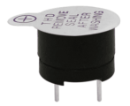

# Project 12：Active Buzzer

### **Introduction**

Active buzzer is a sound making element, which is widely used on computers, printers, alarms, electronic toys, telephones, timers, etc. It has an inner vibration source. In this project, we will use a Raspberry Pi Pico to control the active buzzer to buzz.

### **Components Required**

|  |  |  |
| ------------------------------------------------------------ | ------------------------------------------------------------ | ------------------------------------------------------------ |
| Raspberry Pi Pico*1                                          | Raspberry Pi Pico Expansion Board*1                          | Breadboard*1                                                 |
|  |  |  |
| Jumper Wires                                                 | USB Cable*1                                                  | Active Buzzer*1                                              |

### **Component Knowledge**

# 

The active buzzer inside has a simple oscillator circuit , which can convert constant direct current into a certain frequency pulse signal. Once active buzzer receives a high level, it will sound. The passive buzzer is an integrated electronic buzzer with no internal vibration source. It must be driven by 2K to 5K square wave instead of a DC signal. The appearance of the two buzzers is very similar, but passive buzzers come with a green circuit board, and active buzzers come with a black tape. Passive buzzers don't have positive pole, but active buzzers have. As shown below:


### **Circuit Diagram and Wiring Diagram**


Note:

1\. The buzzer power supply in this circuit is 5V.  On a 3.3V power supply, the buzzer will work, but it will reduce the loudness.  

2\. The VUSB should connect to the positive terminal of the USB cable, if it connects to GND, it could burn out the computer or Raspberry Pi Pico.  Similarly, the Raspberry Pi Pico's 36-40 pins need to be connected carefully to avoid short circuits. 

3\. The positive terminal ("+"/long pin) of the active buzzer is connected to pin 16, and the negative terminal (short pin) is connected to GND.

### **Test Code**

The code used in this project is saved in the file KS3026 Keyestudio Raspberry Pi Pico Learning Kit Basic Edition\\2. Windows System\\1. Python\_Tutorial\\2. Python Projects\\Project 12：Active Buzzer. You can move the code to anywhere, for example, we can save the code in the Disk(D), the route is D:\\2. Python Projects.

Open“Thonny”, click“This computer”→“D:”→“2. Python Projects”→“Project 12：Active Buzzer”. And double left-click the Project\_12\_Active\_Buzzer.py”.


```python
from machine import Pin
import time

buzzer = Pin(16, Pin.OUT)   # create buzzer object from Pin 16, Set Pin 16 to output

try:
    while True:
        buzzer.value(1)    # Set buzzer turn on
        time.sleep(0.5) # Sleep 0.5s
        buzzer.value(0)    # Set buzzer turn off
        time.sleep(0.5) # Sleep 0.5s
except:
    pass
```

### **Test Result**

Ensure that the Raspberry Pi Pico is connected to the computer, and click “Stop/Restart backend”.


Click “Run current script”, the code starts executing, we will see that the the active buzzer starts to buzz. Press “Ctrl+C” or click “Stop/Restart backend” to exit the program.


