# **Arduino_C_Tutorial(Windows)**


## 1. How to Download Arduino, Drivers and Libraries

### 1.1. Install Windows Drivers


#### 1.1.1. Download and install Arduino software

Enter the Arduino official website [https://www.arduino.cc/](https://www.arduino.cc/) and click "**SOFTWARE**" to enter the download page, as shown in the following figure.


 Then, select and Download the corresponding installer according to your operating system. If you are a Windows user, please select "Windows Installer" to download the correct installation driver.


Click **Windows Win7 and newer** to download the installer for Arduino1.8.16, which needs to be installed manually. And when clicking on the **Windows ZIP file**, the zip file of the Arduino 1.8.16 will be downloaded directly, and you only need to unzip it to complete the installation.


Generally, you can download it by clicking **JUST DOWNLOAD**. Of course, if you like, you can choose a small sponsorship to help the great Arduino open source.

Once the Arduino software is downloaded, continue to install. When you receive **a warning from your operating system, allow the driver to install.** Click on **I Agree**, select the components you want to install and then click **Next**.


Select the installation directory (The default directory is recommended.), then click **Install**.


If the following interface appears, you should select **Install**.


This process will extract and install all the necessary files to properly execute the Arduino software (IDE).


After the installation is complete, an Arduino software shortcut will be created on the desktop.


#### 1.1.2. Install the Pico development board

Open **Arduino IDE**, and click **Tools** → **Board** → **Boards Manager...**

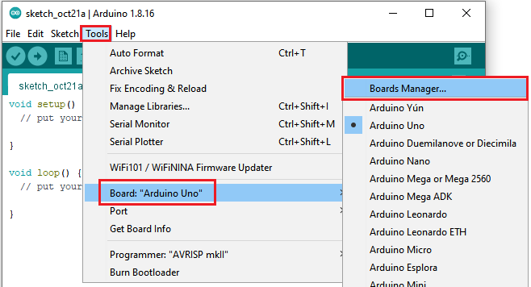

Enter **Pico** and select **Arduino Mbed OS RP2040 Boards** and click **Install**.


Then click **Install**.


Then click **Close**.


#### 1.1.3. Upload the pico firmware compatible with Arduino

You need to upload a pico firmware compatible with Arduino.

Disconnect the computer with the pico board.

Hold down the button BOOTSEL, connect them again before releasing the button.

<span style="color: rgb(255, 76, 65);">Keep holding down the button before connecting the pico board with your computer; otherwise, the firmware can’t be downloaded</span>.


Open **Arduino IDE** and **File** → **Examples** → **01.Basics** → **Blink**.


Click **Tools** → **Board** → **Arduino Mbed OS RP2040 Boards** → **Raspberry Pi Pico**.


Upload the script (Blink) to the Raspberry Pi Pico.


Then the indicator on the Raspberry Pi Pico will flash.


Click **Tools**→**Port**→**COMx(Raspberry Pi Pico)**. ( Com port is different on the computers. Please select your correct COM port. In this tutorial, the com port is Com15.)

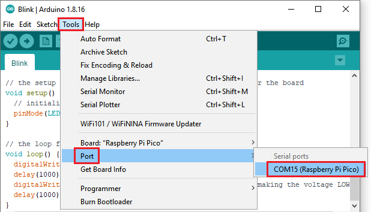

**Don’t select the port if it’s your first time to upload scripts to the pico board .**

**Select if the com port is correct when uploading the script each time; otherwise the code will fail to upload.**

**Sometimes, Raspberry Pi Pico can’t work in light of the loss of code. At this time, you need to upload the firmware of the pico board in accordance with above steps.**

### 1.2. Install the driver on MAC


Download Arduino IDE:


Just refer to the Windows system


## 2. Projects：

When we get the kit, we can see that there are some sensors, modules and electronic components in the kit, which contain the corresponding Raspberry Pi Pico mainboard, Raspberry Pi Pico Expansion Board and wirings. 

<span style="color: rgb(255, 76, 65);">Note: </span>When connecting the electronic components, modules, sensor wirings in the projects, the wiring method and position must be followed in the document. What’s more, do not misconnect the power supply and signal pin, otherwise there may be no experimental results or damage to the modules/sensors.  

### Project 01: Hello World

#### 1. Introduction:

For Raspberry Pi Pico beginners, we will start with some simple things. In this project, you only need a Raspberry Pi Pico and a USB cable to complete the "Hello World!" project, which is a test of communication between Raspberry Pi Pico and the PC as well as a primary project.

#### 2. Components:

|  ||
| :-----------------------------: | :--------------------: |
| Raspberry Pi Pico\*1            | USB Cable*1        |

#### 3. Wiring:

In this project, we use a USB cable to connect the Raspberry Pi Pico to the computer.


#### 4. Test Code:

You can open the code we provide:

The code used in this project is saved in (path:) ...\6.Codes\Arduino_C_Codes(Windows)\Project 01：Hello World\Project_01_Hello_World.

```c
//*************************************************************************************
/*
 * Filename    : Hello World
 * Description : Enter the letter R,and the serial port displays"Hello World".
 * Auther      :http//www.keyestudio.com
*/
char val;// defines variable "val"
void setup()
{
Serial.begin(115200);// sets baudrate to 115200
}
void loop()
{
  if (Serial.available() > 0) {
    val=Serial.read();// reads symbols assigns to "val"
    if(val=='R')// checks input for the letter "R"
    {  // if so,    
     Serial.println("Hello World!");// shows “Hello World !”.
    }
  }
}
//*************************************************************************************
```

Before uploading the code to the Raspberry Pi Pico, please check the configuration of the Arduino IDE.

Click **Tools** to confirm the board type and port as follows:


Click to upload the test code to the Raspberry Pi Pico.


The code is uploaded successfully!


#### 5. Test Result:

After uploading successfully, click the icon  to enter the serial monitor.

****Set baud rate to 115200 and type "**R**" in the text box. Click "**Send**", the serial monitor will display "**Hello World!**”.****


### Project 02: Onboard LED Flashing

#### 1. Description:

There is an onboard LED in Raspberry Pi Pico,which is a GP25 pin attached to the Raspberry Pi Pico. In this project, we will learn the effect of making the onboard LED blink.

#### 2. Components:

|  ||
| ------------------------------- | ---------------------- |
| Raspberry Pi Pico\*1            | USB Cable\*1           |

#### 3. Wiring up:

In this project, Raspberry Pi Pico is connected to a computer using a USB cable. 


#### 4. Test Code:

The onboard LED of Raspberry Pi Pico is controlled by GP25. When the GP25 outputs high, the LED will be on; when outputting LOW, the LED will be off.

You can open the code we provide:

The code used in this project is saved in (path:) ...\6.Codes\Arduino_C_Codes(Windows)\Project 02: Onboard LED  flashing\Project_02_Onboard_LED_Flashing.

```c
//**********************************************************************
/*
 * Filename    : Onboard LED flashing
 * Description : Make an led blinking.
 * Auther      : http//www.keyestudio.com
*/
#define LED_BUILTIN 25

// the setup function runs once when you press reset or power the board
void setup() {
  // initialize digital pin LED_BUILTIN as an output.
  pinMode(LED_BUILTIN, OUTPUT);
}

// the loop function runs over and over again forever
void loop() {
  digitalWrite(LED_BUILTIN, HIGH);   // turn the LED on (HIGH is the voltage level)
  delay(1000);                       // wait for a second
  digitalWrite(LED_BUILTIN, LOW);    // turn the LED off by making the voltage LOW
  delay(1000);                       // wait for a second
}
//*************************************************************************************
```
Before uploading Test Code to Raspberry Pi Pico, please check the configuration of Arduino IDE. 
Click "**Tools**" to confirm that the board type and ports.


Click  to upload the test code to the Raspberry Pi Pico board


#### 5. Test Result:

After the project code was uploaded successfully, the LED of Raspberry Pi Pico started flashing


### Project 03：External LED Flashing 

#### 1. Description:

There is an onboard LED in Raspberry Pi Pico,which is a GP25 pin attached to the Raspberry Pi Pico. In this project, we will learn the effect of making the onboard LED blink.

#### 2. Components:

|  |  |
| :-----------------------------------------------------: | :----------------------------------: |
| Raspberry Pi Pico\*1                                    | Raspberry Pi Pico Expansion Board\*1 |
|  |  |
| USB Cable\*1 | Breadboard\*1 |
|  ||
| Red LED\*1                                             | 220Ω Resistor\*1                     |
| 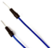 |  |
| Jumper Wire\*2 |  |

#### 3. Component Knowledge:

**LED:**


It is a kind of semiconductor called "light-emitting diode", which is an electronic device made of semiconductor materials (silicon, selenium, germanium, etc.). It has an anode and a cathode. The short lead (cathode) is grounded. The long lead (anode)is connected to 5V. 


**Resistor**

A resistor is an electronic component in a circuit that restricts or regulates the flow current flow. Its unit is(Ω). 1 mΩ= 1000 kΩ，1kΩ= 1000Ω.

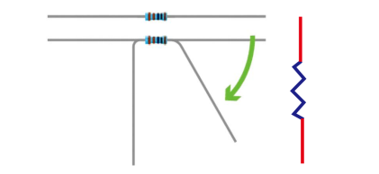

We can use resistors to protect sensitive components, such as LEDs. The strength of the resistance is marked on the body of the resistor with an electronic color code. Each color code represents a number, and you can refer to it in a resistance card.


In this kit, we provide eight 5-band resistors with different resistance values. Take three 5-band resistors as an example.

220Ω resistor\*10


10KΩ resistor\*10


1KΩ resistor\*10

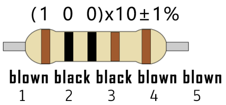

The connection between current, voltage, and resistance can be expressed by the formula: I=U/R.In the figure below, if the voltage is 3V, the current through R1 is: I = U / R = 3 V / 10 KΩ= 0.0003A= 0.3mA.


**Breadboard**

A breadboard is used to build and test circuits quickly before finalizing any circuit design. The breadboard has many holes into which circuit components like integrated circuits and resistors can be inserted. A typical breadboard is as follows.


The bread board has strips of metal which run underneath the board and connect the holes on the top of the board. The metal strips are laid out as shown below. Note that the top and bottom rows of holes are connected horizontally while the remaining holes are connected vertically.


The first two rows (top) and the last two rows (bottom) of the breadboard are used for the positive (+) and negative (-) terminals of the power supply, respectively. The conductive layout of the breadboard is shown in the following diagram.


When we connect DIP (Dual In-line Packages) components, such as integrated circuits, microcontrollers, chips and so on, we can see that a groove in the middle isolates the middle part, so the top and bottom of the groove is not connected. DIP components can be connected as shown in the figure below.

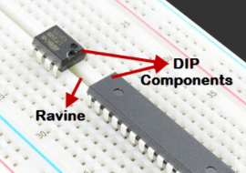

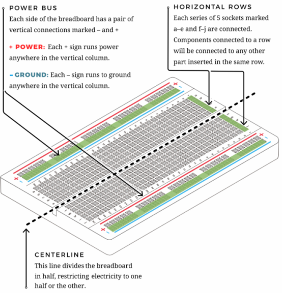

#### 4. Circuit Diagram and Wiring Diagram:

**How to use the keyestudio raspberry pico expansion board**

Stack the pico board onto the expansion board, as shown below;


Interface the pico board with your computer with a USB cable.


**Circuit Diagram**

<span style="color: rgb(255, 76, 65);">Note:</span> Cut off the pico board. Build up the circuit according to the circuit and wiring diagram.

Make sure the circuit is correct then connect the pico board to the computer.

<span style="color: rgb(255, 76, 65);">Note:</span> Avoid any possible short circuits (especially connecting 3.3V and GND)\!

<span style="color: rgb(255, 76, 65);">Warning:</span> A short circuit may cause a large current in the circuit, causing components to overheat and permanent damage to the hardware.


**Wiring Diagram**


Note:

How to connect an LED


How to identify the 220Ω five-band resistor


#### 5. Test Code：

According to the circuit diagram, when Pico's GP16 outputs a high level, the LED will light up; when it outputs a low level, the LED light will be off. Therefore, we can make the LED flash repeatedly by controlling the GP16 to output high and low levels.

You can open the code we provide:

The code used in this project is saved in (path:) ...\6.Codes\Arduino_C_Codes(Windows)\Project 03：External LED flashing\Project_03_External_LED_Flashing.

```c
//**********************************************************************
/*
 * Filename    : External LED flashing
 * Description : Make an led blinking.
 * Auther      : http//www.keyestudio.com
*/
#define PIN_LED   16   //define the led pin

// the setup function runs once when you press reset or power the board
void setup() {
  // initialize digital pin LED as an output.
  pinMode(PIN_LED, OUTPUT);
}

// the loop function runs over and over again forever
void loop() {
  digitalWrite(PIN_LED, HIGH);   // turn the LED on (HIGH is the voltage level)
  delay(500);                       // wait for 0.5s
  digitalWrite(PIN_LED, LOW);    // turn the LED off by making the voltage LOW
  delay(500);                       // wait for 0.5s
}
//*************************************************************************************
```


Before uploading Test Code to Raspberry Pi Pico, please check the configuration of Arduino IDE.

Click "**Tools**" to confirm that the board type and ports.


Click  to upload the test code to the Raspberry Pi Pico board.


#### 6. Test Result:

After the project code was uploaded successfully, the LED started flashing.

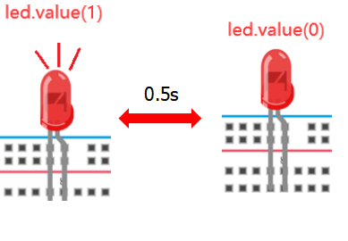


### Project 04: Breathing Led

#### 1. Introduction:

In this project, we will learn the PWM control of ARDUINO. PWM is Pulse Width Modulation, which is a technique that encodes analog signal levels into digital signal levels. We will use PWM to control the brightness of LED.

#### 2. Components:

| 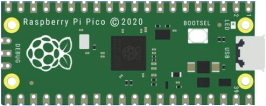 |  |  |  |
| ------------------------------------------------------- | ------------------------------------ | ---------------------- | ---------------------- |
| Raspberry Pi Pico\*1                                    | Raspberry Pi Pico Expansion Board\*1 | USB Cable\*1 | Jumper Wire\*2 |
|  ||| |
| Red LED\*1                                              | 220Ω Resistor\*1                     | Breadboard\*1          |          |

#### 3. Component Knowledge:


**Working principle**

It can control the brightness of LED, the speed of DC motors and Servo motors, and outputs square wave signal. If we want to dim the LED,  we can change the ON(open) and OFF(close) time of the signal. When we change the time of ON and OFF fast enough, then the brightness of the LED will change. Here are some terms related to PWM as follows.

**ON (open)**：When the signal is high.

**OFF (close)**：When the signal is low.

Period: It is the sum of the time of On and Off.

Duty cycle: The percentage of time when the signal is at a high level for a certain period of time. At 50% duty cycle and 1Hz frequency, the LED will be on for half a second and off for the other half of a second. 


**Arduino and PWM**

The Arduino IDE has a built-in function“analogWrite()”that can be used to generate PWM signals. Most of the pins generate signals with a frequency of about 490Hz and we can use this function to give values from 0 to 255.

“analogWrite(0)” indicates a signal with 0% duty cycle. “analogWrite(127)” indicates a signal with 50% duty cycle. “analogWrite(255)” indicates a signal with 100% duty cycle. On the Plus control board, the PWM pins are 3, 5, 6, 9, 10, and 11. PWM pins are marked with the “~”symbol. In this project, you will learn how to get the PWM output from the digital pins of the Plus control board and control the brightness of the LED by code.

#### 4. Circuit Diagram and Wiring Diagram:


**Note:**

How to connect the LED


How to identify the 220Ω 5-band resistor


#### 5. Test Code:

The design of this project makes GP16 output PWM, and the pulse width gradually increases from 0% to 100%, and then gradually decreases from 100% to 0%.

You can open the code we provide:

The code used in this project is saved in (path:) ...\6.Codes\Arduino_C_Codes(Windows)\Project 04：Breathing Led\Project_04_Breathing_Led.

```c
//**********************************************************************
/*
 * Filename    : Breathing Led
 * Description : Make led light fade in and out, just like breathing.
 * Auther      : http//www.keyestudio.com
*/
#define PIN_LED   16   //define the led pin

void setup() {
  pinMode(PIN_LED, OUTPUT);
}

void loop() {
  for (int i = 0; i < 255; i++) { //make light fade in
    analogWrite(PIN_LED, i);
    delay(5);
  }
  for (int i = 255; i > -1; i--) {  //make light fade out
    analogWrite(PIN_LED, i);
    delay(5);
  }
}
//**********************************************************************
```


Before uploading Test Code to Raspberry Pi Pico, please check the configuration of Arduino IDE.

Click "**Tools**" to confirm that the board type and ports.


Click  to upload the test code to the Raspberry Pi Pico board.


#### 6. Test Result:

After burning the project code, connecting the wires according to the wiring diagram, and powering on, the LED lights up gradually, and then gradually darkens.


### Project 05：Traffic Lights

#### 1. Introduction:

Traffic lights are closely related to people's daily lives. Traffic lights generally show red, yellow, and green. Everyone should obey the traffic rules, which can avoid many traffic accidents. In this project, we will use a pico board and some LEDs (red, green and yellow) to simulate the traffic lights.

#### 2. Components:

|  |  ||| |
| ------------------------------------------------------- | ------------------------------------ | --------------------------- | ----------------------- | ----------------------- |
| Raspberry Pi Pico\*1                                    | Raspberry Pi Pico Expansion Board\*1 | Red LED\*1                  | Yellow LED\*1           |          Jumper Wires                  |
|  ||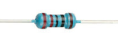|| |
| Green LED\*1                                            | USB Cable\*1                         | 220Ω Resistor\*3            | Breadboard\*1           |            |

#### 3. Circuit Diagram and Wiring Diagram:


Note:

How to connect an LED


How to identify the 220Ω 5-band resistor


#### 4. Test Code:

You can open the code we provide:

The code used in this project is saved in (path:) ...\6.Codes\Arduino_C_Codes(Windows)\Project 05：Traffic Lights\\Project_05_Traffic_Lights.

```c
//**********************************************************************
/*
 * Filename    : Traffic Lights
 * Description : Simulated traffic lights.
 * Auther      : http//www.keyestudio.com
*/
#define PIN_LED_RED   16   //define the red led pin
#define PIN_LED_YELLOW   17   //define the yellow led pin
#define PIN_LED_GREEN  18   //define the green led pin

void setup() {
  pinMode(PIN_LED_RED, OUTPUT);
  pinMode(PIN_LED_YELLOW, OUTPUT);
  pinMode(PIN_LED_GREEN, OUTPUT);
}

void loop() {
  digitalWrite(PIN_LED_GREEN, HIGH);// turns on the green led
delay(5000);// delays 5 seconds
digitalWrite(PIN_LED_GREEN, LOW); // turns off the green led
for(int i=0;i<3;i++)// flashes 3 times.
{
delay(500);// delays 0.5 second
digitalWrite(PIN_LED_YELLOW, HIGH);// turns on the yellow led
delay(500);// delays 0.5 second
digitalWrite(PIN_LED_YELLOW, LOW);// turns off the yellow led
} 
delay(500);// delays 0.5 second
digitalWrite(PIN_LED_RED, HIGH);// turns on the red led
delay(5000);// delays 5 second
digitalWrite(PIN_LED_RED, LOW);// turns off the red led
}
//********************************************************************
```


Before uploading Test Code to Raspberry Pi Pico, please check the configuration of Arduino IDE.

Click "**Tools**" to confirm that the board type and ports.


Click  to upload the test code to the Raspberry Pi Pico board.


#### 5. Test Result:

Upload the code and power on, the green LED will light up for 5s then go off. Next, the yellow one will blink for 3 times and red LED will be on for 5s then go off.


### Project 06: RGB LED

#### 1. Introduction:


In this project, we will introduce the RGB LED and show you how to use the Plus control board to control the RGB LED. Even though RGB LED is very basic, it is also a great way to learn the fundamentals of electronics and coding.

#### 2. Components Required:

|  |  |  |
| ------------------------------------------------------------ | ------------------------------------------------------------ | ------------------------------------------------------------ |
| Raspberry Pi Pico*1                                          | Raspberry Pi Pico Expansion Board*1                          | RGB LED*1                                                    |
|  ||  |
| 220Ω Resistor*3                                              | Breadboard*1                                                 | Jumper Wires                                                 |
|  |                                                              |                                                              |
| USB Cable*1                                                  |                                                              |                                                              |

#### 3. Component Knowledge:

**RGB LED：**

 

The monitors mostly adopt the RGB color standard, and all the colors on the computer screen are composed of the three colors of red, green and blue mixed in different proportions. 


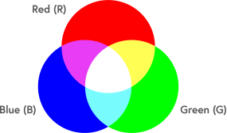

This RGB LED has pin R, G and B and a common cathode. To change its brightness, we can use the PWM pins which can give different duty cycle signals to the RGB LED to produce different colors.

#### 4. Circuit Diagram and Wiring Diagram:


**Note:**

RGB LED longest pin (common cathode) connected to GND.


How to identify the 220Ω 5-band resistor


#### 5. Test Code:

We need to create three PWM channels and use random duty cycles to light up the RGB LEDs randomly.

You can open the code we provide:

The code used in this project is saved in (path:) ...\6.Codes\Arduino_C_Codes(Windows)\Project 06：RGB LED\Project_06_RGB_LED.

```c
//**********************************************************************
/*
 * Filename    : RGB LED
 * Description : Use RGBLED to show random color.
 * Auther      : http//www.keyestudio.com
*/
int ledPins[] = {18, 17, 16};    //define red, green, blue led pins
int red, green, blue;
void setup() {
  for (int i = 0; i < 3; i++) {   //setup the pwm channels,1KHz,8bit
    pinMode(ledPins[i], OUTPUT);
  }
}

void loop() {
  red = random(0, 255);
  green = random(0, 255);
  blue = random(0, 255);
  setColor(red, green, blue);
  delay(1000);
}

void setColor(byte r, byte g, byte b) {
  analogWrite(ledPins[0], 255-r); //Common cathode LED, high level to turn on the led.
  analogWrite(ledPins[1], 255-g);
  analogWrite(ledPins[2], 255-b);
}
//*********************************************************************************
```


Before uploading Test Code to Raspberry Pi Pico, please check the configuration of Arduino IDE.

Click "**Tools**" to confirm that the board type and ports.


Click  to upload the test code to the Raspberry Pi Pico board.

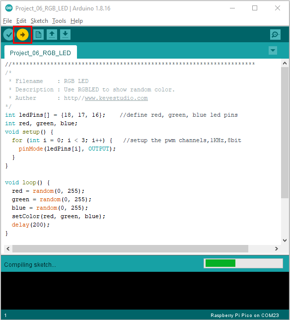


#### 6. Test Result:

Upload the project code, wire up, power up and wait a few seconds, the RGB will show random colors.


### Project 07: Flowing Light

#### 1. Introduction:

In our daily life, we can see many billboards made up of different colors of LED. They constantly change the light to attract the attention of customers. In this project, we will use Plus control board with 5 LEDs to achieve the effect of flowing water.

#### 2. Components Required:


#### 3. Circuit Diagram and Wiring Diagram:


**Note:**

How to connect the LED


How to identify the 220Ω 5-band resistor


#### 4. Test Code：

You can open the code we provide:

The code used in this project is saved in (path:) ...\6.Codes\Arduino_C_Codes(Windows)\Project 07：Flowing Water Light\Project_07_Flowing_Water_Light.

```c
//**********************************************************************
/* 
 * Filename    : Flowing Water Light
 * Description : Using ten leds to demonstrate flowing lamp.
 * Auther      : http//www.keyestudio.com
*/
byte ledPins[] = {16, 17, 18, 19, 20, 21, 22, 26, 27, 28};
int ledCounts;

void setup() {
  ledCounts = sizeof(ledPins);
  for (int i = 0; i < ledCounts; i++) {
    pinMode(ledPins[i], OUTPUT);
  }
}

void loop() {
  for (int i = 0; i < ledCounts; i++) {
    digitalWrite(ledPins[i], HIGH);
    delay(100);
    digitalWrite(ledPins[i], LOW);
  }
  for (int i = ledCounts - 1; i > -1; i--) {
    digitalWrite(ledPins[i], HIGH);
    delay(100);
    digitalWrite(ledPins[i], LOW);
  }
}
//**************************************************************
```


Before uploading Test Code to Raspberry Pi Pico, please check the configuration of Arduino IDE.

Click "**Tools**" to confirm that the board type and ports.


Click  to upload the test code to the Raspberry Pi Pico board.


#### 5. Test Result：

After burning the project code, connecting the wires and powering on, the 10 LEDs will gradually light up and then gradually go off.


### Project 08: 1-Digit Digital Tube

#### 1. Introduction:

The seven-segment digital tube is an electronic display device that displays decimal numbers. It is widely used in digital clocks, electronic meters, basic calculators and other electronic devices that display digital information.  The tubes are an alternative to more complex dot-matrix displays that are easy to use in both limited light conditions and strong sunlight. 

In this project, we will use the PLUS control board to control 1-digit digital tube to display numbers.

#### 2. Components Required:


#### 3. Component Knowledge:

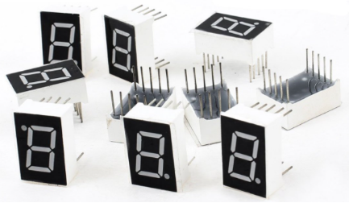

**Display principle:** 

The digital tube display is a semiconductor light-emitting device.  Its basic unit is a light-emitting diode (LED). The digital tube display can be divided into 7-segment digital tube and 8-segment digital tube according to the number of segments. The 8-segment digital tube has one more LED unit than the 7-segment digital tube (used for decimal point display). Each segment of the 7-segment LED display is a separate LED. According to the connection mode of the LED unit, the digital tube can be divided into a common anode digital tube and a common cathode digital tube.

In the common cathode 7-segment digital tube, all the cathodes (or negative electrodes) of the segmented LEDs are connected together, so you should connect the common cathode to GND. To light up a segmented LED, you can set its associated pin to “HIGH”.

In the common anode 7-segment digital tube, the LED anodes (positive electrodes) of all segments are connected together, so you should connect the common anode to “+5V”. To light up a segmented LED, you can set its associated pin to“LOW”.

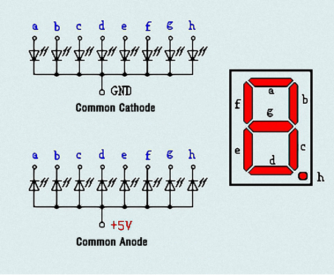

Each part of the digital tube is composed of an LED. So when you use it, you also need to use a current limiting resistor. Otherwise, the LED will be damaged. In this experiment, we use an ordinary common cathode one-bit digital tube. As we mentioned above, you should connect the common cathode to GND. To light up a segmented LED, you can set its associated pin to“HIGH”.

#### 4. Circuit Diagram and Wiring Diagram:


**Note:** 

The direction of the 7-segment digital tube inserted into the breadboard is the same as the wiring diagram, and there is one more point in the lower right corner.


#### 5. Test Code：

The number display is divided into 7 segments, and the decimal point display is divided into 1 segment. When certain numbers are displayed, the corresponding segment will be lit. For example, when the number 1 is displayed, segments b and c will be turned on.

You can open the code we provide:

The code used in this project is saved in (path:) ...\6.Codes\Arduino_C_Codes(Windows)\Project 08：1-Digit Digital Tube\Project_08_One_Digit_Digital_Tube.

```c
//**********************************************************************
/* 
 * Filename    : 1-Digit Digital Tube
 * Description : One Digit Tube displays numbers from 9 to 0.
 * Auther      : http//www.keyestudio.com
*/
// sets the IO PIN for every segment
int a=17; // digital PIN 17 for segment a
int b=16; // digital PIN 16 for segment b
int c=14; // digital PIN 14 for segment c
int d=13; // digital PIN 13 for segment d
int e=12; // digital PIN 12 for segment e
int f=18; // digital PIN 18 for segment f
int g=19; // digital PIN 19 for segment g
int dp=15; // digital PIN 15 for segment dp
void digital_0(void) // displays number 0
{
digitalWrite(a,HIGH);
digitalWrite(b,HIGH);
digitalWrite(c,HIGH);
digitalWrite(d,HIGH);
digitalWrite(e,HIGH);
digitalWrite(f,HIGH);
digitalWrite(g,LOW);
digitalWrite(dp,LOW);
}
void digital_1(void) // displays number 1
{
digitalWrite(a,LOW);
digitalWrite(b,HIGH);
digitalWrite(c,HIGH);
digitalWrite(d,LOW);
digitalWrite(e,LOW);
digitalWrite(f,LOW);
digitalWrite(g,LOW);
digitalWrite(dp,LOW);
}
void digital_2(void) // displays number 2
{
digitalWrite(a,HIGH);
digitalWrite(b,HIGH);
digitalWrite(c,LOW);
digitalWrite(d,HIGH);
digitalWrite(e,HIGH);
digitalWrite(f,LOW);
digitalWrite(g,HIGH);
digitalWrite(dp,LOW);
}
void digital_3(void) // displays number 3
{
digitalWrite(a,HIGH);
digitalWrite(b,HIGH);
digitalWrite(c,HIGH);
digitalWrite(d,HIGH);
digitalWrite(f,LOW);
digitalWrite(e,LOW);
digitalWrite(dp,LOW);
digitalWrite(g,HIGH);
}
void digital_4(void) // displays number 4
{
digitalWrite(a,LOW);
digitalWrite(b,HIGH);
digitalWrite(c,HIGH);
digitalWrite(d,LOW);
digitalWrite(e,LOW);
digitalWrite(f,HIGH);
digitalWrite(g,HIGH);
digitalWrite(dp,LOW);
}
void digital_5(void) // displays number 5
{
digitalWrite(a,HIGH);
digitalWrite(b,LOW);
digitalWrite(c,HIGH);
digitalWrite(d,HIGH);
digitalWrite(e,LOW);
digitalWrite(f,HIGH);
digitalWrite(g,HIGH);
digitalWrite(dp,LOW);
}
void digital_6(void) // displays number 6
{
digitalWrite(a,HIGH);
digitalWrite(b,LOW);
digitalWrite(c,HIGH);
digitalWrite(d,HIGH);
digitalWrite(e,HIGH);
digitalWrite(f,HIGH);
digitalWrite(g,HIGH);
digitalWrite(dp,LOW);
}
void digital_7(void) // displays number 7
{
digitalWrite(a,HIGH);
digitalWrite(b,HIGH);
digitalWrite(c,HIGH);
digitalWrite(d,LOW);
digitalWrite(e,LOW);
digitalWrite(f,LOW);
digitalWrite(g,LOW);
digitalWrite(dp,LOW);
}
void digital_8(void) // displays number 8
{
digitalWrite(a,HIGH);
digitalWrite(b,HIGH);
digitalWrite(c,HIGH);
digitalWrite(d,HIGH);
digitalWrite(e,HIGH);
digitalWrite(f,HIGH);
digitalWrite(g,HIGH);
digitalWrite(dp,LOW);
}
void digital_9(void) // displays number 9
{
digitalWrite(a,HIGH);
digitalWrite(b,HIGH);
digitalWrite(c,HIGH);
digitalWrite(d,HIGH);
digitalWrite(e,LOW);
digitalWrite(f,HIGH);
digitalWrite(g,HIGH);
digitalWrite(dp,LOW);
}
void setup()
{
int i;// declares a Variable
for(i=12;i<=19;i++)
pinMode(i,OUTPUT);// sets PIN 12-19 to "output"
}
void loop()
{
while(1)
{
digital_9();// displays number 9
delay(1000); // waits a sencond
digital_8();// displays number 8
delay(1000); // waits a sencond
digital_7();// displays number 7
delay(1000); // waits a sencond
digital_6();// displays number 6
delay(1000); // waits a sencond
digital_5();// displays number 5
delay(1000); // waits a sencond
digital_4();// displays number 4
delay(1000); // waits a sencond
digital_3();// displays number 3
delay(1000); // waits a sencond
digital_2();// displays number 2
delay(1000); // waits a sencond
digital_1();// displays number 1
delay(1000);// waits a sencond
digital_0();// displays number 0
delay(1000);// waits a sencond
}}
//**********************************************************************
```


Before uploading Test Code to Raspberry Pi Pico, please check the configuration of Arduino IDE.

Click "**Tools**" to confirm that the board type and ports.


Click  to upload the test code to the Raspberry Pi Pico board.


#### 6. Test Result:

After burning the project code, connecting the wires and powering on, 1-digit digital tube will display numbers from 9 to 0.


### Project 09：4-Digit Digital Tube

#### 1. Introduction:

The 4-digit 7-segment digital tube is a very practical display device, and it is used for devices such as electronic clocks and score counters.

Due to the low price and it is easy to use, more and more projects will use 4-digit 7-segment digital tubes. In this project, we will use the PLUS control board to control a 4-bit 7-segment digital tube to create a manual counter.

#### 2. Components Required:

|  |  |  |                                        |
| ------------------------------------- | ------------------------------------- | ------------------------------------- | -------------------------------------- |
| Raspberry Pi Pico*1                   | Raspberry Pi Pico Development Board*1 | 220Ω Resistor*8                       |     USB Cable*1                                       |
| |  |  |    |
| Breadboard*1                          | Jumper Wires                          | 4-digit Tube Display*1                |       |


#### 3. Component Knowledge:


**4-digital tube display:**

The 4-digital tube display is is a semiconductor light-emitting device. Its basic unit is a light-emitting diode (LED). The digital tube display can be divided into 7-segment digital tube and 8-segment digital tube according to the number of segments. The 8-segment digital tube has one more LED unit than the 7-segment digital tube (used for decimal point display). Each segment of the 7-segment LED display is a separate LED.

According to the connection mode of the LED unit, the digital tube can be divided into a common anode digital tube and a common cathode digital tube.

In the common cathode 7-segment digital tube, all the cathodes (or negative electrodes) of the segmented LEDs are connected together, so you should connect the common cathode to GND. To light up a segmented LED, you can set its associated pin to“HIGH”.

Pins of control bit are G1, G2, G3 and G4.


#### 4. Wiring Diagram:

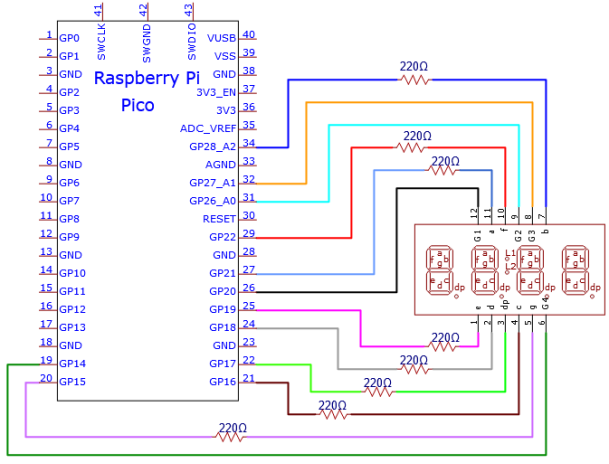


#### 5. Test Code:

You can open the code we provide:

The code used in this project is saved in (path:) ...\6.Codes\Arduino_C_Codes(Windows)\Project 09：4-Digit Digital Tube\Project_09_Four_Digit_Digital_Tube.

```c
/* 
 * Filename    : 4-Digit Digital Tube
 * Description : Four Digit Tube displays numbers from 0000 to 9999.
 * Auther      : http//www.keyestudio.com
*/
#define d_a 21   //Define nixie tube a to pin 21
#define d_b 28
#define d_c 16
#define d_d 18
#define d_e 19
#define d_f 22
#define d_g 15
#define d_dp 17

#define G1 20   //Define the first set of nixtube G1 to pin 20
#define G2 26
#define G3 27
#define G4 14

//Nixie tube 0-F code value
unsigned char num[17][8] =
{
 //a  b  c  d  e  f  g  dp 
  {1, 1, 1, 1, 1, 1, 0, 0},     //0
  {0, 1, 1, 0, 0, 0, 0, 0},     //1
  {1, 1, 0, 1, 1, 0, 1, 0},     //2
  {1, 1, 1, 1, 0, 0, 1, 0},     //3
  {0, 1, 1, 0, 0, 1, 1, 0},     //4
  {1, 0, 1, 1, 0, 1, 1, 0},     //5
  {1, 0, 1, 1, 1, 1, 1, 0},     //6
  {1, 1, 1, 0, 0, 0, 0, 0},     //7
  {1, 1, 1, 1, 1, 1, 1, 0},     //8
  {1, 1, 1, 1, 0, 1, 1, 0},     //9
  {1, 1, 1, 0, 1, 1, 1, 1},     //A
  {1, 1, 1, 1, 1, 1, 1, 1},     //B
  {1, 0, 0, 1, 1, 1, 0, 1},     //C
  {1, 1, 1, 1, 1, 1, 0, 1},     //D
  {1, 0, 0, 1, 1, 1, 1, 1},     //E
  {1, 0, 0, 0, 1, 1, 1, 1},     //F
  {0, 0, 0, 0, 0, 0, 0, 1},     //.
};

void setup()
{
  pinMode(d_a,OUTPUT);    //Set to output pin
  pinMode(d_b,OUTPUT);
  pinMode(d_c,OUTPUT);
  pinMode(d_d,OUTPUT);
  pinMode(d_e,OUTPUT);
  pinMode(d_f,OUTPUT);
  pinMode(d_g,OUTPUT);
  pinMode(d_dp,OUTPUT);

  pinMode(G1,OUTPUT);
  pinMode(G2,OUTPUT);
  pinMode(G3,OUTPUT);
  pinMode(G4,OUTPUT);
}

void loop()
{

  //Start counting from 0 and gradually increase by 1 to 9999, repeating.
  for(int l = 0;l < 10;l++ )
  {
    for(int k = 0; k < 10;k++)
    {
      for(int j = 0; j < 10; j++)
      {
        for(int i = 0;i < 10;i++)
        {
          //125 flashes a second equals one second.
          //1000/8=125
          for(int q = 0;q<125;q++)
          {
            Display(1,l);//The first nixie tube shows the value of L.
            delay(2);
            Display(2,k);
            delay(2);
            Display(3,j);
            delay(2);
            Display(4,i);
            delay(2);
          }

        }
      }
    }
  }
  

}

//Display functions: g ranges from 1 to 4,num ranges from 0 to 9
void Display(unsigned char g,unsigned char n) 
{
  digitalWrite(d_a,LOW);      //Remove the light
  digitalWrite(d_b,LOW);
  digitalWrite(d_c,LOW);
  digitalWrite(d_d,LOW);
  digitalWrite(d_e,LOW);
  digitalWrite(d_f,LOW);
  digitalWrite(d_g,LOW);
  digitalWrite(d_dp,LOW);

  switch(g)           //Gate a choice
  {
    case 1:
      digitalWrite(G1,LOW);   //Choose the first digit
      digitalWrite(G2,HIGH);
      digitalWrite(G3,HIGH);
      digitalWrite(G4,HIGH);
      break;
    case 2:
      digitalWrite(G1,HIGH);
      digitalWrite(G2,LOW);   //Choose the second bit
      digitalWrite(G3,HIGH);
      digitalWrite(G4,HIGH);
      break;
    case 3:
      digitalWrite(G1,HIGH);
      digitalWrite(G2,HIGH);
      digitalWrite(G3,LOW);   //Choose the third bit
      digitalWrite(G4,HIGH);
      break;
    case 4:
      digitalWrite(G1,HIGH);
      digitalWrite(G2,HIGH);
      digitalWrite(G3,HIGH);
      digitalWrite(G4,LOW);   //Choose the fourth bit
      break;
    default:break;
  }

  digitalWrite(d_a,num[n][0]);      //a Queries the code value table
  digitalWrite(d_b,num[n][1]);
  digitalWrite(d_c,num[n][2]);
  digitalWrite(d_d,num[n][3]);
  digitalWrite(d_e,num[n][4]);
  digitalWrite(d_f,num[n][5]);
  digitalWrite(d_g,num[n][6]);
  digitalWrite(d_dp,num[n][7]);
}
```


Before uploading Test Code to Raspberry Pi Pico, please check the configuration of Arduino IDE.

Click "**Tools**" to confirm that the board type and ports.


Click  to upload the test code to the Raspberry Pi Pico board


The code was uploaded successfully.


#### 6. Test Result:

Upload the project code, wire up and power on, 4-digit digital tube circularly displays numbers from 0000 to 9999.

### Project 10：8×8 Dot-matrix Display

#### 1. Introduction:

The dot-matrix display is an electronic digital display device that can show information on machines, clocks and many other devices. In this project, we will use the pico board control the 8x8 LED dot matrix to lit up.

#### 2. Components Required:

|  |  |||
| --------------- | ------------------------------------ | ---------------------- | ---------------------- |
| Raspberry Pi Pico\*1                                    | Raspberry Pi Pico Expansion Board\*1 | 8\*8 Dot-matrix Display *1   | 220Ω Resistor*8|
|||| |
|Jumper Wire  | M-F Dupont Wires                     | USB Cable\*1           |  |

#### 3. Component Knowledge:


**8\*8 Dot-matrix display module:**

The 8x8 dot matrix is composed of 64 LEDs, and each LED is placed at the intersection of a row and a column. When using a single-chip microcomputer to drive an 8*8 dot matrix, we need to use a total of 16 digital ports, which greatly wastes the data of the single-chip microcomputer. For this reason, we specially designed this module, using the HT16K33 chip to drive an 8*8 dot matrix, and only need to use the I2C communication port of the single-chip microcomputer to control the dot matrix, which greatly saves the microcontroller resources.


#### 4. Circuit diagram and wiring diagram:


#### 5. Test Code:

You can open the code we provide:

The code used in this project is saved in (path:) ...\6.Codes\Arduino_C_Codes(Windows)\Project 10：8×8 Dot-matrix Display\Project_10_8_8_Dot_Matrix_Display.

```c
//**********************************************************************
/* 
 * Filename    : 8×8 Dot-matrix Display
 * Description : 8×8 Dot-matrix displays numbers from 0 to 9.
 * Auther      : http//www.keyestudio.com
*/
int R[] = {18,26,17,21,10,16,11,14};
int C[] = {22,12,13,19,15,20,27,28};

unsigned char data_0[8][8] =
{
{0,0,1,1,1,0,0,0},
{0,1,0,0,0,1,0,0},
{0,1,0,0,0,1,0,0},
{0,1,0,0,0,1,0,0},
{0,1,0,0,0,1,0,0},
{0,1,0,0,0,1,0,0},
{0,1,0,0,0,1,0,0},
{0,0,1,1,1,0,0,0}
};

unsigned char data_1[8][8] =
{
{0,0,0,0,1,0,0,0},
{0,0,0,1,1,0,0,0},
{0,0,0,0,1,0,0,0},
{0,0,0,0,1,0,0,0},
{0,0,0,0,1,0,0,0},
{0,0,0,0,1,0,0,0},
{0,0,0,0,1,0,0,0},
{0,0,0,1,1,1,0,0}
};

unsigned char data_2[8][8] =
{
{0,0,1,1,1,0,0,0},
{0,1,0,0,0,1,0,0},
{0,0,0,0,0,1,0,0},
{0,0,0,0,1,0,0,0},
{0,0,0,1,0,0,0,0},
{0,0,1,0,0,0,0,0},
{0,1,1,1,1,1,0,0},
{0,0,0,0,0,0,0,0}
};

unsigned char data_3[8][8] =
{
{0,0,1,1,1,1,0,0},
{0,0,0,0,0,1,0,0},
{0,0,0,0,0,1,0,0},
{0,0,1,1,1,1,0,0},
{0,0,0,0,0,1,0,0},
{0,0,0,0,0,1,0,0},
{0,0,1,1,1,1,0,0},
{0,0,0,0,0,0,0,0}
};

unsigned char data_4[8][8] =
{
{0,1,0,0,0,0,0,0},
{0,1,0,0,1,0,0,0},
{0,1,0,0,1,0,0,0},
{0,1,1,1,1,1,1,0},
{0,0,0,0,1,0,0,0},
{0,0,0,0,1,0,0,0},
{0,0,0,0,1,0,0,0},
{0,0,0,0,0,0,0,0}
};

unsigned char data_5[8][8] =
{
{0,1,0,0,0,0,0,0},
{0,1,1,1,1,1,0,0},
{0,1,0,0,0,0,0,0},
{0,1,1,1,1,1,0,0},
{0,0,0,0,0,1,0,0},
{0,0,0,0,0,1,0,0},
{0,1,1,1,1,1,0,0},
{0,0,0,0,0,0,0,0}
};

unsigned char data_6[8][8] =
{
{0,1,1,1,1,1,0,0},
{0,1,0,0,0,0,0,0},
{0,1,0,0,0,0,0,0},
{0,1,1,1,1,1,0,0},
{0,1,0,0,0,1,0,0},
{0,1,0,0,0,1,0,0},
{0,1,1,1,1,1,0,0},
{0,0,0,0,0,0,0,0}
};

unsigned char data_7[8][8] =
{
{0,0,0,0,0,0,0,0},
{0,1,1,1,1,1,0,0},
{0,0,0,0,0,1,0,0},
{0,0,0,0,1,0,0,0},
{0,0,0,1,0,0,0,0},
{0,0,1,0,0,0,0,0},
{0,1,0,0,0,0,0,0},
{0,0,0,0,0,0,0,0}
};

unsigned char data_8[8][8] =
{
{0,1,1,1,1,1,0,0},
{0,1,0,0,0,1,0,0},
{0,1,0,0,0,1,0,0},
{0,1,1,1,1,1,0,0},
{0,1,0,0,0,1,0,0},
{0,1,0,0,0,1,0,0},
{0,1,1,1,1,1,0,0},
{0,0,0,0,0,0,0,0}
};

unsigned char data_9[8][8] =
{
{0,1,1,1,1,1,0,0},
{0,1,0,0,0,1,0,0},
{0,1,0,0,0,1,0,0},
{0,1,1,1,1,1,0,0},
{0,0,0,0,0,1,0,0},
{0,0,0,0,0,1,0,0},
{0,1,1,1,1,1,0,0},
{0,0,0,0,0,0,0,0}
};

void Display(unsigned char dat[8][8])
{
for(int c = 0; c<8;c++)
{
digitalWrite(C[c],LOW);
for(int r = 0;r<8;r++)
{
digitalWrite(R[r],dat[r][c]);
}
delay(1);
Clear();
}
}

void Clear()
{
for(int i = 0;i<8;i++)
{
digitalWrite(R[i],LOW);
digitalWrite(C[i],HIGH);
}
}

void setup(){
  for(int i = 0;i<8;i++)
  {
    pinMode(R[i],OUTPUT);
    pinMode(C[i],OUTPUT);
  }

}

void loop(){
  for (int i = 1; i <= 100; i = i + (1)) {
    Display(data_0);
  }
  for (int i = 1; i <= 100; i = i + (1)) {
    Display(data_1);
  }
  for (int i = 1; i <= 100; i = i + (1)) {
    Display(data_2);
  }
  for (int i = 1; i <= 100; i = i + (1)) {
    Display(data_3);
  }
  for (int i = 1; i <= 100; i = i + (1)) {
    Display(data_4);
  }
  for (int i = 1; i <= 100; i = i + (1)) {
    Display(data_5);
  }
  for (int i = 1; i <= 100; i = i + (1)) {
    Display(data_6);
  }
  for (int i = 1; i <= 100; i = i + (1)) {
    Display(data_7);
  }
  for (int i = 1; i <= 100; i = i + (1)) {
    Display(data_8);
  }
  for (int i = 1; i <= 100; i = i + (1)) {
    Display(data_9);
  }
}
//**********************************************************************
```


Before uploading Test Code to Raspberry Pi Pico, please check the configuration of Arduino IDE.

Click "**Tools**" to confirm that the board type and ports.

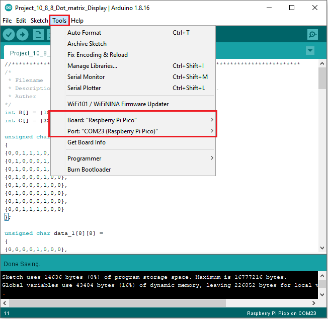

Click  to upload the test code to the Raspberry Pi Pico board.


The code was uploaded successfully.


#### 6. Test Result：

You will view the 8\*8 dot matrix show 0~9.


### Project 11：74HC595N Control 8 LEDs 

#### 1. Introduction:

For a PLUS mainboard, it has only 22 I/O ports, how do we light up a large number of LEDs? In this project, we will use 74HC595N to control 7 LEDs to save port resources.

#### 2. Components Required:

|  |  | 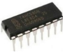 |  |
| ---------------------- | ------------------------------------- | ---------------------- | ---------------------- |
| Raspberry Pi Pico*1    | Raspberry Pi Pico Expansion Board*1   | 74HC595N Chip*1        | Red LED*8              |
|  |                 |  |  |
| 220Ω Resistor*8        | Breadboard*1                          | Jumper Wires           | USB Cable*1            |

**74HC595N Chip:** 

To put it simply, 74HC595N chip is a combination of 8-digit shifting register, memorizer and equipped with tri-state output. The shift register and the memorizer are synchronized to different clocks, and the data is input on the rising edge of the shift register clock SCK and goes into the memory register on the rising edge of the memory register clock RCK. If the two clocks are connected together, the shift register is always one pulse earlier than the storage register. The shift register has a serial shift input (SI) and a serial output (SQH) for cascading. The 8-bit shift register can be reset asynchronously (low-level reset), and the storage register has an 8-bit Three-state parallel bus output, when the output enable (OE) is enabled (active low), the storage register is output to the 74HC595N pin (bus).


**Pins**：

|             PIN             | FUNCTION                                                     |
| :-------------------------: | ------------------------------------------------------------ |
|          Pin13 OE           | It is an output enable pin to ensure that the data of the latch is input to the Q0 to Q7 pins or not. <br />When it is low, no high level is output. <br />In this experiment, we directly connect to GND and keep the data output low. |
|          Pin14 SI           | This is the pin for 74HC595 to receive data, <br />i.e. serial data input, only one bit can be input at a time, then 8 times in a row, it can form a byte. |
|         Pin10 SCLR          | A pin to initialize the storage register pins. <br />It initializes the internal storage registers at a low level. <br />In this experiment, we connect VCC to maintain a high level. |
|          Pin11 SCK          | The clock pin of the shift register. <br />At the rising edge, the data in the shift register is shifted backward as a whole, <br />and new data input is received. |
|          Pin12 RCK          | The clock input pin of the storage register . <br />At the rising edge, the data is transferred from the shift register to the storage register. <br />At this time, the data is output in parallel from the Q0 to Q7 ports. |
|          Pin9 SQH           | It is a serial output pin dedicated for chip cascading to the SI terminal of the next 74HC595. |
| Q0--Q7<br />(Pin 15,Pin1-7) | Eight-bit parallel output, can directly control the 8 segments of the digital tube. |

VCC and GND are used used for chip power supply, and the operating voltage is 5V.

#### 3. Circuit Diagram and Wiring Diagram:


Note: Pay attention to the direction in which the 74HC595N chip is inserted.


#### 4. Test Code:

You can open the code we provide:

The code used in this project is saved in (path:) ...\6.Codes\Arduino_C_Codes(Windows)\Project 11：74HC595N Control 8 LEDs\Project_11_74HC595N_Control_8_LEDs.

```c
//**********************************************************************
/* 
 * Filename    : 74HC595N Control 8 LEDs
 * Description : Use 74HC575N to drive ten leds to display the flowing light.
 * Auther      : http//www.keyestudio.com
*/
int dataPin = 18;   // Pin connected to DS of 74HC595(Pin14)  
int latchPin = 20;  // Pin connected to ST_CP of 74HC595(Pin12)
int clockPin = 21;  // Pin connected to SH_CP of 74HC595(Pin11)          

void setup() { // set pins to output
  pinMode(latchPin, OUTPUT);
  pinMode(clockPin, OUTPUT);
  pinMode(dataPin, OUTPUT);
}

void loop() {
  // Define a one-byte variable to use the 8 bits to represent the state of 8 LEDs of LED bar graph.
  // This variable is assigned to 0x01, that is binary 00000001, which indicates only one LED light on.
  byte x = 0x01;    // 0b 0000 0001
  for (int j = 0; j < 8; j++) { // Let led light up from right to left
    writeTo595(LSBFIRST, x);
    x <<= 1; // make the variable move one bit to left once, then the bright LED move one step to the left once.
    delay(100);
  }
  delay(100);
  x = 0x80;       //0b 1000 0000
  for (int j = 0; j < 8; j++) { // Let led light up from left to right
    writeTo595(LSBFIRST, x);
    x >>= 1;    
    delay(100);
  }
  delay(100);
}
void writeTo595(BitOrder order, byte _data ) {
  // Output low level to latchPin
  digitalWrite(latchPin, LOW);
  // Send serial data to 74HC595
  shiftOut(dataPin, clockPin, order, _data);
  // Output high level to latchPin, and 74HC595 will update the data to the parallel output port.
  digitalWrite(latchPin, HIGH);
}
//**********************************************************************************
```

Before uploading Test Code to Raspberry Pi Pico, please check the configuration of Arduino IDE.

Click "**Tools**" to confirm that the board type and ports.


Click  to upload the test code to the Raspberry Pi Pico board.


#### 5. Test Result:

Upload project code, wire up and power on, then you can see 8 LED flash like a flowing light.


### Project 12：Active Buzzer

#### 1. Introduction:

Active buzzer is a sound making element, widely used on computers, printers, alarms, electronic toys, telephones, timers, etc. It has an inner vibration source. In this project, we will use a PLUS control board to control the active buzzer to buzz.

#### 2. Components Required:

|  |  |  |
| ------------------------------------------------------- | ------------------------------------ | ---------------------- |
| Raspberry Pi Pico\*1                                    | Raspberry Pi Pico Expansion Board\*1 | USB Cable\*1 |
|  |||
| Active Buzzer\*1                                        | Breadboard \*1                       | Jumper Wires           |

#### 3. Component Knowledge:


The active buzzer inside has a simple oscillator circuit which can convert constant direct current into a certain frequency pulse signal. Once active buzzer receives a high level, it will sound. The passive buzzer is an integrated electronic buzzer with no internal vibration source. It must be driven by 2K to 5K square wave instead of a DC signal. The appearance of the two buzzers is very similar, but passive buzzers come with a green circuit board, and active buzzers come with a black tape. Passive buzzers don't have positive pole, but active buzzers have.


#### 3. Circuit Diagram and Wiring Diagram:


<span style="color: rgb(255, 76, 65);">Note:</span>

1). The power supply of the buzzer is 5V. With a 3.3V supply, the buzzer will work, but it will beep weakly.

2). VUSB should be connected to the positive side of the USB cable, if it is connected to GND, it may burn out the computer or Raspberry Pi Pico. Also, be careful when wiring the Raspberry Pi Pico pins 36-40 to avoid short circuits.


3). The positive pole (“+”/long pin) of the active buzzer is connected to pin 16, and the negative pole (short pin) is connected to GND.

#### 4. Test Code:

You can open the code we provide:

The code used in this project is saved in (path:) ...\6.Codes\Arduino_C_Codes(Windows)\Project 12：Active Buzzer\Project_12_Active_Buzzer.

```C
//**********************************************************************
/* 
 * Filename    : Active Buzzer
 * Description : Active buzzer beeps.
 * Auther      : http//www.keyestudio.com
*/
#define buzzerPin  16   //define buzzer pins

void setup ()
{
  pinMode (buzzerPin, OUTPUT);
}
void loop ()
{
  digitalWrite (buzzerPin, HIGH);
  delay (500);
  digitalWrite (buzzerPin, LOW);
  delay (500);
}
//*************************************************************************
```


Before uploading Test Code to Raspberry Pi Pico, please check the configuration of Arduino IDE.

Click "**Tools**" to confirm that the board type and ports.


Click  to upload the test code to the Raspberry Pi Pico board.


#### 5. Test Result:

Upload the project code, wire up and power up, then the active buzzer buzzes.


### Project 13：Passive Buzzer

#### 1. Introduction:

In this project, we will learn the passive buzzer and use the Plus control board to control the passive buzzer to play a song. Unlike an active buzzer, a passive buzzer can emit sounds of different frequencies. 

#### 2. Components Required:

|  |  |  |
| ------------------------------------------------------- | ------------------------------------ | ---------------------- |
| Raspberry Pi Pico\*1                                    | Raspberry Pi Pico Expansion Board\*1 | USB Cable\*1 |
|  |||
| Passive Buzzer\*1                                       | Breadboard\*1                        | Jumper Wires           |

#### 3. Component Knowledge:

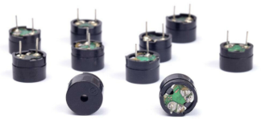

A passive buzzer is an integrated electronic buzzer with no internal vibration source. It must be driven by 2K to 5K square wave, not a DC signal. The two buzzers are very similar in appearance, but one buzzer with a green circuit board is a passive buzzer, while the other with black tape is an active buzzer. Passive buzzers cannot distinguish between positive polarity while active buzzers can.


#### 4. Circuit Diagram and Wiring Diagram:


#### 5. Test Code:

You can open the code we provide:

The code used in this project is saved in (path:) ...\6.Codes\Arduino_C_Codes(Windows)\Project 13：Passive Buzzer\Project_13_Passive_Buzzer.

```c
//**********************************************************************
/*
 * Filename    : Passive Buzzer
 * Description : Passive Buzzer sounds the alarm.
 * Auther      : http//www.keyestudio.com
*/
#define PIN_BUZZER 16   //define buzzer pins

void setup() {
  pinMode(PIN_BUZZER, OUTPUT);
}

void loop() {
    alert();
}

void alert() {
  float sinVal;         // Define a variable to save sine value
  int toneVal;          // Define a variable to save sound frequency
  for (int x = 0; x < 360; x += 10) {     // X from 0 degree->360 degree
    sinVal = sin(x * (PI / 180));       // Calculate the sine of x
    toneVal = 2000 + sinVal * 500;      // Calculate sound frequency according to the sine of x
    freq(PIN_BUZZER, toneVal, 10);
  }
}

void freq(int PIN, int freqs, int times) {
  if (freqs == 0) {
    digitalWrite(PIN, LOW);
  }
  else {
    for (int i = 0; i < times * freqs / 1000; i ++) {
      digitalWrite(PIN, HIGH);
      delayMicroseconds(1000000 / freqs / 2);
      digitalWrite(PIN, LOW);
      delayMicroseconds(1000000 / freqs / 2);
    }
  }
}
//**********************************************************************
```


Before uploading Test Code to Raspberry Pi Pico, please check the configuration of Arduino IDE.

Click "**Tools**" to confirm that the board type and ports.


Click  to upload the test code to the Raspberry Pi Pico board


#### 6. Test Result:

Upload the project code, wire up and power on, then the passive buzzer will alarm.


### Project 14: Mini Table Lamp

#### 1. Introduction:

Did you know that Arduino can light up an LED when you press a button? In this project, we will use the Plus Mainboard, a key switch and an LED to make a small desk lamp.

#### 2. Components Required:

| 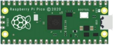                |  |  |  |  |
| ------------------------------------- | ------------------------------------- | ------------------------------------- | ------------------------------------- | ------------------------------------- |
| Raspberry Pi Pico*1                   | Raspberry Pi Pico Expansion Board*1   | Button*1                              | Red LED*1                             | 10KΩ Resistor*1                       |
|  |                 |                |                |                |
| Breadboard*1                          | 220Ω Resistor*1                       | USB Cable*1                           | Jumper Wires                          | Button Cap*1                          |

#### 3. Component Knowledge:


**Button:** 

The button can control the circuit on and off. The circuit is disconnected when the button is not pressed. But it breaks when you release it. Why does it only work when you press it? It starts from the internal structure of the button:. 

Before the button is pressed, 1 and 2 are on, 3 and 4 are also on, but 1, 3 or 1, 4 or 2, 3 or 2, 4 are off (not working). Only when the button is pressed, 1, 3 or 1, 4 or 2, 3 or 2, 4 are on.

The key switch is one of the most commonly used components in circuit design.

**Schematic diagram of the button:**


#### 4. Circuit Diagram and Wiring Diagram:


**Note:**

How to connect the LED


How to identify the 220Ω 5-band resistor and 10KΩ 5-band resistor


#### 5. Test Code：

You can open the code we provide:

The code used in this project is saved in (path:) ...\6.Codes\Arduino_C_Codes(Windows)\Project 14：Mini Table Lamp\Project_14_Mini_Table_Lamp.

```c
//**********************************************************************
/* 
 * Filename    : Mini Table Lamp
 * Description : Make a table lamp.
 * Auther      : http//www.keyestudio.com
*/
#define PIN_LED    19
#define PIN_BUTTON 22
bool ledState = false;

void setup() {
  // initialize digital pin PIN_LED as an output.
  pinMode(PIN_LED, OUTPUT);
  pinMode(PIN_BUTTON, INPUT);
}

// the loop function runs over and over again forever
void loop() {
  if (digitalRead(PIN_BUTTON) == LOW) {
    delay(20);
    if (digitalRead(PIN_BUTTON) == LOW) {
      reverseGPIO(PIN_LED);
    }
    while (digitalRead(PIN_BUTTON) == LOW);
  }
}

void reverseGPIO(int pin) {
  ledState = !ledState;
  digitalWrite(pin, ledState);
}
//**********************************************************************
```


Before uploading Test Code to Raspberry Pi Pico, please check the configuration of Arduino IDE.

Click "**Tools**" to confirm that the board type and ports.


Click  to upload the test code to the Raspberry Pi Pico board


#### 6. Test Result:

Burn the project code, connect the wires and power on first. Then press the button, the LED will turn on. Press the button again, the LED will turn off.


### Project 15：Tilt And LED

#### 1. Introduction:

In this lesson, we will use a PLUS mainboard , a tilt switch and 4 LEDs to make an electronic hourglass.

#### 2. Components Required:

|   |  |  |  |  |
| -------------------------------------- | -------------------------------------- | -------------------------------------- | -------------------------------------- | -------------------------------------- |
| Raspberry Pi Pico*1                    | Raspberry Pi Pico Expansion Board*1    | Tilt Switch*1                          | Red LED*4                              | 10KΩ Resistor*1                        |
| |  |  |  |                                        |
| Breadboard*1                           | 220Ω Resistor*4                        | USB Cable*1                            | Jumper Wires                           |                                        |

#### 3. Component Knowledge:


Tilt switch is also called digital switch. Inside is a metal ball that can roll. The principle of rolling the metal ball to contact with the conductive plate at the bottom, which is used to control the on and off of the circuit. When it is a rolling ball tilt sensing switch with single directional trigger, the tilt sensor is tilted toward the trigger end (two gold-plated pin ends), the tilt switch is in a closed circuit and the voltage at the analog port is about 5V (binary number is 1023). In this way, the LED will light up. When the tilt switch is in a horizontal position or tilted to the other end, it is open and the voltage of the analog port is about 0V (binary number is 0), the LED will turn off. In the program, we judge the state of the switch based on whether the voltage value of the analog port is greater than 2.5V (binary number is 512).

As shown in the figure, use the internal structure of the tilt switch to illustrate how it works.


#### 4. Circuit Diagram and Wiring Diagram:


Note:

How to connect the LED


How to identify the 220Ω 5-band resistor and 10KΩ 5-band resistor


#### 5. Test Code:

The code used in this project is saved in (path:) ...\6.Codes\Arduino_C_Codes(Windows)\Project 15：Tilt And LED\Project_15_Tilt_And_LED.

```c
//**********************************************************************
/* 
 * Filename    : Tilt And LED
 * Description : Tilt switches and four leds to simulate an hourglass.
 * Auther      : http//www.keyestudio.com
*/
#define SWITCH_PIN  22  // the tilt switch is connected to Pin22
byte switch_state = 0;
void setup()
{
     for(int i=16;i<20;i++)
  {
        pinMode(i, OUTPUT);
  } 
    pinMode(SWITCH_PIN, INPUT);
 for(int i=16;i<20;i++)
  {
    digitalWrite(i,0);
  } 
  Serial.begin(9600);
}
void loop()
{
switch_state = digitalRead(SWITCH_PIN); 
Serial.println(switch_state);
 if (switch_state == 0) 
 {
 for(int i=16;i<20;i++)
  {
    digitalWrite(i,1);
    delay(500);
  } 
  }
   if (switch_state == 1) 
 {
   for(int i=19;i>15;i--)
   {
    digitalWrite(i,0);
    delay(500);
   }
  }
}
//***************************************************************************
```


Before uploading Test Code to Raspberry Pi Pico, please check the configuration of Arduino IDE.

Click "**Tools**" to confirm that the board type and ports.


Click  to upload the test code to the Raspberry Pi Pico board


#### 6. Test Result:

Upload project code, wire up and power up, hold the breadboard. When you tilt the breadboard to any angle, the LEDs will light up one by one. When you turn the breadboard to the original angle, the LEDs will turn off one by one.


### Project 16: I2C 128×32 LCD

#### 1. Introduction:

We can use modules such as monitors to do various experiments in life. You can also DIY a variety of small objects. For example, you can make a temperature meter with a temperature sensor and display, or make a distance meter with an ultrasonic module and display.

In this project, we will use the LCD_128X32_DOT module as a display and connect it to the Plus control board. The pico board will be used to control the LCD_128X32_DOT display to show various English characters, common symbols and numbers.

#### 2. Components Required:

|  |  |   | 
|------------------------------------------------------------ | ------------------------------------------------------------ | ------------------------------------------------------------ |
| Raspberry Pi Pico*1                                          |  Raspberry Pi Pico Expansion Board*1   |LCD_128X32_DOT*1  |                                    
|  |  |  |
| 10CM M-F Dupont Wires   | USB Cable*1                                                  |  |

#### 3. Component Knowledge:


**LCD\_128X32\_DOT:** 

It is an LCD module with 128*32 pixels and its driver chip is ST7567A. The module uses the IIC communication mode, while the code contains a library of all alphabets and common symbols that can be called directly. When using, we can also set it in the code so that the  English letters and symbols show different text sizes.

**Schematic diagram:**


**Features:**

Pixel：128\*32 character

Operating voltage(chip)：4.5V to 5.5V

Operating current：100mA (5.0V)

Optimal operating voltage(module):5.0V

#### 4. Connection Diagram:

<span style="color: rgb(255, 76, 65);">Attention:</span> You must use a 10CM short male-to-female DuPont cable to connect the LCD\_128X32\_DOT,  and the LCD\_128X32\_DOT will display normally. 

<br>
<br>


#### 5. Adding the lcd128\_32\_io library:

If you had added the **lcd128\_32\_io** library, just skip this step.

Add the library as follows :

Open Arduino IDE，click “<span style="color: rgb(255, 76, 65);">Sketch</span>”→“<span style="color: rgb(255, 76, 65);">Include Library</span>”→“<span style="color: rgb(255, 76, 65);">Add .zip Library...</span>”. Go to the folder <span style="color: rgb(255, 76, 65);">...\5.Libraries_and_Firmware\Arduino_C_Libraries(Windows)\LCD_128X32.zip</span>，click “<span style="color: rgb(255, 76, 65);">LCD_128X32.zip</span>” and then click “<span style="color: rgb(255, 76, 65);">Open</span>”.


#### 6. Test Code:

After adding the **lcd128\_32\_io library, you can open the code we provide;**

You can open the code we provide:

The code used in this project is saved in (path:) ...\6.Codes\Arduino_C_Codes(Windows)\Project 16：I2C 128×32 LCD\Project_16_I2C_128_32_LCD.

```c
//**********************************************************************************
/*
 * Filename    : LCD 128*32
 * Description : LCD 128*32 display string
 * Auther      : http//www.keyestudio.com
*/
#include "lcd128_32_io.h"

//Create lCD128 *32 pin，sda--->20， scl--->21
lcd lcd(20, 21);

void setup() {
  lcd.Init(); //initialize
  lcd.Clear();  //clear
}

void loop() {
  lcd.Cursor(0, 4); //Set display position
  lcd.Display("KEYESTUDIO"); //Setting the display
  lcd.Cursor(1, 0);
  lcd.Display("ABCDEFGHIJKLMNOPQR");
  lcd.Cursor(2, 0);
  lcd.Display("123456789+-*/<>=$@");
  lcd.Cursor(3, 0);
  lcd.Display("%^&(){}:;'|?,.~\\[]");
}
//**********************************************************************************
```


Before uploading Test Code to Raspberry Pi Pico, please check the configuration of Arduino IDE.

Click "**Tools**" to confirm that the board type and ports.


Click  to upload the test code to the Raspberry Pi Pico board.


#### 7. Test Result:

Upload the test code, wire up and power on, the LCD module display will show "KEYESTUDIO" at the first line.

"ABCDEFGHIJKLMNOPQR" will be displayed at the second line. "123456789 + - * / <> = $ @ " will shown at the third line and "% ^ & () {} :; '|?,. ~ \\ [] " will be displayed at the fourth line.


### Project 17：Small Fan

#### 1. Introduction:

In the hot summer, we need an electric fan to cool us down, so in this project, we will use the Plus control board to control 130 motor module and small blade to make a small fan.

#### 2. Components Required:

|  |  |  |
| ------------------------------------------------------------ | ------------------------------------------------------------ | ------------------------------------------------------------ |
| Raspberry Pi Pico*1                                          | Raspberry Pi Pico Expansion Board*1                          | DC Motor*1                                                   |
||  |  |
| Breadboard*1                                                 | Fan*1                                                        | S8050 Triode*1                                               |
|  | 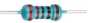 |  |
| S8550 Triode*1                                               | 1KΩ Resistor*1                                               | Jumper Wires                                                 |
|  |  |                                                              |
| Diode*1                                                      | USB Cable*1                                                  |                                                              |

#### 3. Component Knowledge:


**Triode：**

It is referred as the semiconductor triode and a bipolar transistor or a transistor.

The triode is one of the basic semiconductor components as the core of the electronic circuit, which can amplify current. The triode means that two PN junctions are made on a semiconductor wafer. The two PN junctions divide the entire semiconductor into three parts. The middle part is the base area, and the two sides are the emitter and collector areas.

As for NPN triode, it is composed of two N type semiconductors and a P type semiconductor.

The type of transistor which may be used in some applications in place of the triode tube is the "junction" transistor, which actually has two junctions. It has an emitter, base, and collector which correspond to the cathode, grid, and plate, respectively, in the triode tube. Junction transistors are of two types, the NPN type and the PNP type.

The PN junction between the emitting area and the base area is emitter junction and the PN junction flanked by the collector area and the base area is collector junction. And three pins are E（Emitter, B (Base)and C (Collector).

**S8050（NPN triode）**


**S8550（PNP triode)**


The S8050 transistor is a low-power NPN silicon tube and its the maximum voltage of collector and base can reach 40V and the current of the collector is (Ic) 0.5A.

The pins of the S8050 transistor should facing down, pin 1 is the emitter (E pole), pin 2 is the base (B pole), and pin 3 is the collector (C pole). Similarly, the S8550 transistor is the same. 

  


The commonly used triodes are divided into two types: PNP type triode and NPN type triode. S8550 is the PNP type triode, S8050 is the NPN type triode, what we provide in this kit are S8050 and S8550. 

     
   
    

#### 4. Connection Diagram 1:

we apply the S8050(NPN triode) in this experiment to control the motor


#### 5. Test Code 1:

The code used in this project is saved in (path:) ...\6.Codes\Arduino_C_Codes(Windows)\Project 17：Small Fan\Project_17.1_Small_Fan.

```c
//**********************************************************************
/* 
 * Filename    : Small_Fan
 * Description  : S8050 triode drives the motor working
 * Auther      : http//www.keyestudio.com
*/

void setup() {
  
  pinMode(22, OUTPUT); // Initialize pin 22 as output.
}

void loop() {
  digitalWrite(22, HIGH);   // Turn on the motor (HIGH means HIGH level)
  delay(4000);              // Delay 4 seconds
  digitalWrite(22, LOW);    // Reduce the voltage and turn off the motor
  delay(2000);              // Delay 2 seconds
}
//***************************************************************************
```


Before uploading Test Code to Raspberry Pi Pico, please check the configuration of Arduino IDE.

Click "**Tools**" to confirm that the board type and ports.


Click  to upload the test code to the Raspberry Pi Pico board.


#### 6. Test Result 1:

Upload the code and power up with a USB cable. Then fan will rotate for 4s, stop for 2s.

#### 7. Circuit diagrams and wiring diagrams 2:

We use the S8550 PNP triode to control the motor


#### 8. Test Code 2:

The code used in this project is saved in (path:) ...\6.Codes\Arduino_C_Codes(Windows)\Project 17：Small Fan\Project_17.2_ Small_Fan.

```c
//**********************************************************************
/* 
 * Filename    : Small_Fan
 * Description : S8550 triode drives the motor working
 * Auther      : http//www.keyestudio.com
*/

void setup() {
  
  pinMode(22, OUTPUT); // Initialize pin 22 as output.
}

void loop() {
  digitalWrite(22, LOW);   // Turn on the motor (LOW means LOW level)
  delay(4000);              // Delay 4 seconds
  digitalWrite(22, HIGH);    // Raise the voltage and turn off the motor
  delay(2000);              // Delay 2 seconds
}
//*************************************************************************
```


Before uploading Test Code to Raspberry Pi Pico, please check the configuration of Arduino IDE.

Click "**Tools**" to confirm that the board type and ports.


Click  to upload the test code to the Raspberry Pi Pico board.


#### 9. Test Result 2:

Upload the code to and power up with a USB cable.

Install the fan onto the DC motor, after powering, you will see the motor rotates for 4s and stop for 2s, in a loop way.


### Project 18: Dimming Light

#### 1. Introduction:

A potentiometer is a three-terminal resistor with a sliding or rotating contact that forms an adjustable voltage divider. It works by varying the position of a sliding contact across a uniform resistance. In a potentiometer, the entire input voltage is applied across the whole length of the resistor, and the output voltage is the voltage drop between the fixed and sliding contact. 

In this project, we are going to learn how to use Arduino to read the values of the potentiometer, and make a dimming lamp.

#### 2. Components Required:

|  |              |  |  |
| ----------------------- | ----------------------------------- | ----------------------- | ----------------------- |
| Raspberry Pi Pico*1     | Raspberry Pi Pico Expansion Board*1 | Potentiometer*1         | Red LED*1               |
|  |              |  |  |
| Breadboard*1            | 200Ω Resistor*1                     | Jumper Wires            | USB Cable*1             |

#### 3. Component Knowledge:


**Adjustable potentiometer:** 

It is a kind of resistor and an analog electronic component, which has two states of 0 and 1(high level and low level). The analog quantity is different, its data state presents a linear state such as 0 to 1023.

#### 4. Read the Potentiometer Value:

We connect the adjustable potentiometer to the analog pin of Arduino to read its value. Please refer to the following wiring diagram for wiring.


You can open the code we provide:

The code used in this project is saved in (path:) ...\6.Codes\C_Codes(Windows)\Project 18：Dimming Light\Project_18.1_Read_Potentiometer_Analog_Value.

```c
//**********************************************************************************
/*  
 * Filename    : Read Potentiometer Analog Value
 * Description : Basic usage of ADC
 * Auther      : http//www.keyestudio.com
*/
#define PIN_ANALOG_IN  26  //the pin of the Potentiometer

void setup() {
  Serial.begin(115200);
}

//In loop() function, analogRead is called to get the ADC value of ADC0 and assign it to adcVal. 
//Calculate the measured voltage value through the formula, and print these data through the serial port monitor.
void loop() {
  int adcVal = analogRead(PIN_ANALOG_IN);
  double voltage = adcVal / 1023.0 * 3.3;
  Serial.println("ADC Value: " + String(adcVal) + " --- Voltage Value: " + String(voltage) + "V");
  delay(500);
}
//**********************************************************************************
```


Before uploading Test Code to Raspberry Pi Pico, please check the configuration of Arduino IDE.

Click "**Tools**" to confirm that the board type and ports.


Click  to upload the test code to the Raspberry Pi Pico board.


Upload the code , connect the wires and power on first. Then open the serial monitor, set the baud rate to 115200. The serial monitor window will print out the ADC value and voltage value of the potentiometer. When moving the knob of the potentiometer is turned, the ADC value and voltage value will change. As shown below:


#### 5. Circuit diagram and wiring diagram:

In the previous step, we read the ADC value and voltage value of the potentiometer. Then we need to convert the ADC value into the brightness of the LED to make a light with adjustable brightness. 

As shown below:


#### 6. Test Code:

You can open the code we provide:

The code used in this project is saved in (path:) ...\6.Codes\Arduino_C_Codes(Windows)\Project 18：Dimming Light\Project_18.2_Dimming_Light.

```c
//**********************************************************************************
/*  
 * Filename    : Dimming Light
 * Description : Controlling the brightness of LED by potentiometer.
 * Auther      : http//www.keyestudio.com
*/
#define PIN_ADC0    26  //the pin of the potentiometer
#define PIN_LED     16  // the pin of the LED

void setup() {
  pinMode(PIN_LED, OUTPUT);
  pinMode(PIN_ADC0, INPUT);
}

void loop() {
  int adcVal = analogRead(PIN_ADC0); //read the ADC value of potentiometer
  analogWrite(PIN_LED, map(adcVal, 0, 1023, 0, 255));//map ADC to the duty cycle of PWM to control LED brightness.
  delay(10);
}
//*********************************************************************************
```


Before uploading Test Code to Raspberry Pi Pico, please check the configuration of Arduino IDE.

Click "**Tools**" to confirm that the board type and ports.


Click  to upload the test code to the Raspberry Pi Pico board.


#### 7. Test Result:

Upload the code to Raspberry Pi Pico, change the input voltage of GP26 by turning the potentiometer.

Raspberry Pi Pico changes the output voltage of GP16 according to this voltage value, thereby changing the brightness of the LED.


### Project 19：Flame Alarm

#### 1. Introduction:

In this project, we will use the pico board, a flame sensor and a buzzer to make fire alarm devices.

#### 2. Components Required:

|  |              |  |  |  |
| ----------------------- | ----------------------------------- | ----------------------- | ----------------------- | ----------------------- |
| Raspberry Pi Pico*1     | Raspberry Pi Pico Expansion Board*1 | Flame Sensor*1          | Red LED*1               | Active Buzzer*1         |
|  |              |  |  |  |
| Breadboard*1            | 220Ω Resistor*1                     | 10KΩ Resistor*1         | Jumper Wires            | USB Cable*1             |

#### 3. Component Knowledge:


**Flame Sensor**

The flame emits a certain degree of IR light, which is invisible to the human eye, but our flame sensor can detect it and alert the microcontroller. If the Arduino has detected a fire, it has a specially designed infrared receiver to detect the flame, and then convert the flame brightness into a fluctuating level signal. The short pin of the receiving triode is negative pole and the other long pin is positive pole. We should connect the short pin (negative pole) to 5V and the long pin (positive pole) to the analog pin, a resistor and GND. As shown in the figure below.


Note: Since vulnerable to radio frequency radiation and temperature changes, the flame sensor should be kept away from heat sources like radiators, heaters and air conditioners, as well as direct irradiation of sunlight, headlights and incandescent light.

#### 4. Read the Simulation Value:

We start with a simple code to read the value of the flame sensor and print it on the serial monitor. For wiring, please refer to the following wiring diagram.


You can open the code we provide:

The code used in this project is saved in (path:) ...\6.Codes\C_Codes(Windows)\Project 19：Flame Alarm\Project_19.1_Read_Analog_Value_Of_Flame_Sensor.

```c
//**********************************************************************************
/*  
 * Filename    : Read Analog Value Of Flame Sensor
 * Description : Basic usage of ADC
 * Auther      : http//www.keyestudio.com
*/
#define PIN_ANALOG_IN  26  //the pin of the Flame Sensor

void setup() {
  Serial.begin(115200);
}

//In loop() function, analogRead is called to get the ADC value of ADC0 and assign it to adcVal. 
//Calculate the measured voltage value through the formula, and print these data through the serial port monitor.
void loop() {
  int adcVal = analogRead(PIN_ANALOG_IN);
  double voltage = adcVal / 1023.0 * 3.3;
  Serial.println("ADC Value: " + String(adcVal) + " --- Voltage Value: " + String(voltage) + "V");
  delay(500);
}
//**********************************************************************************
```


Before uploading Test Code to Raspberry Pi Pico, please check the configuration of Arduino IDE.

Click "**Tools**" to confirm that the board type and ports.


Click  to upload the test code to the Raspberry Pi Pico board.


Upload the code, power up with a USB cable, open the monitor and set baud rate to 115200.

The monitor will show the analog value. When the sensor is closed to fire, the analog value will get greater.


#### 5. Circuit diagram and wiring diagram:

We will make a fun project - fire alarm device using flame sensor and buzzer, LED. When the flame sensor detects a flame, the LED flashes and the buzzer alarms.


#### 6. Test Code:

（<span style="color: rgb(255, 76, 65);">Note：</span>you can set the threshold value)

You can open the code we provide:

The code used in this project is saved in (path:) ...\6.Codes\Arduino_C_Codes(Windows)\Project 19：Flame Alarm\Project_19.2_Flame_Alarm.

```c
//**********************************************************************************
/*  
 * Filename    : Flame Alarm
 * Description : Controlling the buzzer and LED by flame sensor.
 * Auther      : http//www.keyestudio.com
*/
#define PIN_ADC0      26  //the pin of the flame sensor
#define PIN_LED       16  // the pin of the LED
#define PIN_BUZZER    17  // the pin of the buzzer

void setup() {
  pinMode(PIN_LED, OUTPUT);
  pinMode(PIN_BUZZER, OUTPUT);
  pinMode(PIN_ADC0, INPUT);
}

void loop() {
  int adcVal = analogRead(PIN_ADC0); //read the ADC value of flame sensor
  if (adcVal >= 500) {
    digitalWrite (PIN_BUZZER, HIGH); //turn on buzzer
    digitalWrite(PIN_LED, HIGH); // turn on LED
    delay(500); // wait a second.
    digitalWrite(PIN_LED, LOW); // turn off LED
    delay(500); // wait a second
  }
  else
  {
    digitalWrite(PIN_LED, LOW);  //turn off LED
    digitalWrite (PIN_BUZZER, LOW); //turn off buzzer
  }
}
//*******************************************************************************
```


Before uploading Test Code to Raspberry Pi Pico, please check the configuration of Arduino IDE.

Click "**Tools**" to confirm that the board type and ports.


Click  to upload the test code to the Raspberry Pi Pico board.


#### 7. Test Result:

Upload the code and power up. monitor will display the value of the flame sensor. When the flame sensor detects the flame, the LED will flash and the buzzer will alarm; otherwise, the LED does not light up and the buzzer does not sound.


### Project 20：Night Lamp

#### 1. Introduction:

Sensors or components are ubiquitous in our daily life. For example, some public street lights turn on automatically at night and turn off automatically during the day. 

Why? In fact, this make use of a photosensitive element that senses the intensity of external ambient light. When the outdoor brightness decreases at night, the street lights will automatically turn on. In the daytime, the street lights will automatically turn off. The principle of this is very simple. 

In this lesson we will use  Raspberry Pi Pico to control LEDs to implement the function of this street light.

#### 2. Components Required:

|  |              |  |
| ----------------------- | ----------------------------------- | ----------------------- |
| Raspberry Pi Pico*1     | Raspberry Pi Pico Expansion Board*1 | Photoresistor*1         |
| |              |  |
| Breadboard*1            | 220ΩResistor*1                      | Jumper Wires            |
|  |              |  |
| Red LED*1               | 10KΩResistor*1                      | USB Cable*1             |

#### 3. Component Knowledge:


It is a photosensitive resistor, its principle is that the photoresistor surface receives brightness (light) to reduce the resistance. The resistance value will change with the detected intensity of the ambient light . With this property, we can use photoresistors to detect light intensity. Photoresistors and other electronic symbols are as follows:  


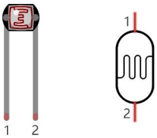

The following circuit is used to detect changes in resistance values of photoresistors:


In the circuit above, when the resistance of the photoresistor changes due to the change of light intensity, the voltage between the photoresistor and resistance R2 will also change. Thus, the intensity of light can be obtained by measuring this voltage.

#### 4. Read the Analog Value:

We first use a simple code to read the value of the photoresistor, print it in the serial monitor. For wiring, please refer to the following wiring diagram.


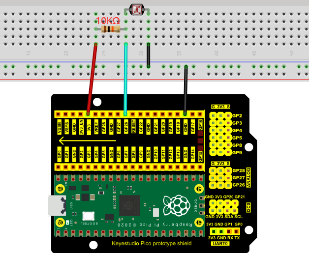


The code used in this project is saved in (path:) ...\6.Codes\Arduino_C_Codes(Windows)\Project 20：Night Lamp\Project_20.1_Read_Photosensitive_Analog_Value.

```c
//**********************************************************************************
/*  
 * Filename    : Read Photosensitive Analog Value
 * Description : Basic usage of ADC
 * Auther      : http//www.keyestudio.com
*/
#define PIN_ANALOG_IN  26  //the pin of the photosensitive sensor

void setup() {
  Serial.begin(115200);
}

//In loop() function, analogRead is called to get the ADC value of ADC0 and assign it to adcVal. 
//Calculate the measured voltage value through the formula, and print these data through the serial port monitor.
void loop() {
  int adcVal = analogRead(PIN_ANALOG_IN);
  double voltage = adcVal / 1023.0 * 3.3;
  Serial.println("ADC Value: " + String(adcVal) + " --- Voltage Value: " + String(voltage) + "V");
  delay(500);
}
//*********************************************************************************
```


Before uploading Test Code to Raspberry Pi Pico, please check the configuration of Arduino IDE.

Click "**Tools**" to confirm that the board type and ports.


Click  to upload the test code to the Raspberry Pi Pico board.


Upload the code to the Pico board, wire up and power up, open the serial monitor and set the baud rate to 115200. Then you can read the analog value of photoresistor. When the light intensity around the sensor gets dim, the analog value displayed on the serial monitor will gradually reduce. On the contrary, the analog value will gradually increase.


#### 5. Circuit Diagram and Wiring Diagram:

Next, we make a light-control lamp.

The Raspberry Pi Pico takes the analog value of the sensor and then adjusts the brightness of the LED.


#### 6. Test Code:

You can open the code we provide:

The code used in this project is saved in (path:) ...\6.Codes\Arduino_C_Codes(Windows)\Project 20：Night Lamp\Project_20.2_Night_Lamp.

```c
//**********************************************************************************
/*  
 * Filename    : Night Lamp
 * Description : Controlling the brightness of LED by photosensitive sensor.
 * Auther      : http//www.keyestudio.com
*/
#define PIN_ADC0    26  // the pin of the photosensitive sensor
#define PIN_LED     16  // the pin of the LED

void setup() {
  pinMode(PIN_LED, OUTPUT);
  pinMode(PIN_ADC0, INPUT);
}

void loop() {
  int adcVal = analogRead(PIN_ADC0); //read the ADC value of photosensitive sensor
  analogWrite(PIN_LED, map(adcVal, 0, 1023, 0, 255));//map ADC to the duty cycle of PWM to control LED brightness.
  delay(10);
}
//********************************************************************************
```


Before uploading Test Code to Raspberry Pi Pico, please check the configuration of Arduino IDE.

Click "**Tools**" to confirm that the board type and ports.


Click  to upload the test code to the Raspberry Pi Pico board.


#### 7. Test Results:

After the project code is uploaded successfully and power up. when the light intensity gets weak, the LED will becomes brighter; otherwise, the LED will become darker.


### Project 21：Temperature Instrument

#### 1. Introduction:

LM35 is a commonly used and easy-to-use temperature sensor. It does not require other hardware, only needs an analog port. The difficulty lies in compiling the code and converting the analog values to Celsius temperature. 

In this project, we use a temperature sensor and 3 LEDs to make a temperature tester. When the temperature sensor touches objects with different temperature, the LED will show different colors.

#### 2. Components Required:

|  |              |  |
| ----------------------- | ----------------------------------- | ----------------------- |
| Raspberry Pi Pico*1     | Raspberry Pi Pico Expansion Board*1 | Photoresistor*1         |
|  |            |  |
| 10CMM-F Dupont Wires    | Breadboard*1                        | LCD 128X32 DOT*1        |
|  |              |  |
| 10KΩ Resistor*1         | USB Cable*1                         | Jumper Wires            |

#### 3. Component Knowledge:

**Thermistor**

A thermistor is a temperature sensitive resistor. When it senses a change in temperature, the thermistor's resistance changes. We can use this feature to detect temperature intensity with thermistor. Thermistors and its electronic symbols are shown below:


The relation between thermistor resistance and temperature is:


**Rt** is the resistance of the thermistor at T2 temperature.

**R** is the nominal resistance value of the thermistor at T1 room temperature.

**EXP\[n\]** is the nth power of e.

**B** is the temperature index

**T1** and **T2** refer to K degrees, that is, Kelvin temperature. Kelvin temperature =273.15 + Celsius temperature. 

For thermistor parameters, we use: B=3950, R=10KΩ，T1=25℃.

The circuit connection method of thermistor is similar to that the photoresistor, as shown below :


We can use the value measured by the ADC converter to get the resistance value of the thermistor, and then use the formula to get the temperature value. Therefore, the temperature formula can be deduced as:


#### 4. Read the Values:

First we will learn the thermistor to read the current ADC value, voltage value and temperature value and print them out. Please connect the wires according to the following wiring diagram.


You can open the code we provide:

The code used in this project is saved in (path:) ...\6.Codes\Arduino_C_Codes(Windows)\Project 21：Temperature Instrument\Project_21.1_Read_the_thermistor_analog_value.

```c
//**********************************************************************************
/*  
 * Filename    : Read the thermistor analog value
 * Description : Making a thermometer by thermistor.
 * Auther      : http//www.keyestudio.com
*/
#define PIN_ADC1   27
void setup() {
  Serial.begin(115200);
}

void loop() {
  int adcValue = analogRead(PIN_ADC1);                            //read ADC pin
  double voltage = (float)adcValue / 1023.0 * 3.3;                // calculate voltage
  double Rt = 10 * voltage / (3.3 - voltage);                     //calculate resistance value of thermistor
  double tempK = 1 / (1 / (273.15 + 25) + log(Rt / 10) / 3950.0); //calculate temperature (Kelvin)
  double tempC = tempK - 273.15;                                  //calculate temperature (Celsius)
  Serial.println("Voltage: " + String(voltage) + "V,\t\t" + "Kelvins: " + String(tempK) + "K,\t" + "Temperature: " + String(tempC) + "C");
  delay(1000);
}
//**********************************************************************************
```

Before uploading Test Code to Raspberry Pi Pico, please check the configuration of Arduino IDE.

Click "**Tools**" to confirm that the board type and ports.


Click  to upload the test code to the Raspberry Pi Pico board.


Upload the code to the Raspberry Pi Pico successfully, power up with a USB cable, open the serial monitor and set the baud rate to 115200.

The serial monitor will display the current ADC value, voltage value and temperature value of the thermistor. Press the photoresistor, the temperature value will rise.


#### 5. Circuit diagram and wiring diagram:

<span style="color: rgb(255, 76, 65);">Note:</span> You must use a 10CM M-F DuPont wire to connect LCD\_128X32\_DOT, then LCD\_128X32\_DOT will display normally.


#### 6. Adding the lcd128\_32\_io library:

If you added the **lcd128\_32\_io** library, just skip this step.

Add the library as follows :

Open Arduino IDE，click “<span style="color: rgb(255, 76, 65);">Sketch</span>”→“<span style="color: rgb(255, 76, 65);">Include Library</span>”→“<span style="color: rgb(255, 76, 65);">Add .zip Library...</span>”. Go to the folder <span style="color: rgb(255, 76, 65);">...\5.Libraries_and_Firmware\Arduino_C_Libraries(Windows)\LCD_128X32.zip</span>，click “<span style="color: rgb(255, 76, 65);">LCD_128X32.zip</span>” and then click “<span style="color: rgb(255, 76, 65);">Open</span>”.


#### 7. Test Code:

You can open the code we provide:

The code used in this project is saved in (path:) ...\6.Codes\Arduino_C_Codes(Windows)\Project 21：Temperature Instrument\Project_21.2_Temperature_Instrument.

```c
//**********************************************************************************
/*  
 * Filename    : Temperature Instrument
 * Description : LCD displays the temperature of thermistor.
 * Auther      : http//www.keyestudio.com
*/
#include "lcd128_32_io.h"

#define PIN_ADC1  27

lcd lcd(20, 21); //Create lCD128 *32 pin，sda->20， scl->21

void setup()  {
  lcd.Init(); //initialize
  lcd.Clear();  //clear
}
char string[10];

void loop() {
  int adcValue = analogRead(PIN_ADC1);                            //read ADC pin
  double voltage = (float)adcValue / 1023.0 * 3.3;                // calculate voltage
  double Rt = 10 * voltage / (3.3 - voltage);                     //calculate resistance value of thermistor
  double tempK = 1 / (1 / (273.15 + 25) + log(Rt / 10) / 3950.0); //calculate temperature (Kelvin)
  double tempC = tempK - 273.15;                                  //calculate temperature (Celsius)
  lcd.Cursor(0,0); //Set display position
  lcd.Display("Voltage:"); //Setting the display
  lcd.Cursor(0,8);
  lcd.DisplayNum(voltage);
  lcd.Cursor(0,11);
  lcd.Display("V");
  lcd.Cursor(2,0); 
  lcd.Display("tempC:");
  lcd.Cursor(2,8);
  lcd.DisplayNum(tempC);
  lcd.Cursor(2,11);
  lcd.Display("C");
  delay(200);
}
//********************************************************************************
```

Before uploading Test Code to Raspberry Pi Pico, please check the configuration of Arduino IDE.

Click "**Tools**" to confirm that the board type and ports.


Click  to upload the test code to the Raspberry Pi Pico board.


#### 8. Test Result:

Upload the code and power up with a USB cable. The LCD 128X32 DOT will show the voltage value and temperature value.

