# Python_Tutorial(Raspberry-Pi)

## 1. Preparation before class for Python

Raspberry Pi is a card computer whose official system is Raspberry Pi OS, and can be installed on the Raspberry Pi, such as: ubuntu, Windows IoT. Raspberry Pi can be used as a personal server, performing camera monitoring and recognition, as well as voice interaction by connecting a camera and a voice interactive assistant. 

Also, Raspberry Pi leads out 40Pin pins that can be connected to various sensors and control LEDs, motors, etc. This can be used to make a robot with a Raspberry Pi.

### 1.1. Tools needed for the Raspberry Pi system

#### 1.1.1. Hardware Tool:

- Raspberry Pi 4B/3B/2B

- Above 16G TFT Memory Card

- Card Reader

- Computer and other parts

#### 1.1.2. Install Software Tools(Windows System):

##### (1) Putty

Download link:
[https://www.chiark.greenend.org.uk/\~sgtatham/putty/](https://www.chiark.greenend.org.uk/~sgtatham/putty/)


1). After downloading the package file , double-click it and tap “Next”.
    

    
2). Click “Next”.
    


3). Choose “Install PuTTY files” and click “Install”.
    


4). After a few seconds, click "Finish".

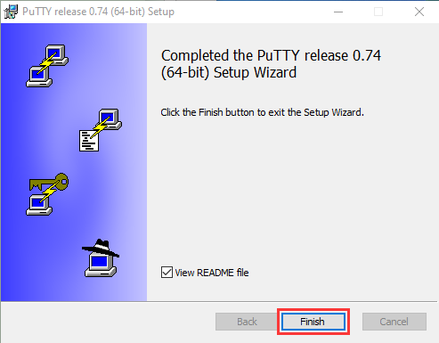

##### (2) SSH Remote Login software -WinSCP

Download Link: [https://winscp.net/eng/download.php](https://winscp.net/eng/download.php)

1). After downloading the package file , click .
    

    
2). Click “Accept”.


3). Follow the below steps to finish the installation.


##### (3) SD Card Formatter

Format TFT card tool, download SD Card Formatter :

[http://www.canadiancontent.net/tech/download/SD\_Card\_Formatter.html](http://www.canadiancontent.net/tech/download/SD_Card_Formatter.html)


1). Unzip the SDCardFormatterv5\_WinEN package, double-click to run it.
    
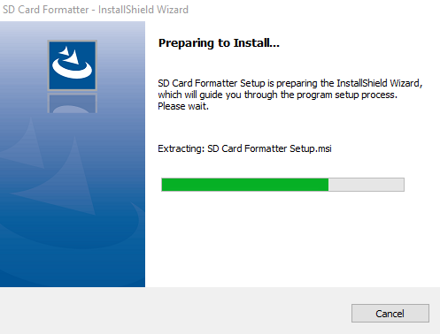
    

2). Click“Next”and choose  , then tap“Next” .


    
3). Click “Next” and “Install”.
    

    


4). After a few seconds, click "Finish".
    


##### (4) Burn Win32DiskImager 

Download Link：[https://sourceforge.net/projects/win32diskimager/](https://sourceforge.net/projects/win32diskimager/)


a. After the download, double-click and tap“Run”.


b. Select  and tap“Next”.


c. Click “Browse...”and find out the folder where the Win32DiskImager is located, tap “Next”. 

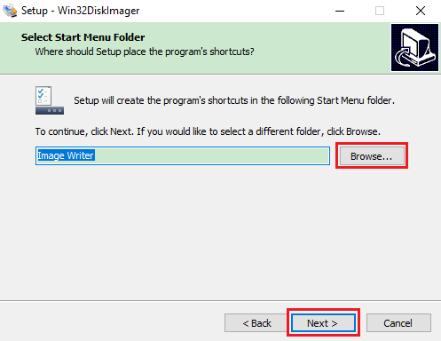

d. Tick  , click “Next” and “Install”.


e. After a few seconds, click“Finish”. The installation is finished. 

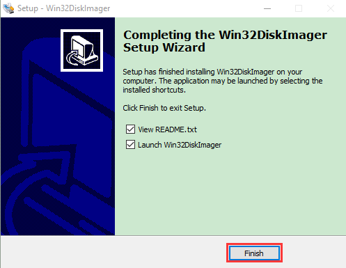

##### (5) Scan for IP address software tool---WNetWatcher
    
Download Link：[http://www.nirsoft.net/utils/wnetwatcher.zip](http://www.nirsoft.net/utils/wnetwatcher.zip)
        
##### (6) Raspberry Pi Imager

Download link for **the latest version**:

[https://www.raspberrypi.org/downloads/raspberry-pi-os/](https://www.raspberrypi.org/downloads/raspberry-pi-os/)

**Old version**：

Raspbian：[https://downloads.raspberrypi.org/raspbian/images/](https://downloads.raspberrypi.org/raspbian/images/)

Raspbian full：[https://downloads.raspberrypi.org/raspbian_full/images/](https://downloads.raspberrypi.org/raspbian_full/images/)

Raspbian lite：[https://downloads.raspberrypi.org/raspbian_lite/images/](https://downloads.raspberrypi.org/raspbian_lite/images/)

We use the 2020.05.28 version in the tutorial and recommend you to use this version

(Please download this version as shown in the picture below.)

[https://downloads.raspberrypi.org/raspios_full_armhf/images/raspios_full_armhf-2021-05-28/](https://downloads.raspberrypi.org/raspios_full_armhf/images/raspios_full_armhf-2021-05-28/)


### 1.2. Install Raspberry Pi OS on Raspberry Pi 4B

#### 1.2.1. Connect the TFT memory card to a card reader, then plug the card reader into a computer’s USB port.


#### 1.2.2. Use the SD Card Formatter to format a TFT memory card, as illustrated below：


#### 1.2.3. Burn System:

（1）Use **Win32DiskImager** to burn the official **Raspberry Pi OS** mirror to the TFT memory card.


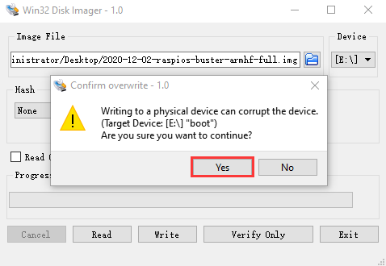


（2）After the mirror system is burned, don’t pull out the card reader, use a notepad to create a file named **SSH** and delete **.txt** , then copy it to the boot directory of the TFT card, so that you can open the SSH login function, as shown in the following figure:


（3） Pull out the card reader.

#### 1.2.4. Log in system:

（<span style="color: rgb(255, 76, 65);">The following operations require raspberry to share the same LOCAL area network with the PC</span>）

A. Insert the burned TFT memory card into the Raspberry Pi, connect internet cables and plug in power. If there is a screen and a HDMI cable of Raspberry Pi, connect the screen, and you can see the Raspberry Pi OS startup screen. If there is not a HDMI cable of Raspberry Pi, you can enter the desktop of Raspberry Pi via SSH remote login software---WinSCP and xrdp.


B. Use the WNetWatcher software to find the IP address of the Raspberry Pi.


C. If there is no IP address as shown in the figure above, follow the following steps to set it.


D. Once the setup is complete, record the IP and MAC addresses of the Raspberry Pi. As shown in the red box below, the MAC address of the Raspberry Pi is **b8:27:eb:17:16:01**, and the ip address is **192.168.0.57**. 


E. If you do not know the mac address and the ip address of the Raspberry Pi, then unplug the network cable of the Raspberry PI first, open the **WNetWatcher** query, and the detection times will be displayed on the right side of the interface. Connect the Raspberry Pi cable and query it once using **WNetWatcher**, and the Raspberry Pi address is detected one less time than the other addresses. Then write down the ip and mac addresses.

#### 1.2.5. Remote login

Enter default user name, password and host name on WinSCP to log in. Only a Raspberry Pi is connected in the same network.


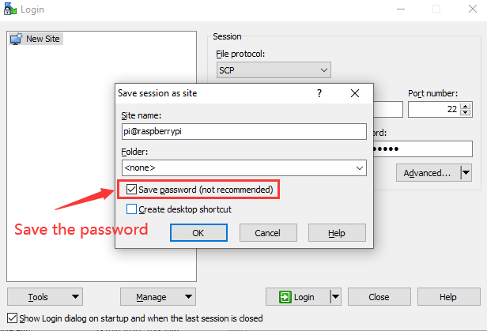


#### 1.2.6. View the ip address and mac address


Click to open terminal and input the password: <span style="color: rgb(255, 76, 65);">raspberry</span>, and tap“**Enter**”on keyboard.


After successfully login, open the terminal, input <span style="color: rgb(255, 76, 65);">ip a</span> and tap“**Enter**”keyboard to view the ip address and mac address.


#### 1.2.7. Fix the IP address of Raspberry Pi

IP address is changeable, therefore, we need to make IP address fixed for convenient use.

Follow the below steps:

Switch to root user

If without root user’s password

① Set root password

Input password in the terminal: **sudo passwd root** to set password.

② Switch to root user

Input **su root**

③ Fix the configuration file of IP address

Firstly change IP address of the following configuration file.

（<span style="color: rgb(255, 76, 65);">\#New IP address:：address 192.168.0.57</span>）

Copy the above new address to terminal and tap“**Enter**”keyboard.

**Configuration File:**

```
echo -e '

auto eth0

iface eth0 inet static

\#Change IP address

address 192.168.0.57

netmask 255.255.255.0

gateway 192.168.1.1

network 192.168.1.0

broadcast 192.168.1.255

dns-domain 119.29.29.29

dns-nameservers 119.29.29.29

metric 0

mtu 1492

'\>/etc/network/interfaces.d/eth0
```
Example operation diagram, as follows：


④ Reboot the system to activate the configuration file.

Input the restart command in the terminal: **sudo reboot**

You could log in via fixed IP afterwards.

⑤ Check IP to ensure IP address fixed well.


#### 1.2.8. Log in desktop on Raspberry Pi wirelessly

If we don't have an HDMI cable to connect to the display, can we wirelessly log in to the Raspberry Pi desktop from the Windows desktop? Yes, there are many methods, VNC and Xrdp are commonly used to log in desktop of Raspberry Pi wirelessly.

Let’s take an example of Xrdp.

①Install Xrdp Service in the terminal

Installation commands:

Switch to root User: <span style="color: rgb(255, 76, 65);">su root</span>

Installation commands: <span style="color: rgb(255, 76, 65);">apt-get install xrdp</span>

Enter y and tap“**Enter**”keyboard.

As shown below:


Open the remote desktop connection on Windows

Press **WIN+R** on keyboard and enter **mstsc.exe**.

As shown below:


Enter the IP address of the Raspberry Pi, as shown below. Click “Connect” and then click “Connect”again. **192.168.0.57** is the ip address we use, you could change it into your IP address.


A prompt will appear and you can click “Yes”.


Then enter the user name: <span style="color: rgb(255, 76, 65);">pi</span> ,and the default password: <span style="color: rgb(255, 76, 65);">raspberry</span>, as shown below:


Click“OK”or tap“Enter”keyboard, you will view the desktop of Raspberry Pi OS, as shown below:


Now, we finish the basic configuration of the Raspberry Pi OS system.

### 1.3. Preparations for Python

Python is a programming language that lets you work more quickly and integrate your systems more effectively.

Python is an interpreted, high-level and general-purpose programming language. Python's design philosophy emphasizes code readability with its notable use of significant whitespace. Its language constructs and object-oriented approach aim to help programmers write clear, logical code for small and large-scale projects.

Next to pick up Python to control 40 pin of Raspberry Pi.

#### 1.3.1. Hardware：

| **Raspberry Pi 4B**     | **Raspberry Pi 4B Model** |
| :---------------------: | :-----------------------: |
|  |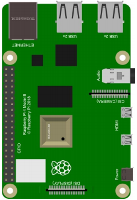|

**Hardware Interfaces：**


**40-Pin GPIO Header Description：**

GPIO pins are divided into BCM GPIO number, physics number and WiringPi GPIO number.

We usually use WiringPi GPIO when using C language and BCM GPIO and physics number are used to Python, as shown below;

In these lessons, we use Python, so BCM GPIO number is adopted.


Note: pin(3.3 V) on the left hand is square, but other pins are round. Turn Raspberry Pi over, there is a square GPIO on the back.(you could tell from pin(3.3V).


<span style="color: rgb(255, 76, 65);">Note:</span> the largest current of each pin on Raspberry Pi 4B is 16mA and the aggregate current of all pins is not less than 51mA.

#### 1.3.2. Copy Example Code Folder to Raspberry Pi：

Place example code folder to the pi folder of Raspberry Pi. and extract the example code from “<span style="color: rgb(255, 76, 65);">**Python_Codes(Raspberry-Pi).zip**</span>” file, as shown below:


Double-click “<span style="color: rgb(255, 76, 65);">**Python_Codes(Raspberry-Pi)**</span>” to check <span style="color: rgb(255, 76, 65);">.py</span> files.

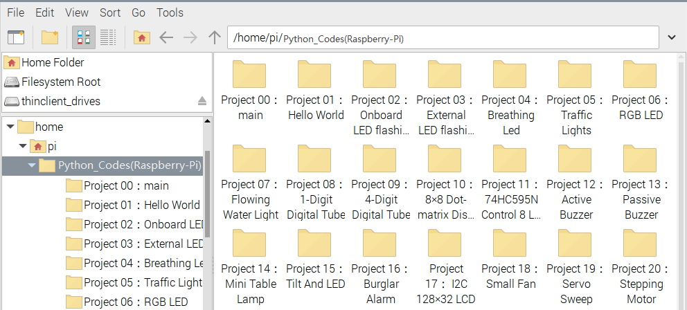


####  1.3.3. Micropython firmware and Thonny

##### (1) Update the firmware of Micropython

If you want to run the MicroPython on the Pi Pico board, you need to upload a firmware to the pico board.

You can program via C language or MicroPython on the pico board. But you need to download the MicroPython firmware.

<span style="color: rgb(255, 76, 65);">Note: </span>

MicroPython firmware is required to be downloaded once. You don’t need to download it again when programming with MicroPython. 

If you have downloaded the .uf2 program firmware written in C language, the MicroPython firmware will be overwritten, so next time you use MicroPython, you need to follow the steps below to update the Raspberry Pi Pico's firmware.

**Download the firmward of Micropython**

<span style="color: rgb(255, 76, 65);">Method 1:</span> 

Click to enter the website：[https://www.raspberrypi.com/documentation/microcontrollers/](https://www.raspberrypi.com/documentation/microcontrollers/)


Click “**MicroPython(**Getting started MicroPython**)**” to go to the firmware download page.


<span style="color: rgb(255, 76, 65);">Method 2:</span>

Clickto open the browser，click [https://micropython.org/download/rp2-pico/rp2-pico-latest.uf2](https://micropython.org/download/rp2-pico/rp2-pico-latest.uf2) to download the firmware.

<span style="color: rgb(255, 76, 65);">**Note：** transfer the firmware（rp2-pico-20210902-v1.17.uf2）to the desktop of Raspberry pi imager.</span>


##### (2) Program the firmware of MicroPython

Hold down **BOOTSEL** , connect a microUSB cable to the USB port of the pico board.


Release the button, then there pops up a page.

Enter “**raspberry**” in the Password box, click “**OK**”.


The drive **RPI-RP2** will appear on the desktop of the Raspberry Pi imager.


<span style="color: rgb(255, 76, 65);">Note：</span>

The latest Raspberry Pi mirroring system will not display the above dialog box, but the old version will display the above dialog box.

<br>
<br>

Click “**OK**” and open “**drive(RPI-RP2)**”. Copy or drag the file（**rp2-pico-20210902-v1.17.uf2**）to the RPI-RP2.


After the firmware is programmed, the Pico board will reboot. Then you can run Micropython.

**Serial Ports**

The MicroPython firmware is equipped with a virtual USB serial port which is accessed through the micro USB connector on Raspberry Pi Pico.

Your computer should notice this serial port and list it as a character device, most likely **/dev/ttyACM0**.

You can run **ls /dev/tty\*** to list your serial ports. There may be quite a few, but MicroPython’s USB serial will start with **/dev/ttyACM**. If in doubt, unplug the micro USB connector and see which one disappears. If you don’t see anything, you can try rebooting your Raspberry Pi.

Enter the following command to install minicom:

<span style="color: rgb(0, 209, 0);">sudo apt install minicom</span>

<br>
<br>


Select **Y** .


Enter the following commander, press **Enter** and open minicom

<span style="color: rgb(0, 209, 0);">minicom -o -D /dev/ttyACM0</span>

<br>
<br>

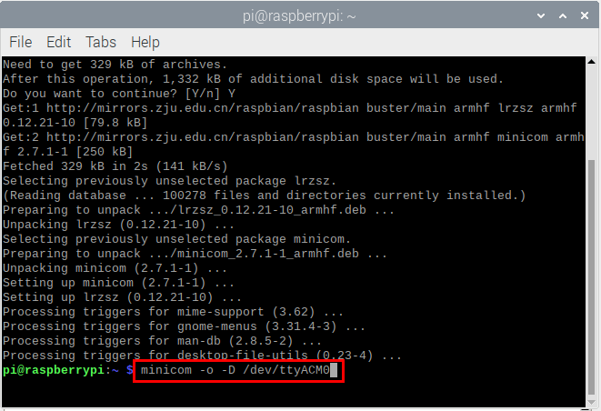


Press **Ctrl + B** .

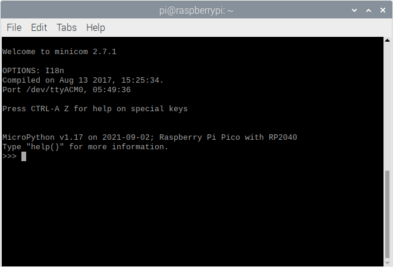

Enter print("Hello World") at the terminal and press **Enter**，then **Hello World** will be displayed.


##### (3) Install Thonny

The Raspberry Pi Imager that we downloaded comes with some commonly used software, and Thonny is among them.


If the Raspberry Pi Imager does not have Thonny, you need to manually download it yourself. Enter the following command in the terminal to download and install Thonny.

<span style="color: rgb(255, 169, 0);">sudo apt install thonny</span>

<br>
<br>


Open Thonny, click“**Switch to regular mode**”to switch modes, and click OK to reopen the Thonny.


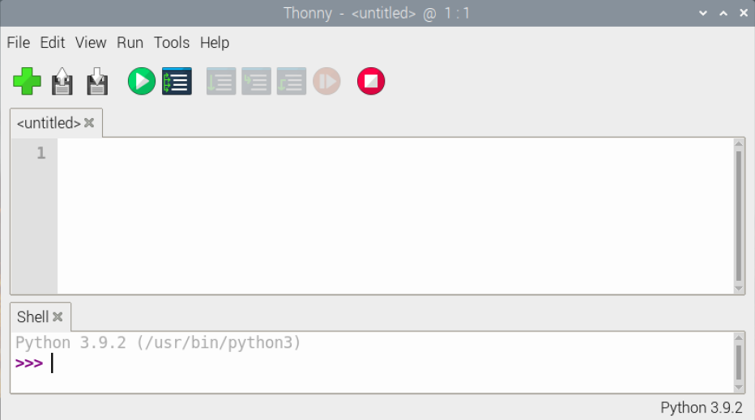

**Connect the Raspberry Pi Pico on the Thonny**

Click “**Python3.9.2**” and select “**MicroPython(Raspberry Pi Pico)**”.


Click “**Tools**” → “**Options...**”.


Select “**Micropython (generic)**” or “**Micropython (Raspberry Pi Pico)**”. How to choose Micropython(Raspberry Pi Pico)? As shown below;

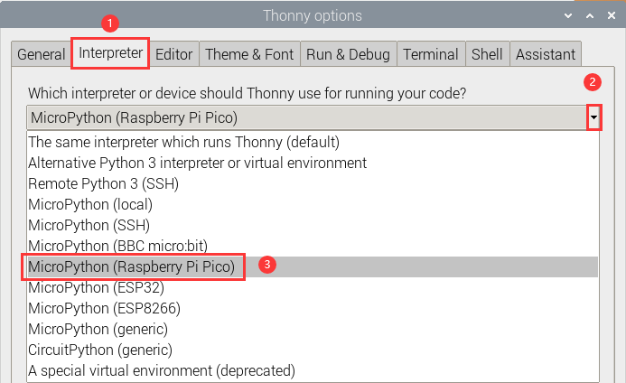

Click “**Port**” to **select corresponding port** and click "**OK**".

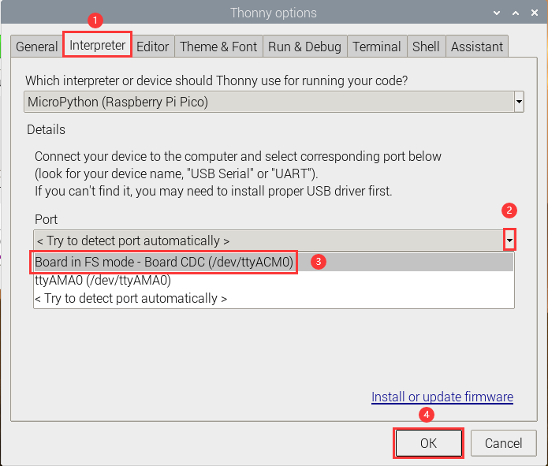


Click “**View**” → “**Files**”, then “**This computer**” and “**Raspberry Pi Pico**” will appear.


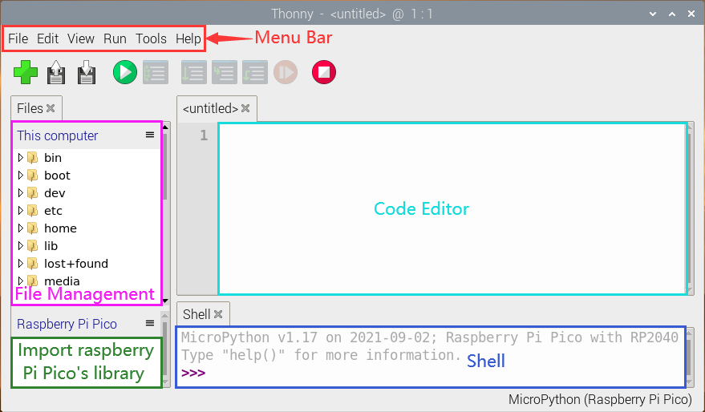


### 1.4. Test Code

<span style="color: rgb(255, 169, 0);">Test the Shell commander</span>

<br>
<br>

Enter “**print(Hello World\!)**” in the Shell and press “**Enter**”.


#### Online running：

To run Raspberry Pi Pico online, we need to connect the Raspberry Pi Pico to our computer, which allows us to compile or debug programs using Thonny software.  

**Advantages**: you can compile or debug programs using Thonny software.  

Through the "**Shell**" window, we can view the error information and output results generated during the operation of the program, and query related function information online to help improve the program.  

**Disadvantages**: To run Raspberry Pi Pico online, you must connect Raspberry Pi Pico to a computer and run it with Thonny software.  

If the Raspberry Pi Pico is disconnected from the computer, when they reconnect, the program won't run again.  

<span style="color: rgb(255, 76, 65);">basic operation:</span>

<br>

Open Thonny and click “**Open...**”.


Click“**This computer**”.


Enter "<span style="color: rgb(255, 76, 65);">.../home/pi/Python_Codes(Raspberry-Pi)/Project 01: Hello World</span>" to select **Project\_01\_HelloWorld.py** and click **OK**.


Click “Run current script to program **Hello World\!**, "**Welcome Keyestudio**" will be displayed on the **Shell**.


**Exit online**

When running online, click “**Stop /Restart Backend**” on Thonny to exit the program.  


#### Offline running:

When running offline, the Raspberry Pi Pico doesn't need to connect to a computer and Thonny. Once powered up, it can run the main.pyprogram stored in the Raspberry Pi Pico.  

**Pros**: We don't need to connect a computer to Thonny's software to run the program.  

**Cons**: The program stops automatically when an error occurs or the Raspberry Pi Pico runs out of power, and the code is hard to change.

**Basic Operation:**

Once powered up, the Raspberry Pi Pico will  check for the presence of main\.py on the device automatically. If so, run the program in main\.py and go to the shell command system. (If we want the code to run offline, we can save it as main\.py); If the main\.py does not exist, go directly to the shell command system.   

Click “**File**” → “**New**”, create and write code.


Enter the code in the newly opened file. Here we use the Project\_02\_Onboard\_LED\_Flashing. Py code as an example.  

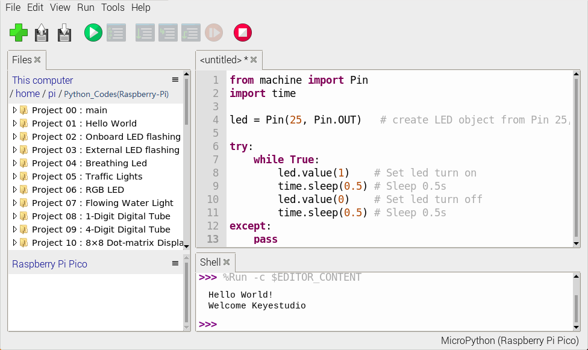

Click “**Save**” on the menu bar, we can save the code in This computer or MicroPython device.


Select “**MicroPython device**”，enter “**main\.py**”in the new pop-up window and click “**OK**”.


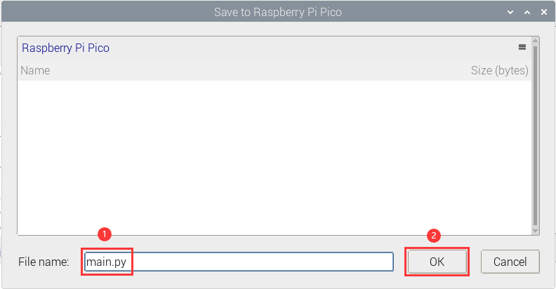


Disconnect the microUSB cable to the Raspberry Pi Pico and reconnect, and the LEDs on the Raspberry Pi Pico will  flash repeatedly. 


**Exit from Offline operation**

Connect Raspberry Pi Pico to the computer，click  “Stop/Restart backend”on Thonny to end the offline operation.  


If it does’t work, click  “Stop/Restart backend” on Thonny several times or reconnect to the Raspberry Pi Pico.


We provide a main\.py file to run offline.  The code added to main\.py is the bootstrap that executes the user code file. We just need to upload the offline project's code file (<span style="color: rgb(255, 76, 65);">.py</span>) to the "<span style="color: rgb(255, 76, 65);">MicroPython Device</span>".

Move the folder <span style="color: rgb(255, 76, 65);">**Python_Codes(Raspberry-Pi)**</span> to the folder home/pi of Raspberry Pi system and open Thonny.


Expand Project 00 : main in <span style="color: rgb(255, 169, 0);">.../home/pi/Python_Codes(Raspberry-Pi)</span> directory . Double-click "**main\.py**" to make the code in "**MicroPython Device**" run offline.  

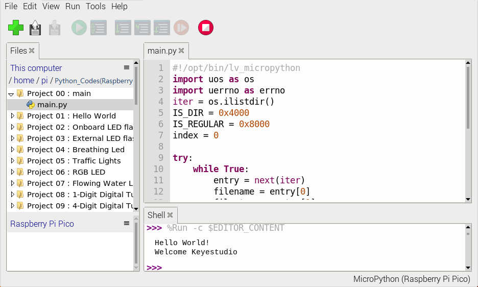

Here, we use project 00 and Project 02 cases as examples.  

The results are displayed using an LED(GP25 pin) on a Raspberry Pi Pico.  If we have modified the Project\_02\_Onboard\_LED\_Flashing. Py file, then we need to modify it accordingly. 

Right-click the Project\_02\_Onboard\_LED\_Flashing. Py file and select '**Upload to/**' to upload the code to Raspberry Pi Pico, as shown below.  


Upload the **main\.py** in the same way.


Disconnect and reconnect the microUSB cable to the Raspberry Pi Pico, and the LEDs will flash repeatedly .


<span style="color: rgb(255, 76, 65);">**Note:**</span>

The code here runs offline. If we want to stop running offline and go to "Shell", simply click "Stop/Restart Backend" on Thonny software.

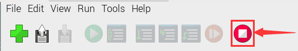


### 1.5. Thonny common operations

#### (1) Upload the code to Raspberry Pi Pico

In the Project 01：Hello World file, right-click and select Project\_01\_HelloWorld.py，select “**Upload to /**”and upload the code to the root directory of the Raspberry Pi Pico.


#### (2) Download the code to the computer

In the “**MicroPython device**”, right-click and select Project\_01\_HelloWorld.py，select “**Download to ...**” to download the code to our computer.


#### (3) Delete the files in the Raspberry Pi Pico root directory

In the “**MicroPython device**”，right-click and select Project\_01\_HelloWorld.py，select “**Delete**”，delete the Project\_01\_HelloWorld.py from the Raspberry Pi Pico root directory.


#### (4) Delete files from the computer's directory

In the Project\_01 : Hello World file, right-click and select Project\_01\_HelloWorld.py，select “**Move to Recycle Bin**”，then it can be deleted from the Project\_01\_HelloWorld file.


#### (5) Create and Save Code

Click “**File**” → “**New**” to create and compile code.


Enter code in the newly opened file, here we use Project\_02\_Onboard\_LED\_Flashing.py code as an example.


Click “**Save**”，and we can save the code to our computer or the Raspberry Pi Pico.


Select “**MicroPython device**”，enter “**main\.py**” in the new pop-up window and click“**OK**”.


We can see the code has been uploaded to the Raspberry Pi Pico.


Click “**Run current script**”, the LED on the Raspberry Pi Pico will flash periodically.


## 2. Projects：

When we get the kit, we can see that there are some sensors, modules and electronic components in the kit, which contain the corresponding Raspberry Pi Pico mainboard, Raspberry Pi Pico Expansion Board and wirings. 

<span style="color: rgb(255, 76, 65);">Note: </span>When connecting the electronic components, modules, sensor wirings in the projects, the wiring method and position must be followed in the document. What’s more, do not misconnect the power supply and signal pin, otherwise there may be no experimental results or damage to the modules/sensors. 

### Project 01: Hello World

#### 1. Introduction:

For Raspberry Pi Pico beginners, we will start with some simple things. In this project, you only need a Raspberry Pi Pico and a USB cable to complete the "Hello World!" project, which is a test of communication between Raspberry Pi Pico and the PC as well as a primary project.


#### 2. Components:

|  ||
| ------------------------------- | ---------------------- |
| Raspberry Pi Pico\*1            | USB Cable\*1           |


#### 3. Wiring Up:

In this project, we use a USB cable to connect the Raspberry Pi Pico to Raspberry Pi.


#### 4. Online running code:

Connect the pico board to the Raspberry Pi, then the Thonny can compile or debug.

**Advantages**：

1). You can use Thonny software to compile or debug programs.

2). In the "Shell" window, you can view the error information and output results generated during the running of the program, and you can query related functional information online to help improve the program.

**Disadvantages**：

1). You have to connect the pico board with the Raspberry Pi then run the Thonny.

2). If disconnecting pico board and the Raspberry Pi and rebooting them, programming may fail.


Open Thonny and click“Open...”


Then click “**This computer**”.


Select “**Project\_01\_HelloWorld.py**” and click “**OK**”.

Check the code in the folder"**...\6.Codes\Python_Codes(Raspberry-Pi)**".

You can move the code anywhere. For example, We copy the **Python_Codes(Raspberry-Pi).zip** to the <span style="color: rgb(255, 76, 65);">pi</span> folder of the Raspberry Pi system.

<span style="color: rgb(255, 76, 65);">Path: home/pi/Python_Codes(Raspberry-Pi)</span>

<br>
<br>


Click to run the code "Hello World\!". Then "Welcome Keyestudio" will be displayed on the **Shell**.


#### 5. Exit online running:

When running online，click“Stop /Restart backend”to exit


#### 6. Text Code:

```Python
print("Hello World!")
print("Welcome Keyestudio")
```

### Project 02: Onboard LED flashing

#### 1. Description：

There is an onboard LED in Raspberry Pi Pico,which is a GP25 pin attached to the Raspberry Pi Pico. In this project, we will learn the effect of making the onboard LED blink.

#### 2. Components:

|  ||
| ------------------------------- | ---------------------- |
| Raspberry Pi Pico\*1            | USB Cable\*1           |

#### 3. Wiring Up:

In this project, we use a USB cable to connect the Raspberry Pi Pico to the computer.


#### 4. Test Code:

Check the code in the folder "**...\6.Codes\Python_Codes(Raspberry-Pi)**".

You can move the code anywhere. For example, We copy the **Python_Codes(Raspberry-Pi).zip** to the <span style="color: rgb(255, 76, 65);">pi</span> folder of the Raspberry Pi system.

<span style="color: rgb(255, 76, 65);">Path: home/pi/Python_Codes(Raspberry-Pi)</span>

<br>
<br>


**Online running**

Open “Thonny”, click “This computer” → “home” → “pi” → “Python_Codes(Raspberry-Pi)” → “Project 02：Onboard LED flashing”


Go to the folder Project 02：Onboard LED flashing, double-click “Project\_02\_Onboard\_LED\_flashing.py”, as shown below;


```python
from machine import Pin
import time

led = Pin(25, Pin.OUT)   # create LED object from Pin 25, Set Pin 25 to output

try:
    while True:
        led.value(1)    # Set led turn on
        time.sleep(0.5) # Sleep 0.5s
        led.value(0)    # Set led turn off
        time.sleep(0.5) # Sleep 0.5s
except:
    pass
```

Connect the pico board to the Raspberry Pi. Click to check the Shell.

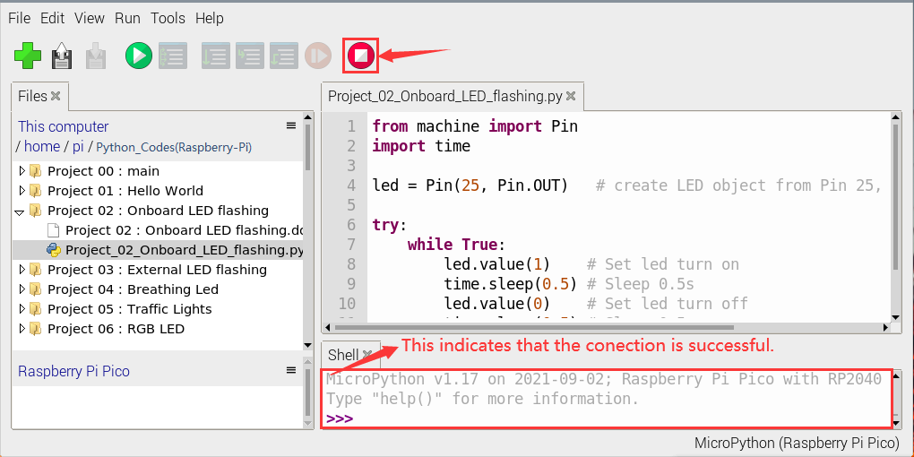

Click  to run the code. Then the LED on the pico board will flash; click to exit the program.


<span style="color: rgb(255, 169, 0);">Note:</span> This is the code that runs online.  If you disconnect the USB cable and restart Raspberry Pi Pico, the LEDS on Raspberry Pi Pico stop flashing. 

<br>
<br>

The following information will be displayed in the "Shell" window of Thonny software:  

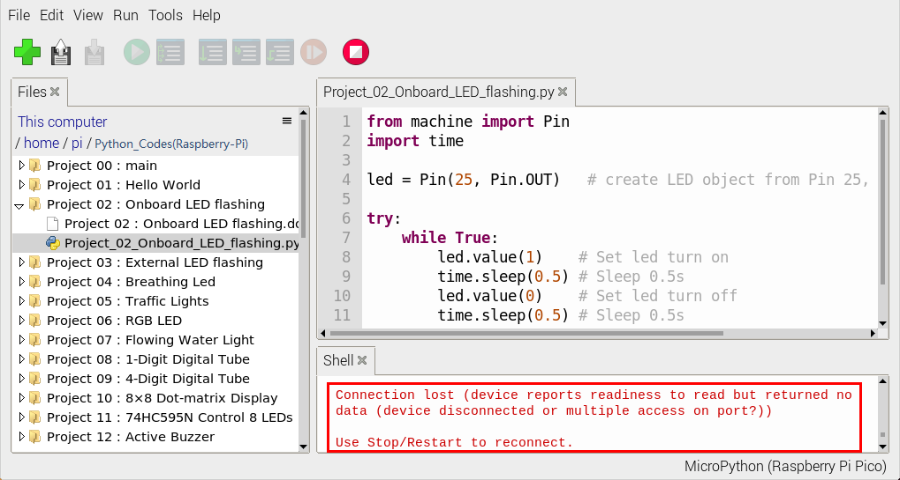

**Code to run offline** (upload code to Raspberry Pi Pico) :

Ensure that the Raspberry Pi Pico is connected to the computer and click .  


As shown in the following figure, right-click the file“Project\_02\_Onboard\_LED\_Flashing. py”and choose “**Upload to/**” to upload the code to Raspberry Pi Pico.  


Upload **main\.py** in the same way.


Disconnect the USB cable from the Raspberry Pi Pico and reconnect, and the Raspberry Pi Pico's LED flashes repeatedly.  


<span style="color: rgb(255, 76, 65);">Note:</span> The code here runs offline.  If you want to Stop running offlineand display the information in the “Shell” window, simply click in Thonny software.

<br>
<br>


### Project 03：External LED flashing 

#### 1. Introduction:

In this project, we are going to show you the external LED flashing effect.  We will use the Raspberry Pi Pico's digital pins to turn on the LED and make it flash.

#### 2. Components:

|  |  |  ||
| ------------------------------------------------------- | ------------------------------------ | ---------------------- | ---------------------- |
| Raspberry Pi Pico\*1                                    | Raspberry Pi Pico Expansion Board\*1 | Red LED\*1 | Jumper Wire\*2 |
|||| |
| 220Ω Resistor\*1                     | Breadboard\*1          | USB Cable\*1           | |

#### 3. Knowledge:

**LED:**


The LED is a kind of semiconductor called “light-emitting diode”, which is an electronic device made from semiconducting materials (silicon, selenium, germanium, etc.). It has a anode and a cathode. The short lead is cathode, which connects to GND, the long lead is anode , which connects to3.3V or 5V.


**5-band Resistor:**

A resistor is an electronic component in a circuit that restricts or regulates the flow current flow. On the left is the appearance of the resistor and on the right is the symbol for the resistance in the circuit . Its unit is(Ω). 1 mΩ= 1000 kΩ，1kΩ= 1000Ω.


We can use resistors to protect sensitive components, such as LEDs. The strength of the resistance is marked on the body of the resistor with an electronic color code. Each color code represents a number, and you can refer to it in a resistance card.

\-Color 1 – 1st Digit

\-Color 2 – 2nd Digit

\-Color 3 – 3rd Digit

\-Color 4 – Multiplier

\-Color 5 – Tolerance


In this kit, we provide three 5-band resistors with different resistance values. Take three 5-band resistors as an example.

220Ω resistor\*10


10KΩ resistor\*10


1KΩ resistor\*10


In the same voltage, there will be less current and more resistance. The connection between current, voltage, and resistance can be expressed by the formula: I=U/R. In the figure below, if the voltage is 3V, the current through R1 is: I = U / R = 3 V / 10 KΩ= 0.0003A=0.3mA.


Do not directly connect resistors with very low resistance to the two poles of the power supply, as this will cause excessive current to damage the electronic components. Resistors do not have positive and negative poles.

**Breadboard:**

A breadboard is used to build and test circuits quickly before finalizing any circuit design. The breadboard has many holes , into which circuit components like integrated circuits and resistors can be inserted. A typical breadboard is as follows.


The bread board has strips of metal, which run underneath the board and connect the holes on the top of the board. The metal strips are laid out as shown below. 

Note that the top and bottom rows of holes are connected horizontally while the remaining holes are connected vertically.


The first two rows (top) and the last two rows (bottom) of the breadboard are used for the positive (+) and negative (-) terminals of the power supply, respectively. The conductive layout of the breadboard is shown in the following diagram.


When we connect DIP (Dual In-line Packages) components, such as integrated circuits, microcontrollers, chips and so on, we can see that a groove in the middle isolates the middle part, so the top and bottom of the groove is not connected. 

DIP components can be connected as shown in the figure below:


#### 4. How to use the keyestudio raspberry pico expansion board ?

Stack the Raspberry Pi Pico on the expansionboardto use, as shown below:


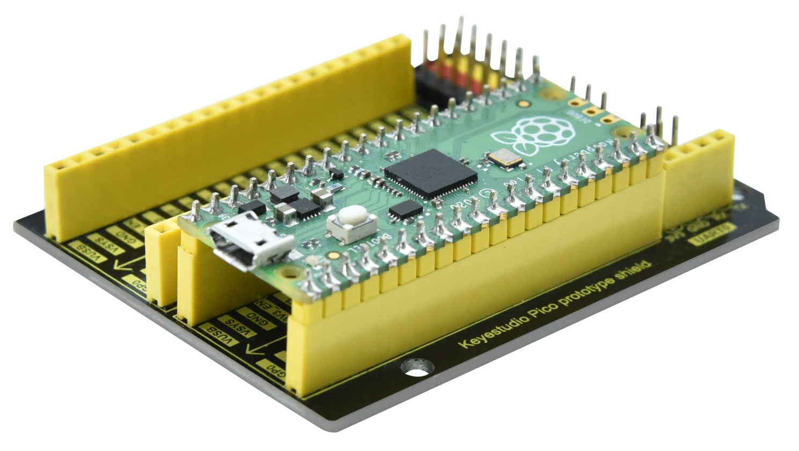

#### 5. Power Supply:

In this project, we use a USB to connect the Raspberry Pi Pico to the computer. Please refer to the documentation for connection methods: Preparation for Python


#### 6. Circuit Diagram and Wiring Diagram:

First, cut all power to the Raspberry Pi Pico.  Then build the circuit according to the circuit diagram and wiring diagram.  After the circuits are set up and verified, using a USB cable to connect the Raspberry Pi Pico to a computer .  Note: Avoid any possible short circuits (especially connecting 3.3V and GND)\!

<span style="color: rgb(255, 76, 65);">Warning:</span> A short circuit may cause a large current in the circuit, causing components to overheat and permanent damage to the hardware.


Note:

How to connect a LED


How to identify the 220Ω five-band resistor


#### 7. Test Code:

According to the circuit diagram, when the GP16 output of the Pico is high, the LED will light up; When the output power is low, the LED will light off. Therefore, we can make the LED flash repeatedly by controlling the GP16 to repeatedly output high and low levels.  

Check the code in the folder "**...\6.Codes\Python_Codes(Raspberry-Pi)**".

You can move the code anywhere. For example, We copy the **Python_Codes(Raspberry-Pi).zip** to the <span style="color: rgb(255, 76, 65);">pi</span> folder of the Raspberry Pi system.

<span style="color: rgb(255, 76, 65);">Path: home/pi/Python_Codes(Raspberry-Pi)</span>

<br>
<br>

**Code running online:**

Open “Thonny”, click “This computer” → “home” → “pi” → “Python_Codes(Raspberry-Pi)” → “Project 03：External LED flashing”.


Enter the file“Project 03：External LED flashing”, double left-click“Project\_03\_External\_LED\_flashing.py”,open it, as shown below:


```python
from machine import Pin
import time

led = Pin(16, Pin.OUT)   # create LED object from Pin 16, Set Pin 16 to output

try:
    while True:
        led.value(1)    # Set led turn on
        time.sleep(0.5) # Sleep 0.5s
        led.value(0)    # Set led turn off
        time.sleep(0.5) # Sleep 0.5s
except:
    pass
```


Connect the pico board to the Raspberry Pi. Click to check the Shell


Click  to run the code. Then the LED on the pico board will flash; click to exit the program.


<span style="color: rgb(255, 76, 65);">Note:</span> This is the code that runs online, if we disconnect the USB cable, then restart the“Raspberry Pi Pico”, the LED will stop flashing. 

<br>
<br>

The following information will be displayed in the "Shell" window of Thonny software:  


**Code running offline**（Upload the code to the Raspberry Pi Pico）：

Ensure that the Raspberry Pi Pico is connected to the computer, click“Stop/Restart backend”.


As shown below, right-click the file“Project\_03\_External\_LED\_flashing.py”，select “**Upload to /**” to upload the code to the Raspberry Pi Pico.


Upload **main\.py** in the same way.


Disconnect the USB from the Raspberry Pi Pico and reconnect, the LED in the circuit will flash repeatedly.


<span style="color: rgb(255, 76, 65);">Note:</span> The code here runs offline. If you want to stop and display the information in the Shell window, simply click“Stop/Restart backend” in Thonny software.

<br>
<br>

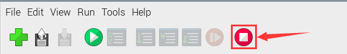


### Project 04: Breathing Led

#### 1. Introduction:

In previous studies, we know that LEDS have on/off state, so how to enter the intermediate state? How to output an intermediate state to make the LED "half bright"? That's what we're going to learn. Breathing lights, or LEDS turn on and off again, which are like "breathing". 

So, how to control the brightness of LEDS? We will use the Raspberry Pi Pico PWM to achieve this goal.  


#### 2. Components:

|  | 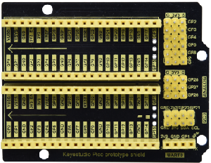 |  | |
| ------------------------------------------------------- | ------------------------------------ | ---------------------- | ---------------------- |
| Raspberry Pi Pico\*1                                    | Raspberry Pi Pico Expansion Board\*1 | Breadboard\*1 |     USB Cable\*1         |
|  |||  |
| Red LED\*1                                              | 220Ω Resistance\*1                   | Jumper Wire\*2         |            |

#### 3. Knowledge:


**Analog & Digital**

Analog signals are continuous signals in both time and value. By contrast, a digital or discrete time signal is a time series consisting of a series of numbers. 

Most signals in life are analog signals. A familiar example of an analog signal is how temperatures change continuously throughout the day, rather than suddenly changing from 0 to 10 in a flash. However, the value of a digital signal can change instantaneously. 

This change is represented numerically as 1 and 0(the basis of binary code). It's easier to see the difference, as shown below:


In practical applications, we often use a binary as a digital signal, which are a series of 0 and 1. Since binary signals have only two values (0 or 1), they have great stability and reliability. 

Finally, analog and digital signals can be converted to each other. 

**PWM：**

Pulse Width Modulation (PWM) is an effective method to control analog circuit by digital signal. 

Ordinary processors cannot directly output analog signals. The PWM makes this conversion (convert digital signal to analog signal) very convenient, which uses digital pins to send square waves at a certain frequency, which is high and low output to alternate for a period of time. 

The total time of each set of high and low levels is generally fixed, which is called the period (Note: the reciprocal of the period is the frequency). The time of the high level output is usually called pulse width, and the duty cycle is the percentage of the pulse width (PW) to the total period (T) of the waveform. The longer the duration of the high level output as well as the duty cycle is, the higher the corresponding voltage in the analog signal will be. 

The figure below shows the variation of analog signal voltage from 0V to 3.3V(high level is 3.3V) corresponding to pulse width of 0% to 100%.  


We all know that the longer the PWM duty cycle is, the higher the output power will be. Therefore, we can use PWM to control the brightness of LEDS or the speed of dc motors and so on. 

As can be seen from the above, the PWM is not a real analog signal, and the effective value of the voltage is equal to the corresponding analog signal. 

Therefore, we can control the output power of LEDS and other output modules to achieve different effects.

**Raspberry Pi Pico and PWM**

The Raspberry Pi Pico has 16 PWM channels, each of which can control frequency and duty cycle independently. The clock frequency ranges from 7Hz to 125MHz.  Each pin on the Raspberry Pi Pico can be configured for PWM output.  


#### 4. Circuit Diagram and Wiring Diagram:


**Note:**

How to connect the LED


How to identify the 220Ω 5-band resistor


#### 5. Test Code:

The design of this project makes the GP16 output PWM, and the pulse width gradually increases from 0% to 100%, and then gradually decreases from 100% to 0%.  

Check the code in the folder "**...\6.Codes\Python_Codes(Raspberry-Pi)**".

You can move the code anywhere. We copy the **Python_Codes(Raspberry-Pi).zip** to the <span style="color: rgb(255, 76, 65);">pi</span> folder of the Raspberry Pi system.

<span style="color: rgb(255, 76, 65);">Path: home/pi/Python_Codes(Raspberry-Pi)</span>

<br>
<br>


Open “Thonny”, click “This computer” → “home” → “pi” → “Python_Codes(Raspberry-Pi)” → ”Project 04: Breathing Led”. And double-click “Project\_04\_Breathing\_Led.py”.


```python
#MicroPython implementation of raspberry PI Pico board LED breathing lamp program example
import time
from machine import Pin,PWM
PWM_PulseWidth=0
#Using external LED, build PWM object PWM LED
pwm_LED=PWM(Pin(16))
#Set the PWM LED frequency
pwm_LED.freq(500)
while True:
    while PWM_PulseWidth<65535:
        PWM_PulseWidth=PWM_PulseWidth+50
        time.sleep_ms(1)   #Delay 1 ms 
        pwm_LED.duty_u16(PWM_PulseWidth)
    while PWM_PulseWidth>0:
        PWM_PulseWidth=PWM_PulseWidth-50
        time.sleep_ms(1)
        pwm_LED.duty_u16(PWM_PulseWidth)
```


#### 6. Test Result：

Connect the pico board to the Raspberry Pi. Clickto check the Shell


Click  to run the code. Then the LED on the picoboard will flash; click to exit the program.


### Project 05：Traffic Lights

#### 1. Introduction:

Traffic lights are closely related to people's daily lives, which generally show red, yellow, and green. Everyone should obey the traffic rules, which can avoid many traffic accidents. In this project, we will use Raspberry Pi Pico and some LEDs (red, green and yellow) to simulate the traffic lights.

#### 2. Components Required:

|  |               |  |
| ------------------------------------- | ----------------------------------- | ---------------------- |
| Raspberry Pi Pico*1                   | Raspberry Pi Pico Expansion Board*1 | Breadboard*1           |
|                 |               |  |
| Red LED*1                             | Yellow LED*1                        | Green LED*1            |
|                 |               | 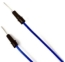 |
| USB Cable*1                           | 220ΩResistor*3                      | Jumper Wires           |


#### 3. Circuit Diagram and Wiring Diagram:


Note:

How to connect an LED


How to identify the 220Ω 5-band resistor


#### 4. Test Code:

Check the code in the folder "**...\6.Codes\Python_Codes(Raspberry-Pi)**".

You can move the code anywhere. For example, We copy the **Python_Codes(Raspberry-Pi).zip** to the <span style="color: rgb(255, 76, 65);">pi</span> folder of the Raspberry Pi system.

<span style="color: rgb(255, 76, 65);">Path: home/pi/Python_Codes(Raspberry-Pi)</span>

<br>
<br>


Open “Thonny”, click “This computer” → “home” → “pi” → “Python_Codes(Raspberry-Pi)” → "Project 05: Traffic Lights”. And double-click “Project\_05\_Traffic\_Lights.py”.

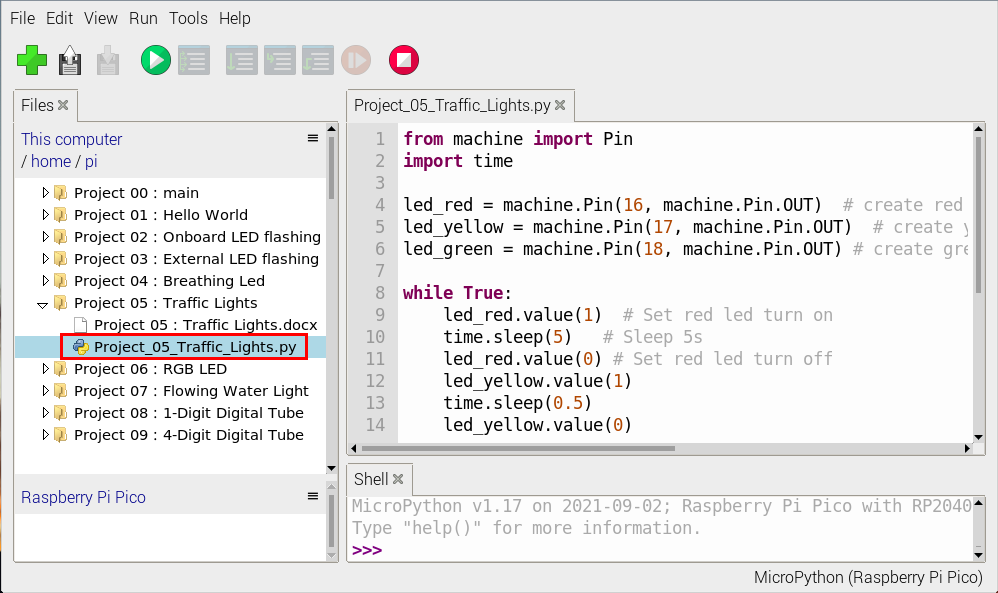

```python
from machine import Pin
import time

led_red = machine.Pin(16, machine.Pin.OUT)  # create red led object from Pin 16, Set Pin 16 to output
led_yellow = machine.Pin(17, machine.Pin.OUT)  # create yellow led object from Pin 17, Set Pin 17 to output
led_green = machine.Pin(18, machine.Pin.OUT) # create green led object from Pin 18, Set Pin 18 to output

while True:
    led_red.value(1)  # Set red led turn on
    time.sleep(5)   # Sleep 5s
    led_red.value(0) # Set red led turn off 
    led_yellow.value(1)
    time.sleep(0.5)
    led_yellow.value(0)
    time.sleep(0.5)
    led_yellow.value(1)
    time.sleep(0.5)
    led_yellow.value(0)
    time.sleep(0.5)
    led_yellow.value(1)
    time.sleep(0.5)
    led_yellow.value(0)
    time.sleep(0.5)
    led_green.value(1)
    time.sleep(5) 
    led_green.value(0) 
```


#### 5. Test Result：

Connect the pico board to the Raspberry Pi. Clickto check the Shell


Click“”, the code starts executing, what we will see are below:

1). First, the green light will be on for 5 seconds and then off; 

2). Next, the yellow light blinks three times and then goes off. 

3). Then, the red light goes on for five seconds and then goes off. 
    

Repeat steps 1 to 3 above and press“Ctrl+C”or click“” to exit the program.


### Project 06: RGB LED

#### 1. Introduction:


RGB LEDS are made up of three colors (red, green, and blue) , which can emit different colors by mixing these three basic colors. 

In this project, we will introduce the RGB LED and show you how to use the Raspberry Pi Pico to control the RGB LED. Even though RGB LED is very basic, it is also a great way to learn the fundamentals of electronics and coding.

#### 2. Components Required:

|  |  ||  |
| ------------------------------------------------------- | ------------------------------------ | ------------------------------- | ---------------------- |
| Raspberry Pi Pico\*1                                    | Raspberry Pi Pico Expansion Board\*1 | RGB LED\*1                      |  USB Cable\*1            |
|  |||  |
| 220ΩResistor\*3                                         | Breadboard\*1                        | Jumper Wires                    |        |


#### 3. Component Knowledge:

The monitors mostly adopt the RGB color standard, and all the colors on the computer screen are composed of the three colors of red, green and blue mixed in different proportions.


This RGB LED has 4 pins and a common cathode. To change its brightness, we can use the PWM of the Raspberry Pi Pico pins, which can give different duty cycle signals to the RGB LED to produce different colors.

If we use three 10-bit PWM to control the RGBLED, theoretically we can create  = 1,073,741,824(1 billion) colors through different combinations.


#### 4. Circuit Diagram and Wiring Diagram:


**Note:**

RGB LED longest pin (common cathode) connected to GND.


How to identify the 220Ω 5-band resistor


#### 5. Test Code:

Check the code in the folder "**...\6.Codes\Python_Codes(Raspberry-Pi)**".

You can move the code anywhere. For example, We copy the **Python_Codes(Raspberry-Pi).zip** to the <span style="color: rgb(255, 76, 65);">pi</span> folder of the Raspberry Pi system.

<span style="color: rgb(255, 76, 65);">Path: home/pi/Python_Codes(Raspberry-Pi)</span>

<br>
<br>


Open “Thonny”, click “This computer” → “home” → “pi” → “Python_Codes(Raspberry-Pi)” → “Project 06：RGB LED” and double left-click the “Project\_06\_RGB\_LED.py”.


```python
# import Pin, PWM and Random function modules.
from machine import Pin, PWM
from random import randint
import time

#configure ouput mode of GP18, GP17 and GP16 as PWM output and PWM frequency as 10000Hz.
pins = [18, 17, 16]
freq_num = 10000

pwm0 = PWM(Pin(pins[0]))  #set PWM
pwm1 = PWM(Pin(pins[1]))
pwm2 = PWM(Pin(pins[2]))
pwm0.freq(freq_num)
pwm1.freq(freq_num)
pwm2.freq(freq_num)

#define a function to set the color of RGBLED.
def setColor(r, g, b):
    pwm0.duty_u16(65535 - r)
    pwm1.duty_u16(65535 - g)
    pwm2.duty_u16(65535 - b)
    
try:
    while True:
        red   = randint(0, 65535) 
        green = randint(0, 65535)
        blue  = randint(0, 65535)
        setColor(red, green, blue)
        time.sleep_ms(200)
except:
    pwm0.deinit()
    pwm1.deinit()
    pwm2.deinit() 
```


#### 6. Test Result:

Ensure that the Raspberry Pi Pico is connected to the computer, click “Stop/Restart backend”.


Click “Run current script”, the code starts executing, we will see that RGB LED starts showing random colors.

Press“Ctrl+C”or click“Stop/Restart backend”to exit the program.


### Project 07: Flowing Water Light

#### 1. Introduction:

In our daily life, we can see many billboards made up of different colors of LED. 

They constantly change the light to attract the attention of customers. In this project, we will use Raspberry Pi Pico to control 10 LEDs to achieve the effect of flowing water.

#### 2. Components Required:

|  |              |  |         |
| ----------------------- | ----------------------------------- | ----------------------- | ----------------------- |
| Raspberry Pi Pico*1     | Raspberry Pi Pico Expansion Board*1 | Red LED*10              | USB Cable*1       |
|  |   |  |   |
| 220ΩResistor*10         | Breadboard*1                        | Jumper Wires            |     |


#### 3. Circuit Diagram and Wiring Diagram:


**Note:**

How to connect the LED


How to identify the 220Ω 5-band resistor


#### 4. Test Code:

This project is to design and manufacture a flowing water light.  

Here are the steps: 

1). turn on LED \#1, then turn it off.  
2). turn on LED \#2, then turn off... . Do the same for the 10 LEDs until the last one is turned off.  
3). repeating the process to achieve the "movement" of the water.

Check the code in the folder "**...\6.Codes\Python_Codes(Raspberry-Pi)**".

You can move the code anywhere. For example, We copy the **Python_Codes(Raspberry-Pi).zip** to the <span style="color: rgb(255, 76, 65);">pi</span> folder of the Raspberry Pi system.

<span style="color: rgb(255, 76, 65);">Path: home/pi/Python_Codes(Raspberry-Pi)</span>

<br>
<br>


Open “Thonny”, click “This computer” → “home” → “pi” → “Python_Codes(Raspberry-Pi)” → ”Project 07：Flowing Water Light” and double-click “Project\_07\_Flowing\_Water\_Light.py”。


```python
from machine import Pin
import time

#Use an array to define 10 GPIO ports connected to LED Bar Graph for easier operation.
pins = [16, 17, 18, 19, 20, 21, 22, 26, 27, 28]
#Use two for loops to turn on LEDs separately from left to right and then back from right to left
def showLed():
    for pin in pins:
        print(pin)
        led = Pin(pin, Pin.OUT)
        led.value(1)
        time.sleep_ms(100)
        led.value(0)
        time.sleep_ms(100)        
    for pin in reversed(pins):
        print(pin)
        led = Pin(pin, Pin.OUT)
        led.value(1)
        time.sleep_ms(100)
        led.value(0)
        time.sleep_ms(100)
          
while True:
    showLed()
```


#### 5. Test Result：

Connect the pico board to the Raspberry Pi. Click to check the Shell


Click “Run current script”, the code starts executing, we will see that the 10 LEDs will light up like a flowing light. 

Click “Stop/Restart backend”to exit the program.


### Project 08: 1-Digit Digital Tube

#### 1. Introduction:

The seven-segment digital tube is an electronic display device that displays decimal numbers. It is widely used in digital clocks, electronic meters, basic calculators and other electronic devices that display digital information. 

The tubes are an alternative to more complex dot-matrix displays that are easy to use in both limited light conditions and strong sunlight. 

In this project, we will use the Raspberry Pi Pico to control 1-digit digital tube to display numbers.


#### 2. Components Required:

|  |              |  |     |
| ----------------------- | ----------------------------------- | ----------------------- | ----------------------- |
| Raspberry Pi Pico*1     | Raspberry Pi Pico Expansion Board*1 | 1-digit Digital Tube*1  |  USB Cable*1     |
|  |      |  |   |
| 220ΩResistor*8          | Breadboard*1                        | BreadboardWires         |             |


#### 3. Component Knowledge:


**Display principle:** 

The digital tube display is a semiconductor light-emitting device.  Its basic unit is a light-emitting diode (LED). The digital tube display can be divided into 7-segment digital tube and 8-segment digital tube according to the number of segments. The 8-segment digital tube has one more LED unit than the 7-segment digital tube (used for decimal point display). Each segment of the 7-segment LED display is a separate LED. According to the connection mode of the LED unit, the digital tube can be divided into a common anode digital tube and a common cathode digital tube.

In the common cathode 7-segment digital tube, all the cathodes (or negative electrodes) of the segmented LEDs are connected together, so you should connect the common cathode to GND. To light up a segmented LED, you can set its associated pin to “HIGH”.

In the common anode 7-segment digital tube, the LED anodes (positive electrodes) of all segments are connected together, so you should connect the common anode to “+5V”. To light up a segmented LED, you can set its associated pin to “LOW”.


Each part of the digital tube is composed of an LED. So when you use it, you also need to use a current limiting resistor. Otherwise, the LED will be damaged. 

In this experiment, we use an ordinary common cathode one-bit digital tube. As we mentioned above, you should connect the common cathode to GND. To light up a segmented LED, you can set its associated pin to “HIGH”.


#### 4. Circuit Diagram and Wiring Diagram:

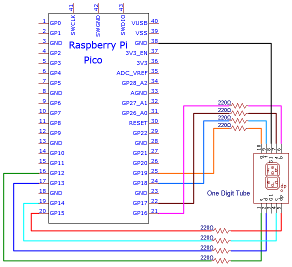

**Note:** 

The direction of the 7-segment digital tube inserted into the breadboard is the same as the wiring diagram, and there is one more point in the lower right corner.


#### 5. Test Code:

The digital display is divided into 7 segments, and the decimal point display is divided into 1 segment. When certain numbers are displayed, the corresponding segment will be illuminated. For example, when the number 1 is displayed, segments b and c will be opened.

Check the code in the folder "**...\6.Codes\Python_Codes(Raspberry-Pi)**".

You can move the code anywhere. For example, We copy the **Python_Codes(Raspberry-Pi).zip** to the <span style="color: rgb(255, 76, 65);">pi</span> folder of the Raspberry Pi system.

<span style="color: rgb(255, 76, 65);">Path: home/pi/Python_Codes(Raspberry-Pi)</span>

<br>
<br>


Open “Thonny”, click “This computer” → “home” → “pi” → “Python_Codes(Raspberry-Pi)” → ”Project 08：1-Digit Digital Tube” and double-click “Project\_08\_One\_Digit\_Digital\_Tube.py”.


```python
from machine import Pin
import time

a = machine.Pin(17, machine.Pin.OUT)
b = machine.Pin(16, machine.Pin.OUT)
c = machine.Pin(14, machine.Pin.OUT)
d = machine.Pin(13, machine.Pin.OUT)
e = machine.Pin(12, machine.Pin.OUT)
f = machine.Pin(18, machine.Pin.OUT)
g = machine.Pin(19, machine.Pin.OUT)
dp = machine.Pin(15, machine.Pin.OUT)

pins = [machine.Pin(id,machine.Pin.OUT) for id in [17, 16, 14, 13, 12, 18, 19, 15]]

def show(code):
    for i in range(0, 8):
        pins[i].value(~code & 1)
        code = code >> 1

#Select code from 0 to 9
mask_digits = [0xc0, 0xf9, 0xa4, 0xb0, 0x99, 0x92, 0x82, 0xf8,0x80, 0x90]
for code in reversed(mask_digits):
    show(code)
    time.sleep(1)
```


#### 6. Test Result：

Connect the pico board to the Raspberry Pi. Click to check the Shell


Click  to run the code. Then we will see that the 1-digit digital tube will display numbers from 9 to 0; click to exit the program.


### Project 09：4-Digit Digital Tube

#### 1. Introduction:

The 4-digit 7-segment digital tube is a very practical display device, and it is used for devices such as electronic clocks and score counters. Due to the low price and it is easy to use, more and more projects will use 4-digit 7-segment digital tubes. 

In this project, we will use the Raspberry Pi Pico to control a 4-bit 7-segment digital tube to create a manual counter.


#### 2. Components Required:

| 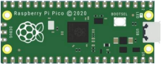 |  || |
| ------------------------------------------------------- | ------------------------------------ | ---------------------- | ---------------------- |
| Raspberry Pi Pico\*1                                    | Raspberry Pi Pico Expansion Board\*1 | 220Ω Resistor\*8       |   Breadboard\*1       |
|  |||  |
| 4-Digit Digital Tube Module\*1                          | Jumper Wires                         | USB Cable\*1           |          |


#### 3. Component Knowledge:


**Four-digit digital tube**: 

The four-digit digital tube has two types of four-digit digital tubes: a common anode and a common cathode. 

The display principle is similar to that of a one-digit digital tube. They are all 8 GPIO ports to control the display segment of the digital tube, that is, 8 LED lights, however, here are 4 bits, so 4 GPIO ports are needed to control the bit selection terminal, that is, to choose which single digital tube is on, the bit switching is very fast, and the naked eye can't distinguish it. A digital tube is displayed at the same time. It is common cathode.

G1, G2, G3 and G4 are pins of control bit.


**Schematic Diagram**

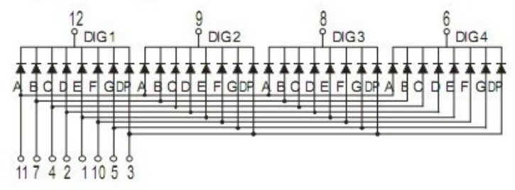

**Circuit Diagram and Wiring Diagram**


#### 4. Test Code:

Check the code in the folder "**...\6.Codes\Python_Codes(Raspberry-Pi)**".

You can move the code anywhere. For example, We copy the **Python_Codes(Raspberry-Pi).zip** to the <span style="color: rgb(255, 76, 65);">pi</span> folder of the Raspberry Pi system.

<span style="color: rgb(255, 76, 65);">Path: home/pi/Python_Codes(Raspberry-Pi)</span>

<br>
<br>


Open “Thonny”, click “This computer” → “home” → “pi” → “Python_Codes(Raspberry-Pi)” → “Project 09：4-Digit Digital Tube” .


```python
from machine import Pin
import time

#Pin of each digit of nixie tube
a = machine.Pin(21, machine.Pin.OUT)
b = machine.Pin(28, machine.Pin.OUT)
c = machine.Pin(16, machine.Pin.OUT)
d = machine.Pin(18, machine.Pin.OUT)
e = machine.Pin(19, machine.Pin.OUT)
f = machine.Pin(22, machine.Pin.OUT)
g = machine.Pin(15, machine.Pin.OUT)
dp = machine.Pin(17, machine.Pin.OUT)

G1 = machine.Pin(20, machine.Pin.OUT)
G2 = machine.Pin(26, machine.Pin.OUT)
G3 = machine.Pin(27, machine.Pin.OUT)
G4 = machine.Pin(14, machine.Pin.OUT)
 
#digital tube a to dp corresponding development board pins
d_Pins=[machine.Pin(i,machine.Pin.OUT)  for i in [21,28,16,18,19,22,15,17]]
#Pin corresponding to digital tube segment G1, G2, G3, and G4
w_Pins=[machine.Pin(i,machine.Pin.OUT)  for i in [20,26,27,14]]
 
number={
    '0':
    [1,1,1,1,1,1,0,0],#0
    '1':
    [0,1,1,0,0,0,0,0],#1
    '2':
    [1,1,0,1,1,0,1,0],#2
    '3':
    [1,1,1,1,0,0,1,0],#3
    '4':
    [0,1,1,0,0,1,1,0],#4
    '5':
    [1,0,1,1,0,1,1,0],#5
    '6':
    [1,0,1,1,1,1,1,0],#6
    '7':
    [1,1,1,0,0,0,0,0],#7
    '8':
    [1,1,1,1,1,1,1,0],#8
    '9':
    [1,1,1,1,0,1,1,0],#9
}
 
def display(num,dp):
    global number
    count=0
    for pin in d_Pins:#displays the value of num 
        pin.value(number[num][count])
        count+=1
    if dp==1:
        d_Pins[7].value(0)
def clear():
    for i in w_Pins:
        i.value(0)
    for i in d_Pins:
        i.value(1)
def showData(num):
   #the hundreds, thousands, ones, and fractional values of a numeric value
    d_num=num
    location=d_num.find('.')
    if location>0:
        d_num=d_num.replace('.','')
        while len(d_num)<4:
            d_num='0'+d_num
        for i in range(0,4):
            time.sleep(2)
            clear()
            w_Pins[3-i].value(1)
            if i==location-1:
                display(d_num[i],1)
            else:
                display(d_num[i],0)
    if location<0:
        for i in range(0,4):
            time.sleep(2)
            clear()
            w_Pins[3-i].value(1)
            display(d_num[i],0)
while True:
 
    num='9016'
showData(num)
```


#### 5. Test Result：

Connect the pico board to the Raspberry Pi. Click to check the Shell


Click “”, the code starts executing, we will see that the 4-digit digital tube circularly displays numbers from 0000 to 9999. 

Click“”to exit the program.


### Project 10：8×8 Dot-matrix Display

#### 1. Introduction:

The dot-matrix display is an electronic digital display device that can show information on machines, clocks and many other devices. 

In this project, we will use the Raspberry Pi Pico to control the 8x8 LED dot matrix to make a“❤”pattern.


#### 2. Components Required:

|  |  |  |     |
| ------------------------------------------------------------ | ------------------------------------------------------------ | ------------------------------------------------------------ | ------------------------------------- |
| Raspberry Pi Pico*1                                          | Raspberry Pi Pico Expansion Board*1                          | 220Ω Resistor*8                                              | Breadboard*1                         |
|                                        |                         |                         |  |
| 8*8 Dot-matrix Display *1                                    |Jumper Wires      | USB Cable*1                                                  |               |


#### 3. Component Knowledge:

**8\*8 Dot-matrix display module:**

The 8\*8 dot matrix is composed of 64 LEDs, and each LED is placed at the intersection of a row and a column. When using a single-chip microcomputer to drive an 8\*8 dot matrix, we need to use a total of 16 digital ports, which greatly wastes the data of the single-chip microcomputer. 

For this reason, we specially designed this module, using the HT16K33 chip to drive an 8\*8 dot matrix, and only need to use the I2C communication port of the single-chip microcomputer to control the dot matrix, which greatly saves the microcontroller resources.


#### 4. Circuit Diagram and Wiring Diagram:


#### 5. Test Code:

Check the code in the folder "**...\6.Codes\Python_Codes(Raspberry-Pi)**".

You can move the code anywhere. For example, We copy the **Python_Codes(Raspberry-Pi).zip** to the <span style="color: rgb(255, 76, 65);">pi</span> folder of the Raspberry Pi system.

<span style="color: rgb(255, 76, 65);">Path: home/pi/Python_Codes(Raspberry-Pi)</span>

<br>
<br>


Open “Thonny”, click “This computer” → “home” → “pi” → “Python_Codes(Raspberry-Pi)” → “Project 10：8×8 Dot-matrix Display” and click “Project\_10\_8×8\_Dot\_Matrix\_Display.py”。


```python
from machine import Pin
import time

#Define the pin of the row and Set to output
row1 = machine.Pin(18, machine.Pin.OUT)
row2 = machine.Pin(26, machine.Pin.OUT)
row3 = machine.Pin(17, machine.Pin.OUT)
row4 = machine.Pin(21, machine.Pin.OUT)
row5 = machine.Pin(10, machine.Pin.OUT)
row6 = machine.Pin(16, machine.Pin.OUT)
row7 = machine.Pin(11, machine.Pin.OUT)
row8 = machine.Pin(14, machine.Pin.OUT)
#Define the pins of the column and Set to output
col1 = machine.Pin(22, machine.Pin.OUT)
col2 = machine.Pin(12, machine.Pin.OUT)
col3 = machine.Pin(13, machine.Pin.OUT)
col4 = machine.Pin(19, machine.Pin.OUT)
col5 = machine.Pin(15, machine.Pin.OUT)
col6 = machine.Pin(20, machine.Pin.OUT)
col7 = machine.Pin(27, machine.Pin.OUT)
col8 = machine.Pin(28, machine.Pin.OUT)

#Sets the pin of the column to low level
col1.value(0)
col2.value(0)
col3.value(0)
col4.value(0)
col5.value(0)
col6.value(0)
col7.value(0)
col8.value(0)

#Since the column of the lattice has been set to low level, 
#the corresponding row of the lattice will light up when the pin of the row is at high level
def Row(d):
    if(d ==1):
        row1.value(1)  #Light the first line
    if(d ==2):
        row2.value(1)  #Light the second line
    if(d ==3):
        row3.value(1)
    if(d ==4):
        row4.value(1)
    if(d ==5):
        row5.value(1)
    if(d ==6):
        row6.value(1)
    if(d ==7):
        row7.value(1)
    if(d ==8):
        row8.value(1)
    
#Close the lattice
def off():
    row1.value(0)
    row2.value(0)
    row3.value(0)
    row4.value(0)
    row5.value(0)
    row6.value(0)
    row7.value(0)
    row8.value(0) 

try:
    print("test...")
    while True:
         for num in range(1,10):  #Light the lattice line by line
             Row(num)
             if(num == 9):  #Because the lattice has only 8 rows, and I'm limiting it here, is equal to 9
                off()      #Close the lattice
             time.sleep(0.2)

except:
    pass
```


#### 6. Test Result:

Ensure that the Raspberry Pi Pico is connected to the computer, click “Stop/Restart backend”.


Click “Run current script”, the code starts executing, we will see that the 8 x 8 dot matrix displays the character "A" 1S, "B" 1S, and "C" 1S. 

Then scroll to display the string "Hello World”repeatedly. 

Click“Stop/Restart backend”to exit the program.


### Project 11：74HC595N Control 8 LEDs 

#### 1. Introduction:

In previous projects, we have learned how to light an LED.  However, how to light up a lot of LEDs with only 26 I/O ports on the Raspberry Pi Pico? Sometimes we may run out of pins, at that time, we need to extend it with the shift register. You can use a 74HC595N chip to control up to eight outputs at a time, using only a few pins on your microcontroller. 

In addition, You can also connect multiple registers together to further expand the output. In this project, we will use a Raspberry Pi Pico, a 74HC595 chip and LEDs to make a flowing water light to understand the function of the chip.  

#### 2. Components Required:

|  ||||
| ------------------------------------------------------- | ------------------------------------ | ---------------------- | --------------------------- |
| Raspberry Pi Pico\*1                                    | Raspberry Pi Pico Expansion Board\*1 | 74HC595N Chip\*1       | Red LED\*8                  |
|  ||||
| 220ΩResistor\*8                                         | Breadboard\*1                        | Jumper Wires           | USB Cable\*1                |

#### 3. Component Knowledge:


**74HC595N Chip:** 

To put it simply, 74HC595N chip is a combination of 8-digit shifting register, memorizer and equipped with tri-state output. The shift register and the memorizer are synchronized to different clocks, and the data is input on the rising edge of the shift register clock SCK and goes into the memory register on the rising edge of the memory register clock RCK. If the two clocks are connected together, the shift register is always one pulse earlier than the storage register. 

The shift register has a serial shift input (SI) and a serial output (SQH) for cascading. The 8-bit shift register can be reset asynchronously (low-level reset), and the storage register has an 8-bit Three-state parallel bus output, when the output enable (OE) is enabled (active low), the storage register is output to the 74HC595N pin (bus).


**Pins**：

|             PIN              | FUNCTION                                                     |
| :--------------------------: | ------------------------------------------------------------ |
|           Pin13 OE           | It is an output enable pin to ensure that the data of the latch is input to the Q0 to Q7 pins or not. <br />When it is low, no high level is output. <br />In this experiment, we directly connect to GND and keep the data output low. |
|           Pin14 SI           | This is the pin for 74HC595 to receive data, i.e. serial data input, only one bit can be input at a time, <br />then 8 times in a row, it can form a byte. |
|          Pin10 SCLR          | A pin to initialize the storage register pins. It initializes the internal storage registers at a low level. <br />In this experiment, we connect VCC to maintain a high level. |
|          Pin11 SCK           | The clock pin of the shift register. <br />At the rising edge, the data in the shift register is shifted backward as a whole, <br />and new data input is received. |
|          Pin12 RCK           | The clock input pin of the storage register . <br />At the rising edge, the data is transferred from the shift register to the storage register. <br />At this time, the data is output in parallel from the Q0 to Q7 ports. |
|           Pin9 SQH           | It is a serial output pin dedicated for chip cascading to the SI terminal of the next 74HC595. |
| Q0--Q7<br />(Pin 15, Pin1-7) | Eight-bit parallel output, can directly control the 8 segments of the digital tube. |


#### 4. Circuit Diagram and Wiring Diagram:


Note: Pay attention to the direction in which the 74HC595N chip is inserted.


#### 5. Test Code:

Check the code in the folder "**...\6.Codes\Python_Codes(Raspberry-Pi)**".

You can move the code anywhere. For example, We copy the **Python_Codes(Raspberry-Pi).zip** to the <span style="color: rgb(255, 76, 65);">pi</span> folder of the Raspberry Pi system.

<span style="color: rgb(255, 76, 65);">Path: home/pi/Python_Codes(Raspberry-Pi)</span>

<br>
<br>


Open “Thonny”, click “This computer” → “home” → “pi” → “Python_Codes(Raspberry-Pi)” → “Project 11：74HC595N Control 8 LEDs”. 

Select “my74HC595、.py”, right-click and select “**Upload to /**”，wait for “my74HC595\.py” to be uploaded to the Raspberry Pi Pico. 

Click the“Project\_11\_74HC595N\_Controls\_8\_LEDs.py”.


```python
#Import time and my74HC595 modules.
from my74HC595 import Chip74HC595
import time

#Create a Chip74HC595 object and configure pins
chip = Chip74HC595(18, 20, 21)
#Chip74HC595() == Chip74HC595(18, 20, 21)

#The first for loop makes LED Bar display separately from left to right
#while the second for loop make it display separately from right to left.
while True:
    x = 0x01
    for count in range(8):
        chip.shiftOut(1, x)
        x = x<<1;
        time.sleep_ms(300)
    x = 0x01
    for count in range(8):
        chip.shiftOut(0, x)
        x = x<<1
        time.sleep_ms(300)
```


#### 6. Test Result:

Ensure that the Raspberry Pi Pico is connected to the computer，click“Stop/Restart backend”.


Click “Run current script”, the code starts executing, we will see that the 8 LEDs start flashing in flowing water mode. 

Press “Ctrl+C”or click“Stop/Restart backend”to exit the program.


### Project 12：Active Buzzer

#### 1. Introduction:

Active buzzer is a sound making element, which is widely used on computers, printers, alarms, electronic toys, telephones, timers, etc. It has an inner vibration source. 

In this project, we will use a Raspberry Pi Pico to control the active buzzer to buzz.

#### 2. Components Required:

|  |  |  |
| ------------------------------------------------------- | ------------------------------------ | ---------------------- | 
| Raspberry Pi Pico\*1                                    | Raspberry Pi Pico Expansion Board\*1 | USB Cable\*1 |                      
|  |||
| Active Buzzer\*1                                        | Breadboard\*1                        | Jumper Wires           |            

#### 3. Component Knowledge:


The active buzzer inside has a simple oscillator circuit , which can convert constant direct current into a certain frequency pulse signal. Once active buzzer receives a high level, it will sound. 

The passive buzzer is an integrated electronic buzzer with no internal vibration source. It must be driven by 2K to 5K square wave instead of a DC signal. 

The appearance of the two buzzers is very similar, but passive buzzers come with a green circuit board, and active buzzers come with a black tape. 

Passive buzzers don't have positive pole, but active buzzers have. As shown below:


#### 4. Circuit Diagram and Wiring Diagram:


<span style="color: rgb(255, 169, 0);">Note:</span>

1)\. The buzzer power supply in this circuit is 5V.  On a 3.3V power supply, the buzzer will work, but it will reduce the loudness.  

2)\. The VUSB should connect to the positive terminal of the USB cable, if it connects to GND, it could burn out the computer or Raspberry Pi Pico.  Similarly, the Raspberry Pi Pico's 36-40 pins need to be connected carefully to avoid short circuits. 

3)\. The positive terminal ("+"/long pin) of the active buzzer is connected to pin 16, and the negative terminal (short pin) is connected to GND.

#### 5. Test Code:

Check the code in the folder "**...\6.Codes\Python_Codes(Raspberry-Pi)**".

You can move the code anywhere. For example, We copy the **Python_Codes(Raspberry-Pi).zip** to the <span style="color: rgb(255, 76, 65);">pi</span> folder of the Raspberry Pi system.

<span style="color: rgb(255, 76, 65);">Path: home/pi/Python_Codes(Raspberry-Pi)</span>

<br>
<br>


Open “Thonny”, click “This computer” → “home” → “pi” → “Python_Codes(Raspberry-Pi)” → “Project 12: Active Buzzer”. And double-click the “Project\_12\_Active\_Buzzer.py”.


```python
from machine import Pin
import time

buzzer = Pin(16, Pin.OUT)   # create buzzer object from Pin 16, Set Pin 16 to output

try:
    while True:
        buzzer.value(1)    # Set buzzer turn on
        time.sleep(0.5) # Sleep 0.5s
        buzzer.value(0)    # Set buzzer turn off
        time.sleep(0.5) # Sleep 0.5s
except:
    pass
```


#### 6. Text Result:

Ensure that the Raspberry Pi Pico is connected to the computer，click“Stop/Restart backend”.


Click “Run current script”, the code starts executing, we will see that the the active buzzer starts to buzz.

Click“Stop/Restart backend”to exit the program.


### Project 13：Passive Buzzer

#### 1. Introduction:

In a previous project, we have learned an active buzzer, which can only produce one sound and may let you feel monotonous. 

In this project, we will learn a passive buzzer and use the Raspberry Pi Pico to control the passive buzzer to sound an alarm. Unlike the active buzzer, the passive buzzer can emit sounds of different frequencies. 

#### 2. Components Required:

|                 |  |  |
| ------------------------------------- | ------------------------------------- | ------------------------------------- |
| Raspberry Pi Pico*1                   | Raspberry Pi PicoExpansion Board*1    | Passive Buzzer*1                      |
| |  |                |
| Breadboard*1                          | Jumper Wires                          | USB Cable*1                           |


#### 3. Component Knowledge:


A passive buzzer is an integrated electronic buzzer with no internal vibration source. It must be driven by 2K to 5K square wave, not a DC signal. 

The two buzzers are very similar in appearance, but one buzzer with a green circuit board is a passive buzzer, while the other with black tape is an active buzzer. 

Passive buzzers cannot distinguish between positive polarity while active buzzers can.


#### 4. Circuit Diagram and Wiring Diagram:


#### 5. Test Code:

Check the code in the folder "**...\6.Codes\Python_Codes(Raspberry-Pi)**".

You can move the code anywhere. For example, We copy the **Python_Codes(Raspberry-Pi).zip** to the <span style="color: rgb(255, 76, 65);">pi</span> folder of the Raspberry Pi system.

<span style="color: rgb(255, 76, 65);">Path: home/pi/Python_Codes(Raspberry-Pi)</span>

<br>
<br>


Open “Thonny”, click “This computer” → “home” → “pi” → “Python_Codes(Raspberry-Pi)” → “Project 13：Passive Buzzer”. And double left-click the “Project\_13\_Passive\_Buzzer.py”.


```python
from machine import Pin
import time

#Initialize the passive buzzer
buzzer = Pin(16,Pin.OUT)

#Simulate two different frequencies
while True:
    #Output 500HZ frequency sound
    for i in range(80):
        buzzer.value(1)
        time.sleep(0.001)
        buzzer.value(0)
        time.sleep(0.001)
    #Output 250HZ frequency sound
    for i in range(100):
        buzzer.value(1)
        time.sleep(0.002)
        buzzer.value(0)
        time.sleep(0.002)
```


#### 6. Test Result:

Ensure that the Raspberry Pi Pico is connected to the computer，click“Stop/Restart backend”.


Click “Run current script”, the code starts executing, we will see that the the passive buzzer sounds the alarm.

Click “Stop/Restart backend”to exit the program.


### Project 14: Mini Table Lamp

#### 1. Introduction:

Did you know that a Raspberry Pi Pico can light up an LED when you press a button? In this project, we will use the Raspberry Pi Pico, a key switch and an LED to make a Mini Table lamp.

#### 2. Components Required:

|                  |  |  |  |  |
| --------------------------------------- | -------------------------------------- | --------------------------------------- | --------------------------------------- | --------------------------------------- |
| Raspberry Pi Pico*1                     | Raspberry Pi Pico Expansion Board*1    | Button*1                                | Red LED*1                               | 10KΩResistor*1                          |
| |                 |  |  |  |
| Breadboard*1                            | 220ΩResistor*1                         | USB Cable*1                             | JumperWires                             | Button Cap*1                            |

#### 3. Component Knowledge:


**Button:** 

The button can control the circuit on and off. The circuit is disconnected when the button is not pressed. But it breaks when you release it. Why does it only work when you press it? It starts from the internal structure of the button, which is shown in the figure:

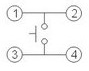

Before the button is pressed, 1 and 2 are on, 3 and 4 are also on, but 1, 3 or 1, 4 or 2, 3 or 2, 4 are off (not working). Only when the button is pressed, 1, 3 or 1, 4 or 2, 3 or 2, 4 are on. The key switch is one of the most commonly used components in circuit design.

**Schematic diagram of the button:**


**What is button jitter?**

We think of the switch circuit as "press the button and turn it on immediately", "press it again and turn it off immediately". In fact, this is not the case.

The button usually uses a mechanical elastic switch, and the mechanical elastic switch will produce a series of jitter due to the elastic action at the moment when the mechanical contact is opened and closed (usually about 10ms). 

As a result, the button switch will not immediately and stably turn on the circuit when it is closed, and it will not be completely and instantaneously disconnected when it is turned off. 


**How to eliminate the jitter?**

There are two common methods, namely fix jitter in the software and hardware. We only discuss the jitter removal in the software.

We already know that the jitter time generated by elasticity is about 10ms, and the delay command can be used to delay the execution time of the command to achieve the effect of jitter removal.

Therefore, we delay 0.02s in the code to achieve the key anti-shake function.


#### 4. Circuit Diagram and Wiring Diagram:


**Note:**

How to connect the LED


How to identify the 220Ω 5-band resistor and 10KΩ 5-band resistor


#### 5. Test Code:

Check the code in the folder "**...\6.Codes\Python_Codes(Raspberry-Pi)**".

You can move the code anywhere. For example, We copy the **Python_Codes(Raspberry-Pi).zip** to the <span style="color: rgb(255, 76, 65);">pi</span> folder of the Raspberry Pi system.

<span style="color: rgb(255, 76, 65);">Path: home/pi/Python_Codes(Raspberry-Pi)</span>

<br>
<br>


Open “Thonny”, click “This computer” → “home” → “pi” → “Python_Codes(Raspberry-Pi)” → “Project 14：Mini Table Lamp”. And double-click the “Project\_14\_Mini\_Table\_Lamp.py”.


```python
from machine import Pin
import time

led = Pin(19, Pin.OUT) # create LED object from Pin 19,Set Pin 19 to output                   
button = Pin(22, Pin.IN, Pin.PULL_UP) #Create button object from Pin22,Set GP22 to input

#Customize a function and name it reverseGPIO(),which reverses the output level of the LED
def reverseGPIO():
    if led.value():
        led.value(0)     #Set led turn off
    else:
        led.value(1)     #Set led turn on

try:
    while True:
        if not button.value():
            time.sleep_ms(20)
            if not button.value():
                reverseGPIO()
                while not button.value():
                    time.sleep_ms(20)
except:
    pass
```


#### 6. Test Result:

Ensure that the Raspberry Pi Pico is connected to the computer，click“Stop/Restart backend”.


Click“Run current script”, the code starts executing, we will see that press the button, the LED lights up;  when the button is released, the LED remains lit.  

Press the button again, the LED goes off;  When the button is released, the LED remains off. Doesn't it look like a little lamp? 

Click “Stop/Restart backend”to exit the program.


### Project 15：Tilt And LED

#### 1. Introduction:

The ancients without electronic clocks, so the hourglass are invented to measure time. The hourglass has a large capacity on both sides, and which is filled with fine sand on one side. What’s more, there is a small channel in the middle, which can make the hourglass stand upright , the side with fine sand is on the top. 

However, due to the action of gravity, the fine sand will flow down through the channel to the other side of the hourglass. When the sand reaches the bottom, turn it upside down and record the number of times it has gone through the hourglass, therefore, the next day we can know the approximate time of the day by it. In this project, we will use a Raspberry Pi Pico to control the tilt switch and LED lights to simulate an hourglass and make an electronic hourglass. 

#### 2. Components Required:

|  |  |  |  |  |
| -------------------------------------- | -------------------------------------- | -------------------------------------- | -------------------------------------- | -------------------------------------- |
| Raspberry Pi Pico*1                    | Raspberry Pi Pico Expansion Board*1    | Tilt Switch*1                          | Red LED*4                              | 10KΩResistor*1                         |
|  |  |  |  |                                        |
| Breadboard*1                           | 220ΩResistor*4                         | USB Cable*1                            | Jumper Wires                           |                                        |

#### 3. Component Knowledge:


Tilt switch is also called digital switch. Inside is a metal ball that can roll. The principle of rolling the metal ball to contact with the conductive plate at the bottom, which is used to control the on and off of the circuit. When it is a rolling ball tilt sensing switch with single directional trigger, the tilt sensor is tilted toward the trigger end (two gold-plated pin ends), the tilt switch is in a closed circuit and the voltage at the analog port is about 5V (binary number is 1023). 

In this way, the LED will light up. When the tilt switch is in a horizontal position or tilted to the other end, it is open and the voltage of the analog port is about 0V (binary number is 0), the LED will turn off. 

In the program, we judge the state of the switch based on whether the voltage value of the analog port is greater than 2.5V (binary number is 512).

As shown in the figure, use the internal structure of the tilt switch to illustrate how it works.


#### 4. Circuit Diagram and Wiring Diagram:


Note:

How to connect the LED


How to identify the 220Ω 5-band resistor and 10KΩ 5-band resistor


#### 5. Test Code:

Check the code in the folder "**...\6.Codes\Python_Codes(Raspberry-Pi)**".

You can move the code anywhere. For example, We copy the **Python_Codes(Raspberry-Pi).zip** to the <span style="color: rgb(255, 76, 65);">pi</span> folder of the Raspberry Pi system.

<span style="color: rgb(255, 76, 65);">Path: home/pi/Python_Codes(Raspberry-Pi)</span>

<br>
<br>


Open “Thonny”, click “This computer” → “home” → “pi” → “Python_Codes(Raspberry-Pi)” → “Project 15：Tilt And LED”. And double-click the “Project\_15\_Tilt\_And\_LED.py”.


```python
from machine import Pin
import time

led1 = Pin(19, Pin.OUT) # create LED object from Pin 19,Set Pin 19 to output
led2 = Pin(18, Pin.OUT) # create LED object from Pin 18,Set Pin 18 to output
led3 = Pin(17, Pin.OUT) # create LED object from Pin 17,Set Pin 17 to output
led4 = Pin(16, Pin.OUT) # create LED object from Pin 16,Set Pin 16 to output
Tilt_Sensor = Pin(22,Pin.IN) #Create tilt object from Pin22,Set GP22 to input

while True:
    if(Tilt_Sensor.value() == 0) : #when the value of tilt sensor is 0
        led1.value(1) # led1 turn on
        time.sleep_ms(200)#delay
        led2.value(1) # led2 turn on
        time.sleep_ms(200)#delay
        led3.value(1) # led3 turn on
        time.sleep_ms(200)#delay
        led4.value(1) # led4 turn on
        time.sleep_ms(200)#delay 
    else :           #when the value of tilt sensor is 1
        led4.value(0) # led4 turn off
        time.sleep_ms(200)#delay
        led3.value(0) # led3 turn off
        time.sleep_ms(200)#delay
        led2.value(0) # led2 turn off
        time.sleep_ms(200)#delay
        led1.value(0) # led1 turn off
        time.sleep_ms(200)#delay
```


#### 6. Test Result:

Ensure that the Raspberry Pi Pico is connected to the computer，click“Stop/Restart backend”.


Click“Run current script”, the code starts executing, we will see that when you tilt the breadboard to an angle, the LEDs will light up one by one. 

When you turn the breadboard to the original angle, the LEDs will turn off one by one. Like the hourglass, the sand will leak out over time.

Click“Stop/Restart backend”to exit the program.


### Project 16：I2C 128×32 LCD

#### 1. Introduction:

We can use modules such as monitors to do various experiments in life. You can also DIY a variety of small objects. For example, you can make a temperature meter with a temperature sensor and display, or make a distance meter with an ultrasonic module and display.

In this project, we will use the LCD_128X32_DOT module as a display and connect it to a Raspberry Pi Pico, which will be used to control the LCD_128X32_DOT display to show various English characters, common symbols and numbers.

#### 2. Components Required:

| |  ||||
| ------------------------------------------------------- | ----------------------- | --------------------------- | ---------------------- |---------------------- |
| Raspberry Pi Pico\*1       | Raspberry Pi Pico Expansion Board*1    | LCD\_128X32\_DOT\*1     | 10CM M-F Dupont Wires       | USB Cable\*1           |

#### 3. Component Knowledge:


**LCD\_128X32\_DOT:** 

It is an LCD module with 128*32 pixels and its driver chip is ST7567A. The module uses the IIC communication mode, while the code contains a library of all alphabets and common symbols that can be called directly. When using, we can also set it in the code so that the  English letters and symbols show different text sizes. 

To make it easy to set up the pattern display, we also provide a mold capture software that converts a specific pattern into control code and then copies it directly into the test code for use.

**Schematic diagram:**


**Features:**

- Pixel：128\*32 character

- Operating voltage(chip)：4.5V to 5.5V

- Operating current：100mA (5.0V)

- Optimal operating voltage(module):5.0V


#### 4. Circuit Diagram and Wiring Diagram:

<span style="color: rgb(255, 76, 65);">Note:</span> The LCD_128X32_DOT must be connected with 10CM M-F Dupont wires, which can make the LCD_128X32_DOT display normally. 
 
<br>
<br>


#### 5. Test Code:

Check the code in the folder "**...\6.Codes\Python_Codes(Raspberry-Pi)**".

You can move the code anywhere. For example, We copy the **Python_Codes(Raspberry-Pi).zip** to the <span style="color: rgb(255, 76, 65);">pi</span> folder of the Raspberry Pi system.

<span style="color: rgb(255, 76, 65);">Path: home/pi/Python_Codes(Raspberry-Pi)</span>

<br>
<br>


Open “Thonny”, click “This computer” → “home” → “pi” → “Python_Codes(Raspberry-Pi)” → “Project 16： I2C 128×32 LCD”. 

Select “lcd128\_32.py” and “lcd128\_32\_fonts.py”，right-click and select “**Upload to /**”，wait for the “lcd128\_32.py” and the “lcd128\_32\_fonts.py” to be uploaded to the Raspberry Pi Pico. 

And double-click the “Project 16：I2C 128×32 LCD\.py”.


```python
import machine
import time
import lcd128_32_fonts
from lcd128_32 import lcd128_32

#i2c config
clock_pin = 21
data_pin = 20
bus = 0
i2c_addr = 0x3f
use_i2c = True

def scan_for_devices():
    i2c = machine.I2C(bus,sda=machine.Pin(data_pin),scl=machine.Pin(clock_pin))
    devices = i2c.scan()
    if devices:
        for d in devices:
            print(hex(d))
    else:
        print('no i2c devices')

if use_i2c:
    scan_for_devices()
    lcd = lcd128_32(data_pin, clock_pin, bus, i2c_addr)

lcd.Clear()

lcd.Cursor(0, 4)
lcd.Display("KEYESTUDIO")
lcd.Cursor(1, 0)
lcd.Display("ABCDEFGHIJKLMNOPQR")
lcd.Cursor(2, 0)
lcd.Display("123456789+-*/<>=$@")
lcd.Cursor(3, 0)
lcd.Display("%^&(){}:;'|?,.~\\[]")
"""
while True:
    scan_for_devices()
    time.sleep(0.5)
"""
```

#### 6. Test Result:

Ensure that the Raspberry Pi Pico is connected to the computer，click“Stop/Restart backend”.


Click “Run current script”, the code starts executing, we will see that the LCD module display will show "KEYESTUDIO" at the first line. 

"ABCDEFGHIJKLMNOPQR" will be displayed at the second line. 

"123456789 + - \* / \<\> = $ @ " will be shown at the third line and "% ^ & () {} :; '|?,. \~ \\\\ \[\] " will be displayed at the fourth line. 

Press“Ctrl+C”or click“Stop/Restart backend”to exit the program.


### Project 17：Small Fan

#### 1. Introduction:

In the hot summer, we need an electric fan to cool us down, so in this project, we will use the Plus control board to control 130 motor module and small blade to make a small fan.


#### 2. Components Required:

|  |  |  |
| ------------------------------------------------------------ | ------------------------------------------------------------ | ------------------------------------------------------------ |
| Raspberry Pi Pico*1                                          | Raspberry Pi Pico Expansion Board*1                          | DC Motor*1                                                   |
|                     |                       |                       |
| Breadboard*1                                                 | Fan*1                                                        | S8050 Triode*1                                               |
|                       |                       |                       |
| S8550 Triode*1                                               | 1KΩ Resistor*1                                               | Jumper Wires                                                 |
|                       |                       |                                                              |
| Diode*1                                                      | USB Cable*1                                                  |                                                              |


#### 3. Component Knowledge:


**Triode：**

It is referred as the semiconductor triode and a bipolar transistor or a transistor.

The triode is one of the basic semiconductor components as the core of the electronic circuit., which can amplify current. The triode means that two PN junctions are made on a semiconductor wafer. The two PN junctions divide the entire semiconductor into three parts. The middle part is the base area, and the two sides are the emitter and collector areas.

As for NPN triode, it is composed of two N type semiconductors and a P type semiconductor.

The type of transistor which may be used in some applications in place of the triode tube is the "junction" transistor, which actually has two junctions. It has an emitter, base, and collector which correspond to the cathode, grid, and plate, respectively, in the triode tube. Junction transistors are of two types, the NPN type and the PNP type.

The PN junction between the emitting area and the base area is emitter junction and the PN junction flanked by the collector area and the base area is collector junction. And three pins are E（Emitter, B (Base)and C (Collector).

**S8050（NPN triode）**


**S8550（PNP triode）**


The S8050 transistor is a low-power NPN silicon tube and its the maximum voltage of collector and base can reach 40V and the current of the collector is (Ic) 0.5A.

The pins of the S8050 transistor should facing down, pin 1 is the emitter (E pole), pin 2 is the base (B pole), and pin 3 is the collector (C pole). Similarly, the S8550 transistor is the same.


The commonly used triodes are divided into two types: PNP type triode and NPN type triode. S8550 is the PNP type triode, S8050 is the NPN type triode, what we provide in this kit are S8050 and S8550.


#### 4. Connection Diagram 1:

we apply the S8050(NPN triode) in this experiment to control the motor


#### 5. Test Code 1:

Check the code in the folder "**...\6.Codes\Python_Codes(Raspberry-Pi)**".

You can move the code anywhere. For example, We copy the **Python_Codes(Raspberry-Pi).zip** to the <span style="color: rgb(255, 76, 65);">pi</span> folder of the Raspberry Pi system.

<span style="color: rgb(255, 76, 65);">Path: home/pi/Python_Codes(Raspberry-Pi)</span>

<br>
<br>


Open “Thonny”, click “This computer” → “D:” → “Python_Codes(Raspberry-Pi)” → “Project 17：Small Fan”. And double left-click the “Project\_17.1\_Small\_Fan.py”.


```python
from machine import Pin
import time

motor = Pin(22, Pin.OUT)   # create S8050 object from Pin 22, Set Pin 22 to output

try:
    while True:
        motor.value(1)    # Set motor turn on
        time.sleep(4) # Sleep 4s
        motor.value(0)    # Set motoe turn off
        time.sleep(2) # Sleep 2s
except:
    pass
```


#### 6. Test Result 1:

Ensure that the Raspberry Pi Pico is connected to the computer，click“Stop/Restart backend”.


Click “Run current script”, the code starts executing, we will see that The small fan turns counterclockwise for 4 seconds and stops for 2 seconds, in a loop way. 

Press“Ctrl+C”or click“Stop/Restart backend”to exit the program.


#### 7. Circuit Diagram and Wiring Diagram 2：

We use the S8550 PNP triode to control a motor


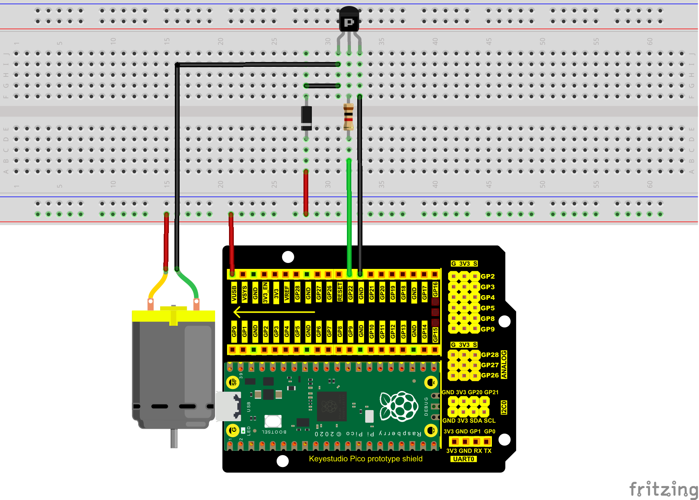

#### 8. Test Code 2:

Check the code in the folder "**...\6.Codes\Python_Codes(Raspberry-Pi)**".

You can move the code anywhere. For example, We copy the **Python_Codes(Raspberry-Pi).zip** to the <span style="color: rgb(255, 76, 65);">pi</span> folder of the Raspberry Pi system.

<span style="color: rgb(255, 76, 65);">Path: home/pi/Python_Codes(Raspberry-Pi)</span>

<br>
<br>


Open “Thonny”, click “This computer” → “D:” → “Python_Codes(Raspberry-Pi)” → “Project 17：Small Fan”. And double left-click the “Project\_17.2\_Small\_Fan.py”.


```python
from machine import Pin
import time

motor = Pin(22, Pin.OUT)   # create S8550 object from Pin 22, Set Pin 22 to output

try:
    while True:
        motor.value(0)    # Set motor turn on
        time.sleep(4) # Sleep 4s
        motor.value(1)    # Set motoe turn off
        time.sleep(2) # Sleep 2s
except:
    pass
```


#### 9. Test Result 2:

Ensure that the Raspberry Pi Pico is connected to the computer，click“Stop/Restart backend”.


Click “Run current script”, the code starts executing, we will see that The small fan turns counterclockwise for 4 seconds and stops for 2 seconds, in a loop way. 

Press“Ctrl+C”or click“Stop/Restart backend”to exit the program.


### Project 18 : Dimming Light

#### 1. Introduction:

A potentiometer is a three-terminal resistor with a sliding or rotating contact that forms an adjustable voltage divider. It works by varying the position of a sliding contact across a uniform resistance. In a potentiometer, the entire input voltage is applied across the whole length of the resistor, and the output voltage is the voltage drop between the fixed and sliding contact. 

In this project, we are going to learn how to use Raspberry Pi Pico to read the values of the potentiometer, and make a dimming lamp with LEDs.

#### 2. Components Required:

|  ||||
| ------------------------------------------------------- | ------------------------------------ | ------------------------ | --------------------------- |
| Raspberry Pi Pico\*1                                    | Raspberry Pi Pico Expansion Board\*1 | Potentiometer\*1         | Red LED\*1                  |
|  ||||
| Breadboard\*1                                           | 220ΩResistor\*1                      | Jumper Wires             | USB Cable\*1                |

#### 3. Component Knowledge:


**Adjustable potentiometer:** 

It is a kind of resistor and an analog electronic component, which has two states of 0 and 1(high level and low level). The analog quantity is different, its data state presents a linear state such as 1 ~ 1024.

#### 4. Read the Potentiometer Value:

We connect the adjustable potentiometer to the analog IO of the Raspberry Pi Pico to read its value and voltage value . Please refer to the following wiring diagram for wiring.

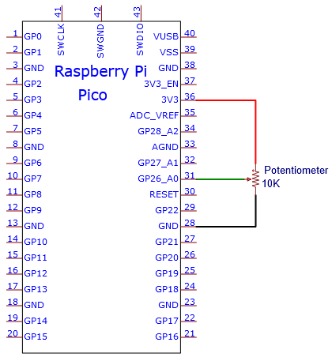


Check the code in the folder "**...\6.Codes\Python_Codes(Raspberry-Pi)**".

You can move the code anywhere. For example, We copy the **Python_Codes(Raspberry-Pi).zip** to the <span style="color: rgb(255, 76, 65);">pi</span> folder of the Raspberry Pi system.

<span style="color: rgb(255, 76, 65);">Path: home/pi/Python_Codes(Raspberry-Pi)</span>

<br>
<br>


Open “Thonny”, click “This computer” → “home” → “pi” → “Python_Codes(Raspberry-Pi)” → “Project 18：Dimming Light”. And click “Project\_18.1\_Read\_Potentiometer\_Analog\_Value.py”.


```python
from machine import ADC, Pin
import time
# Initialize the potentiometer to pin 26 (ADC function)
adc = ADC(26)

# Print the current adc value of the potentiometer cyclically 
# Print the current voltage value of the potentiometer cyclically
try:
    while True:
        adcValue = adc.read_u16() # read the ADC value of potentiometer
        voltage = adcValue / 65535.0 * 3.3
        print("ADC Value:", adcValue, "Voltage:", voltage, "V")
        time.sleep(0.1)
except:
    pass
```


Ensure that the Raspberry Pi Pico is connected to the computer，click“Stop/Restart backend”.


Click“Run current script”, the code starts executing, we will see that the "Shell" window of Thonny IDE will print the ADC value and voltage value of the potentiomete, turn the potentiometer handle, the ADC value and voltage value will change.

Click“Stop/Restart backend”to exit the program.


#### 5. Circuit Diagram and Wiring Diagram:

In the last step, we read the value of the potentiometer, and now we need to convert the value of the potentiometer into the brightness of the LED to make a lamp that can adjust the brightness. 

The wiring diagram is as follows:


#### 6. Test Code:

Check the code in the folder "**...\6.Codes\Python_Codes(Raspberry-Pi)**".

You can move the code anywhere. For example, We copy the **Python_Codes(Raspberry-Pi).zip** to the <span style="color: rgb(255, 76, 65);">pi</span> folder of the Raspberry Pi system.

<span style="color: rgb(255, 76, 65);">Path: home/pi/Python_Codes(Raspberry-Pi)</span>

<br>
<br>


Open “Thonny”, click “This computer” → “home” → “pi” → “Python_Codes(Raspberry-Pi)” → “Project 18：Dimming Light”. And double left-click the “Project\_18.2\_Dimming\_Light.py”.


```python
from machine import ADC, Pin, PWM
import time

adc = ADC(26) # Initialize the potentiometer to pin 26 (ADC function)
pwm = PWM(Pin(16)) # Initialize the led's PWM to pin 16
pwm.freq(1000) # Define the PWM frequency as 1000
try:
    while True:
        adcValue = adc.read_u16() # read the ADC value of potentiometer
        pwm.duty_u16(adcValue) #map it to the duty cycle of PWM to control led brightness 
        time.sleep(0.1)
except:
    pwm.deinit()
```

#### 7. Test Result:

Ensure that the Raspberry Pi Pico is connected to the computer，click“Stop/Restart backend”.


Click “Run current script”, the code starts executing, we will see that turn the potentiometer handle and the brightness of the LED will change accordingly.

Click“Stop/Restart backend”to exit the program.


### Project 19：Flame Alarm

#### 1. Introduction:

Fire is a terrible thing and fire alarm systems are very useful in houses, commercial buildings and factories. In this project, we will use a Raspberry Pi Pico to control a flame sensor , a buzzer and LED to make fire alarm devices, which is a meaningful maker activity.

#### 2. Components Required:

|  |   |  |  |  |
| ------------------------------------------------------------ | ------------------------------------------------------------ | ------------------------------------------------------------ | ------------------------------------------------------------ | ------------------------------------------------------------ |
| Raspberry Pi Pico*1                                          | Raspberry Pi Pico Expansion Board*1                          | Flame Sensor*1                                               | Red LED*1                                                    | Active Buzzer*1                                              |
| |  |  |  ||
| Breadboard                                                   | 220ΩResistor*1                                               | 10KΩResistor*1                                               | Jumper Wires                                                 | USBCable*1                                                   |


#### 3. Component Knowledge:


**Flame Sensor**：

The flame emits a certain degree of IR light, which is invisible to the human eye, but our flame sensor can detect it and alert the microcontroller. If the Raspberry Pi Pico has detected a fire, it has a specially designed infrared receiver to detect the flame, and then convert the flame brightness into a fluctuating level signal. 

The short pin of the receiving triode is negative pole and the other long pin is positive pole. We should connect the short pin (negative pole) to 5V and the long pin (positive pole) to the analog pin, a resistor and GND. As shown in the figure below.


<span style="color: rgb(255, 76, 65);">Note:</span> 

Since vulnerable to radio frequency radiation and temperature changes, the flame sensor should be kept away from heat sources like radiators, heaters and air conditioners, as well as direct irradiation of sunlight, headlights and incandescent light.


#### 4. Read the Simulation Value:

We start with a simple code to read the value of the flame sensor and print it on the serial monitor. For wiring, please refer to the following wiring diagram.


Check the code in the folder "**...\6.Codes\Python_Codes(Raspberry-Pi)**".

You can move the code anywhere. For example, We copy the **Python_Codes(Raspberry-Pi).zip** to the <span style="color: rgb(255, 76, 65);">pi</span> folder of the Raspberry Pi system.

<span style="color: rgb(255, 76, 65);">Path: home/pi/Python_Codes(Raspberry-Pi)</span>

<br>
<br>


Open “Thonny”, click “This computer” → “home” → “pi” → “Python_Codes(Raspberry-Pi)” → “Project 19：Flame Alarm”. And double left-click “Project\_19.1\_Read\_Analog\_Value\_Of\_Flame\_Sensor.py”.


```python
from machine import ADC, Pin
import time
# Initialize the flame sensor to pin 26 (ADC function)
adc = ADC(26)

# Read the current analog value of the flame sensor and return [0, 1023]
def get_value():
    return int(adc.read_u16() * 1024 / 65536)
 
# Print the current value of the flame sensor cyclically, value=[0, 1023]
while True:
    value = get_value()
    print(value)
    time.sleep(0.1)
```


Ensure that the Raspberry Pi Pico is connected to the computer，click“Stop/Restart backend”.


Click “Run current script”, the code starts executing, we will see that the "Shell" window of Thonny IDE will print the simulation value read by the flame sensor. 

When the flame is close to the sensor, the simulation value increases. On the contrary, the simulated value decreases. 

Press“Ctrl+C”or click“Stop/Restart backend”to exit the program.


#### 5. Circuit Diagram and Wiring Diagram:

Next, we will use flame sensor and buzzer, an RGB LED to make an interesting project, that is flame alarm. When flame is detected, RGB LED is red and buzzer alarms.


#### 6. Test Code:

<span style="color: rgb(255, 76, 65);">Note：</span> The threshold of 500 in the code can be reset itself as required.

<br>
<br>

Check the code in the folder "**...\6.Codes\Python_Codes(Raspberry-Pi)**".

You can move the code anywhere. For example, We copy the **Python_Codes(Raspberry-Pi).zip** to the <span style="color: rgb(255, 76, 65);">pi</span> folder of the Raspberry Pi system.

<span style="color: rgb(255, 76, 65);">Path: home/pi/Python_Codes(Raspberry-Pi)</span>

<br>
<br>


Open “Thonny”, click “This computer” → “home” → “pi” → “Python_Codes(Raspberry-Pi)” → “Project 19：Flame Alarm”. And double left-click the “Project\_19.2\_Flame\_Alarm.py”.


```python
from machine import ADC, Pin
import time

# Initialize the flame sensor to pin 26 (ADC function)
adc = ADC(26)
# create LED object from Pin 16,Set Pin 16 to output
led = Pin(16, Pin.OUT) 
# create buzzer object from Pin 17, Set Pin 17 to output
buzzer = Pin(17, Pin.OUT)   

# Read the current analog value of the flame sensor and return [0, 1023]
def get_value():
    return int(adc.read_u16() * 1024 / 65536)
 
# If the flame sensor detects a flame, the buzzer will beep
# and the LED will blink when the analog value is greater than 500
# Otherwise, the buzzer does not sound and the LED goes off 
while True:
    value = get_value()
    if value >500:
        buzzer.value(1)    # Set buzzer turn on
        led.value(1)    # Set led turn on
        time.sleep(0.5) # Sleep 0.5s
        led.value(0)    # Set led turn off
        time.sleep(0.5) # Sleep 0.5s
    else:
        buzzer.value(0)    # Set buzzer turn off
        led.value(0)    # Set led turn off
```

#### 7. Test Result:

Ensure that the Raspberry Pi Pico is connected to the computer，click“Stop/Restart backend”.


Click“Run current script”, the code starts executing, we will see that when the flame sensor detects the flame, the LED flashes and the buzzer alarms. Otherwise, the LED does not light, the buzzer does not sound. 

Click“Stop/Restart backend”to exit the program.


### Project 20：Night Lamp

#### 1. Introduction:

Sensors or components are ubiquitous in our daily life. For example, some public street lights turn on automatically at night and turn off automatically during the day. 

Why? In fact, this make use of a photosensitive element that senses the intensity of external ambient light. When the outdoor brightness decreases at night, the street lights will automatically turn on. In the daytime, the street lights will automatically turn off. The principle of this is very simple. 

In this lesson we will use Raspberry Pi Pico to control LEDs to implement the function of this street light.

#### 2. Components Required:

|  |              |  |  |  |
| ----------------------- | ----------------------------------- | ----------------------- | ----------------------- | ----------------------- |
| Raspberry Pi Pico*1     | Raspberry Pi Pico Expansion Board*1 | Photoresistor*1         | Red LED*1               | 10KΩResistor*1          |
|  |              |  |  |                         |
| Breadboard*1            | 220ΩResistor*1                      | Jumper Wires            | USB Cable*1             |                         |


#### 3. Component Knowledge:


It is a photosensitive resistor, its principle is that the photoresistor surface receives brightness (light) to reduce the resistance. The resistance value will change with the detected intensity of the ambient light . With this property, we can use photoresistors to detect light intensity.  

Photoresistors and other electronic symbols are as follows:


The following circuit is used to detect changes in resistance values of photoresistors:


In the circuit above, when the resistance of the photoresistor changes due to the change of light intensity, the voltage between the photoresistor and resistance R2 will also change.  Thus, the intensity of light can be obtained by measuring this voltage.


#### 4. Read the Analog Value:

We first use a simple code to read the value of the photoresistor, print it in the serial monitor. For wiring, please refer to the following wiring diagram.

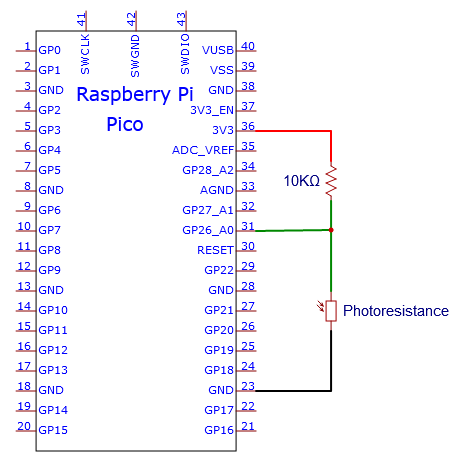


Check the code in the folder "**...\6.Codes\Python_Codes(Raspberry-Pi)**".

You can move the code anywhere. For example, We copy the **Python_Codes(Raspberry-Pi).zip** to the <span style="color: rgb(255, 76, 65);">pi</span> folder of the Raspberry Pi system.

<span style="color: rgb(255, 76, 65);">Path: home/pi/Python_Codes(Raspberry-Pi)</span>

<br>
<br>


Open “Thonny”, click “This computer” → “home” → “pi” → “Python_Codes(Raspberry-Pi)” → “Project 20：Night Lamp”. And double left-click the “Project\_20.1\_Read\_Photosensitive\_Analog\_Value.py”.


```python
from machine import ADC, Pin
import time
# Initialize the photoresistance to pin 26 (ADC function)
adc = ADC(26)

# Read the current analog value of the photoresistance and return [0, 1023]
def get_value():
    return int(adc.read_u16() * 1024 / 65536)
 
# Print the current value of the photoresistance cyclically, value=[0, 1023]
while True:
    value = get_value()
    print(value)
    time.sleep(0.1)
```


Ensure that the Raspberry Pi Pico is connected to the computer，click “Stop/Restart backend”.


Click “Run current script”, the code starts executing, we will see that the "Shell" window of Thonny IDE will print the analog value read by the photoresistor. 

When the light intensity around the photoresistor is gradually reduced, the analog value will gradually increase. On the contrary, the analog value decreases gradually. 

Click“Stop/Restart backend”to exit the program.


#### 5. Circuit Diagram and Wiring Diagram:

We made a little dimmer in the front, now let's make a light controlled lamp. The principle is the same, the Raspberry Pi Pico will be used to obtain the analog value of the sensor and then adjust the brightness of the LED.  


#### 6. Text Code:

Check the code in the folder "**...\6.Codes\Python_Codes(Raspberry-Pi)**".

You can move the code anywhere. For example, We copy the **Python_Codes(Raspberry-Pi).zip** to the <span style="color: rgb(255, 76, 65);">pi</span> folder of the Raspberry Pi system.

<span style="color: rgb(255, 76, 65);">Path: home/pi/Python_Codes(Raspberry-Pi)</span>

<br>
<br>


Open “Thonny”, click “This computer” → “D:” → “Python_Codes(Raspberry-Pi)” → “Project 20：Night Lamp”. And double left-click the “Project\_20.2\_Night\_Lamp.py”.


```python
from machine import Pin, ADC, PWM
import time

adc = ADC(26) # Initialize the potentiometer to pin 26 (ADC function)
pwm = PWM(Pin(16)) # Initialize the led's PWM to pin 16
pwm.freq(10000) # Define the PWM frequency as 1000
try:
    while True:
        adcValue = adc.read_u16() # read the ADC value of photoresistance
        pwm.duty_u16(adcValue) # map ADC value to the duty cycle of PWM to control led brightness
        time.sleep(0.1) # delay
except:
    pwm.deinit()
```


#### 7. Test Result:

Ensure that the Raspberry Pi Pico is connected to the computer，click“Stop/Restart backend”.


Click “Run current script”, the code starts executing, we will see that when the intensity of light around the photoresistor is reduced, the LED will be bright, on the contraty, the LED will be dim. 

Click“Stop/Restart backend”to exit the program.


### Project 21：Temperature Instrument

#### 1. Introduction:

Thermistor is a kind of resistor whose resistance depends on temperature changes, which is widely used in gardening, home alarm system and other devices. Therefore, we can use this feature to make a temperature instrument.

#### 2. Components Required:

|  |              |  |  |         |
| ----------------------- | ----------------------------------- | ----------------------- | ----------------------- | ----------------------- |
| Raspberry Pi Pico*1     | Raspberry Pi Pico Expansion Board*1 | Thermistor*1            | 10KΩResistor*1          |   USB Cable*1           |
| 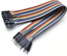 |  |  |  |   |
| 10CM M-F Dupont Wires   | Breadboard*1                        | LCD 128X32 DOT*1        | Jumper Wires            |             |


#### 3. Component Knowledge:

**Thermistor:** 

A thermistor is a temperature sensitive resistor. When it senses a change in temperature, the thermistor's resistance changes. We can use this feature to detect temperature intensity with thermistor. 

Thermistors and its electronic symbols are shown below:


The relation between thermistor resistance and temperature is:


**In the formula:**

**Rt** is the resistance of the thermistor at T2 temperature.

**R** is the nominal resistance value of the thermistor at T1 room temperature.

**EXP\[n\]** is the nth power of e.

**B** is the temperature index

**T1** and **T2** refer to K degrees, that is, Kelvin temperature. 

Kelvin temperature =273.15 + Celsius temperature. 

For thermistor parameters, we use : B=3950, R=10KΩ，T1=25℃.The circuit connection method of thermistor is similar to that the photoresistor, as shown below :


We can use the value measured by the ADC converter to get the resistance value of the thermistor, and then use the formula to get the temperature value. Therefore, the temperature formula can be deduced as:


#### 4. Read the Values:

First we will learn the thermistor to read the current ADC value, voltage value and temperature value and print them out . Please connect the wires according to the following wiring diagram.


Check the code in the folder "**...\6.Codes\Python_Codes(Raspberry-Pi)**".

You can move the code anywhere. For example, We copy the **Python_Codes(Raspberry-Pi).zip** to the <span style="color: rgb(255, 76, 65);">pi</span> folder of the Raspberry Pi system.

<span style="color: rgb(255, 76, 65);">Path: home/pi/Python_Codes(Raspberry-Pi)</span>

<br>
<br>


Open “Thonny”, click “This computer” → “home” → “pi” → “Python_Codes(Raspberry-Pi)” → “Project 21：Temperature Instrument”. And double left-click the “Project\_21.1\_Read\_the\_thermistor\_analog\_value.py”.


```python
from machine import Pin, ADC
import time
import math

#Set ADC
adc=ADC(27)

try:
    while True:
        adcValue = adc.read_u16()
        voltage = adcValue / 65535.0 * 3.3
        Rt = 10 * voltage / (3.3-voltage)
        tempK = (1 / (1 / (273.15+25) + (math.log(Rt/10)) / 3950))
        tempC = int(tempK - 273.15)
        print("ADC value:", adcValue, "  Voltage: %0.2f"%voltage + "V",
              "  Temperature: " + str(tempC) + "C")
        time.sleep(1)
except:
    pass
```


Ensure that the Raspberry Pi Pico is connected to the computer，click“Stop/Restart backend”.


Click “Run current script”, the code starts executing, we will see that the "Shell" window of Thonny IDE will continuously display the thermistor's current ADC value, voltage value, and temperature value.  

Press“Ctrl+C”or click“Stop/Restart backend”to exit the program.

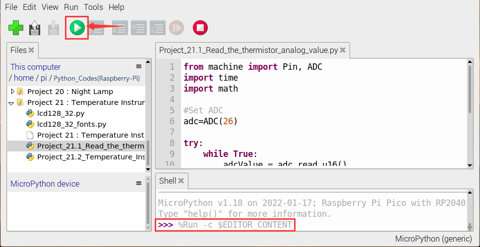


#### 5. Circuit Diagram and Wiring Diagram:

Note : LCD\_128X32\_DOT must be connected with a 10CM M-F Dupont wire, the LCD\_128X32\_DOT will display normally. 


#### 6. Test Code:

Check the code in the folder "**...\6.Codes\Python_Codes(Raspberry-Pi)**".

You can move the code anywhere. For example, We copy the **Python_Codes(Raspberry-Pi).zip** to the <span style="color: rgb(255, 76, 65);">pi</span> folder of the Raspberry Pi system.

<span style="color: rgb(255, 76, 65);">Path: home/pi/Python_Codes(Raspberry-Pi)</span>

<br>
<br>


Open “Thonny”, click “This computer” → “home” → “pi” → “Python_Codes(Raspberry-Pi)” → ”Project 21:Temperature Instrument”.

Select “lcd128\_32.py” and “lcd128\_32\_fonts.py”，right-click and select “**Upload to /**”，wait for the “lcd128\_32.py” and the “lcd128\_32\_fonts.py” to be uploaded to the Raspberry Pi Pico. 

And click the “Project\_21.2\_Temperature\_Instrument.py”.


```python
from machine import Pin, ADC, I2C
import time
import math
import lcd128_32_fonts
from lcd128_32 import lcd128_32

#Set ADC
adc=ADC(27)

#i2c config
clock_pin = 21
data_pin = 20
bus = 0
i2c_addr = 0x3f
use_i2c = True

def scan_for_devices():
    i2c = machine.I2C(bus,sda=machine.Pin(data_pin),scl=machine.Pin(clock_pin))
    devices = i2c.scan()
    if devices:
        for d in devices:
            print(hex(d))
    else:
        print('no i2c devices')

try:
    while True:
        adcValue = adc.read_u16()
        voltage = adcValue / 65535.0 * 3.3
        Rt = 10 * voltage / (3.3-voltage)
        tempK = (1 / (1 / (273.15+25) + (math.log(Rt/10)) / 3950))
        tempC = int(tempK - 273.15)
        
        if use_i2c:
            scan_for_devices()
            lcd = lcd128_32(data_pin, clock_pin, bus, i2c_addr)
            
        lcd.Clear()
        lcd.Cursor(0, 0)
        lcd.Display("Voltage:")
        lcd.Cursor(0, 8)
        lcd.Display(str(voltage))
        lcd.Cursor(0, 20)
        lcd.Display("V")
        lcd.Cursor(2, 0)
        lcd.Display("Temperature:")
        lcd.Cursor(2, 12)
        lcd.Display(str(tempC))
        lcd.Cursor(2, 15)
        lcd.Display("C")
        time.sleep(0.5)
except:
    pass
```

#### 7. Test Result:

Ensure that the Raspberry Pi Pico is connected to the computer，click “Stop/Restart backend”.


Click “Run current script”, the code starts executing, we will see that the LCD 128X32 DOT displays the voltage value of the thermistor and the temperature value in the current environment. 

Click “Stop/Restart backend”to exit the program.


	


